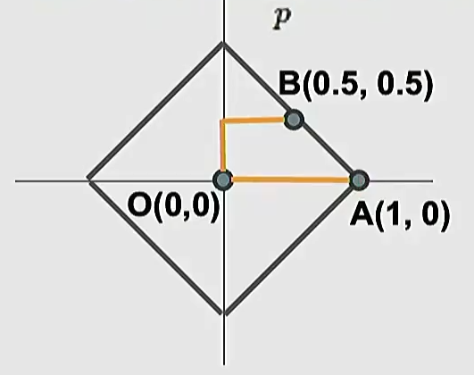
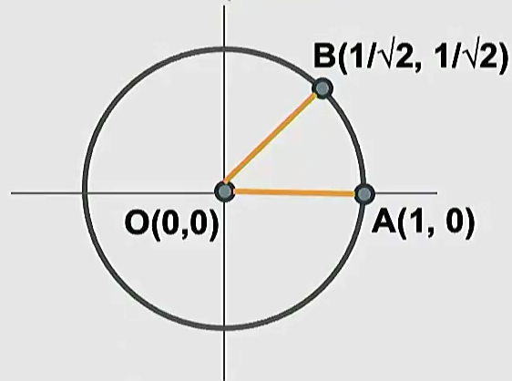
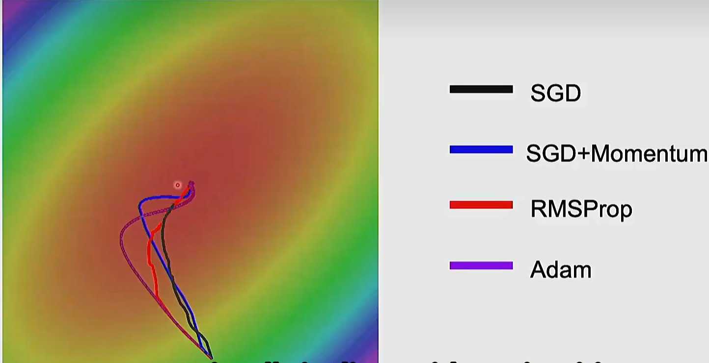
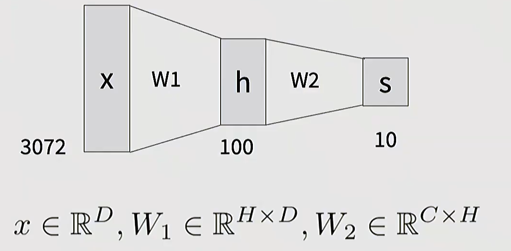
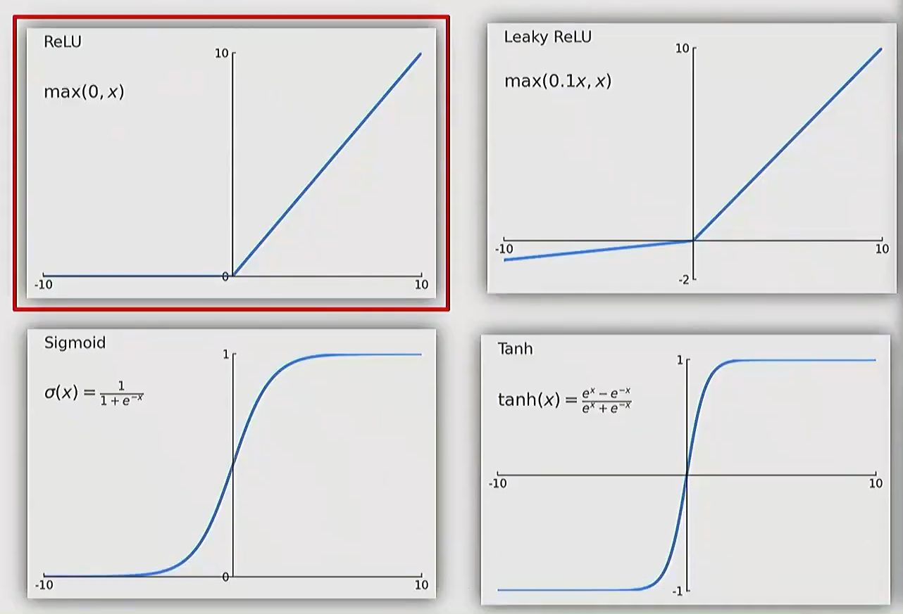
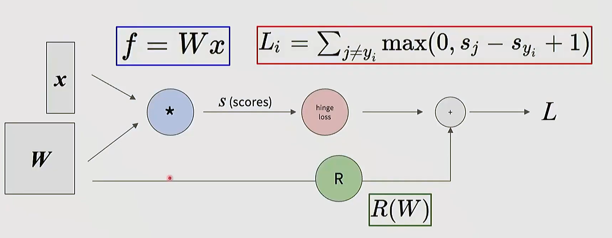

***
# 课程结构
课程大致分为四块：

1. **Deep Learning Basics**
   - 图像分类
   - KNN 与线性分类器
   - 损失函数
   - 优化
   - 反向传播
   - 多层感知机与神经网络

2. **Perceiving and Understanding the Visual World**
   - CNN
   - 经典 CNN 架构
   - RNN
   - Attention / Transformer
   - 目标检测
   - 图像分割
   - 视频理解
   - 视觉语言

3. **Reconstructing and Interacting with the Visual World**
   - 自监督学习
   - 生成模型
   - 3D 视觉
   - 机器人学习

4. **Human-Centered AI**
   - 公平性
   - 偏见
   - 伦理风险
   - 社会影响
--- 
# 视觉与深度学习的发展

####  生物视觉启发

- **Hubel & Wiesel, 1959**：发现视觉皮层中存在对特定方向、边缘、运动响应的神经元。
- **简单细胞 Simple Cells**：响应局部方向、边缘等模式。
- **复杂细胞 Complex Cells**：对位置变化更稳健，体现一定的平移不变性。

这一脉络后来影响了卷积神经网络中的：

- 局部感受野
- 分层特征
- 卷积
- 池化
- 对平移和局部扰动的鲁棒性

#### 早期模型驱动

早期计算机视觉试图手工定义视觉理解流程：

- **Roberts, 1963**：从 2D 图像推断 3D 几何结构。
- **David Marr, 1970s**：提出视觉表示阶段：
  - 原始图像
  - Primal Sketch：边缘、线段、纹理等低层结构
  - 2.5D Sketch：局部表面方向、深度关系
  - 3D Model：物体级三维表示
- **Recognition by Parts**：用部件组合识别物体，例如 generalized cylinders。
- **Canny Edge Detector, 1986**：经典边缘检测。
- **Normalized Cuts, 1997**：图像分割中的图划分思想。
- **SIFT, 1999**：局部特征匹配，具有尺度和旋转鲁棒性。
- **Viola-Jones, 2001**：机器学习驱动的人脸检测，是早期成功的视觉应用之一。

这一阶段的特点：

- 强依赖手工特征与几何假设。
- 能解决部分受控问题，但难以覆盖真实世界复杂变化。

#### 神经网络发展

- **Perceptron, 1958**：早期线性分类器。
- **Minsky & Papert, 1969**：指出单层感知机无法学习 XOR，引发神经网络低潮。
- **Neocognitron, 1980**：受视觉皮层启发，交替使用类似卷积和池化的结构，但缺少有效训练算法。
- **Backpropagation, 1986**：反向传播可高效计算多层网络梯度。
- **LeNet, 1998**：卷积网络成功应用于手写数字识别。
- **2000s Deep Learning**：更深网络开始被探索，但受限于数据、算力和训练技术。

####  ImageNet 与 AlexNet

深度学习真正爆发来自三个条件同时成熟：

- **Data**：ImageNet 提供大规模标注图像，分类挑战包含约 1000 类、百万级图像。
- **Algorithms**：反向传播、卷积网络、激活函数、正则化、优化技巧持续积累。
- **Computation**：GPU 和后来的 Tensor Cores 让大模型训练可行。

关键节点：

- **ImageNet, 2009**：大规模视觉识别数据集。
- **AlexNet, 2012**：在 ImageNet 上显著超过传统方法，使深度学习成为计算机视觉主流。

***

###  深度学习在视觉中的应用扩展

从 2012 年以后，深度学习快速扩展到多个视觉任务：

- **图像分类 Image Classification**：判断整张图像属于哪个类别。
- **图像检索 Image Retrieval**：根据视觉相似性搜索图像。
- **目标检测 Object Detection**：输出物体类别和位置框。
- **语义分割 Semantic Segmentation**：为每个像素预测语义类别。
- **实例分割 Instance Segmentation**：区分同类不同实例。
- **视频理解 Video Understanding**：识别动作、事件和时序结构。
- **姿态估计 Pose Estimation**：识别人或物体关键点。
- **图像描述 Image Captioning**：把图像转换为自然语言描述。
- **视觉关系 Visual Relationship**：理解对象之间的关系，例如 “person riding bike”。
- **风格迁移 Style Transfer**：分离并重组内容和风格。
- **生成模型 Generative Models**：GAN、扩散模型、文本生成图像。
- **视觉语言模型 Vision-Language Models**：例如 CLIP，将图像和文本映射到共享语义空间。
- **3D 视觉 3D Vision**：从 2D/多视角数据恢复三维结构。
- **具身智能 Embodied AI / Robotics**：视觉感知与动作决策结合。

***

### 模型类型

- **MLP / 全连接网络**：把输入展平后用矩阵乘法建模，缺少显式空间归纳偏置。
- **CNN**：利用局部连接、权重共享、层级特征，适合图像网格结构。
- **RNN**：处理序列数据，适合早期视频、语言、序列建模。
- **Attention / Transformer**：用注意力机制建模长程依赖，成为视觉语言和大模型的重要基础。
- **生成模型**：学习数据分布，可以生成图像、补全图像、跨模态生成。

***

# 第 2 讲：分类器

###  图像分类任务

**图像分类 Image Classification**：

给定一张图像，从预设类别集合中预测一个标签。

例子：

```text
输入：一张 32 x 32 x 3 的 CIFAR-10 图像
输出：{airplane, automobile, bird, cat, deer, dog, frog, horse, ship, truck} 中的一个类别
```

计算机看到的图像是张量：

$$
x \in \mathbb{R}^{H \times W \times C}
$$

其中像素值通常在 $[0, 255]$ 或归一化后的 $[0, 1]$，数据张量为分辨率800×200×3通道。

视觉分类的典型挑战：视角改变导致像素大幅变化、
- **Illumination**：光照变化改变颜色和阴影、背景干扰、目标被遮挡、类间差异等。

***

###  数据驱动方法

传统手写规则难以穷尽所有视觉变化，因此采用数据驱动方法：

1. 收集带标签的数据集。
2. 用机器学习算法训练分类器。
3. 在未见过的新图像上评估。

标准流程：

```text
训练集 train：学习模型参数
验证集 validation：选择超参数
测试集 test：最终评估泛化性能，只在最后使用一次
```

***

### 1. Nearest Neighbor 分类器

#### 1.1 基本思想

最近邻分类器不真正 “训练”，而是记住所有训练样本。

预测时：

1. 计算测试图像与每张训练图像的距离。
2. 找到最相似的训练图像。
3. 复制它的标签作为预测结果。

复杂度：

| 阶段 | 复杂度 | 评价 |
|---|---:|---|
| 训练 | $O(1)$ | 只是记忆数据 |
| 预测 | $O(N)$ | 每次预测都要和训练集比较，速度慢 |

在实际深度学习系统中，通常希望训练可以慢一些，但预测要快。

#### 1.2 距离度量

**常见距离：**

**L1 / Manhattan Distance**

$$
d_1(x, y) = \sum_i |x_i - y_i|
$$



***
**L2 / Euclidean Distance**

$$
d_2(x, y) = \sqrt{\sum_i (x_i - y_i)^2}
$$



二者差异：

- L1 更像沿网格线移动，适合想做特征保留。
- L2 是直线距离。
- 距离选择会改变决策边界。

***

### 2. K-Nearest Neighbors

KNN 是最近邻的推广：

- 不只看最近的 1 个样本。
- 找到最近的 $K$ 个样本。
- 用多数投票决定类别。

关键超参数：

- $K$ 的取值
- 距离函数，例如 L1 或 L2

#### 直接比较像素距离通常不是可靠的视觉语义度量。

例如：

- 图像平移 1 个像素，语义不变，但像素距离可能变大。
- 加一点色调变化，语义不变，但像素距离变化明显。
- 遮挡一部分图像，像素距离可能与完全不同语义的图像相近。

所以 KNN 是理解数据驱动分类的好起点，但不是现代图像分类的主力方法。

***

###  超参数选择

**超参数 Hyperparameters** 是算法本身的选择，不是训练过程中直接学出来的参数。

例如：

- KNN 中的 $K$
- 距离度量 L1 / L2
- 学习率
- 正则化强度

错误做法：

- 在训练集上选超参数：容易过拟合。
- 在测试集上反复选超参数：会污染测试集，导致泛化评估失真。

正确做法：

```text
train：训练不同模型
validation：选择超参数
test：只在最终模型确定后评估一次
```

小数据集可以使用 **Cross-Validation 交叉验证**：

- 把训练数据分成多个 fold。
- 每次用一个 fold 做验证集，其余做训练集。
- 对多次验证结果取平均。

深度学习中交叉验证不常用，原因是训练成本高，通常使用固定验证集。

***

### 3. 线性分类器：Parametric Approach

KNN 需要保留整个训练集，而线性分类器只保留参数。

线性分类器对输入做矩阵乘法：

$$
f(x, W, b) = Wx + b
$$

其中：

- $x$：输入图像展平后的向量。
- $W$：权重矩阵。
- $b$：偏置向量。
- $f(x, W, b)$：每个类别的分数，也叫 logits。

例：以 CIFAR-10 将image分类到10个类中

$$
x \in \mathbb{R}^{3072}
$$

因为：

$$
32 \times 32 \times 3 = 3072
$$

若有 10 个类别：

$$
W \in \mathbb{R}^{10 \times 3072}, \quad b \in \mathbb{R}^{10}
$$

输出：

$$
s = Wx + b \in \mathbb{R}^{10}
$$

s为10×1的矩阵，每个 $s_j$ 表示图像属于第 $j$ 类的分数。

 - **损失函数 Loss Function**
   - 衡量当前参数 $W, b$ 的预测有多差。

- **优化算法 Optimization**
   - 找到让损失尽可能小的参数。

数据集平均损失：

$$
L = \frac{1}{N}\sum_{i=1}^{N} L_i
$$

其中 $L_i$ 是第 $i$ 个样本的损失。


***

### 4. Softmax 分类器

它把 logits 转换为概率：

$$
p_j = \frac{e^{s_j}}{\sum_k e^{s_k}}
$$

其中：

- $s_j$：第 $j$ 类的 logit。
- $p_j$：第 $j$ 类的预测概率。
正确类别为 $y_i$ 时，单样本交叉熵损失：

$$
L_i = -\log p_{y_i}
$$


等价于：

$$
L_i = -s_{y_i} + \log \sum_j e^{s_j}
$$

- 正确类别概率越接近 1，损失越接近 0。
- 正确类别概率越接近 0，损失越大。

初始化时如果所有类别分数接近相等，且共有 $C$ 类：

$$
p_j \approx \frac{1}{C}
$$

所以：

$$
L_i \approx -\log \frac{1}{C} = \log C
$$

例如 CIFAR-10 有 10 类：

$$
L_i \approx \log 10 \approx 2.3
$$

***

### 附加： Multiclass SVM Loss

SVM 损失关注的是 **margin**：正确类别分数应该比错误类别至少高出一个间隔 $\Delta$。

单样本多分类 SVM 损失：

$$
L_i = \sum_{j \ne y_i} \max(0, s_j - s_{y_i} + \Delta)
$$

通常取：

$$
\Delta = 1
$$

含义：

- 如果错误类别分数 $s_j$ 太接近或超过正确类别分数 $s_{y_i}$，产生损失。
- 如果正确类别分数已经比错误类别高至少 $\Delta$，该错误类别贡献 0 损失。

当所有初始分数都接近 0 时：

$$
L_i \approx C - 1
$$

因为除正确类别外，每个错误类别都会贡献约 1 的 margin loss。

***

### 对比 Softmax vs SVM

| 对比点       | Softmax              | Multiclass SVM           |
| --------- | -------------------- | ------------------------ |
| 目标        | 最大化正确类别概率            | 让正确类别分数超过错误类别至少一个 margin |
| 输出解释      | 概率分布                 | 类别分数间隔                   |
| 损失形式      | 交叉熵                  | hinge loss               |
| 对分数变化的敏感度 | 即使分类正确，仍会继续推动概率更接近 1 | margin 满足后损失为 0          |
| 常见用途      | 深度学习分类主流             | 传统线性分类与理解 margin 很重要     |

重要区别：

- Softmax 关心完整概率分布。
- SVM 更关心正确类别和错误类别之间是否拉开足够间隔。
- 两者都需要通过优化算法调整 $W$，本讲主要先定义损失，后续讲优化。

***

# 第 3 讲：正则化和优化

### 1. 从分类器到完整的目标函数

第 2 讲已经建立了图像分类的基本框架：

- 数据集：$(x_i, y_i)$，其中 $x_i$ 是图像，$y_i$ 是类别标签。
- 打分函数：$f(x, W)$，线性分类器中常写作 $f(x, W)=Wx+b$。
- 损失函数：衡量当前参数产生的分数有多差。

训练时真正最小化的是 **数据损失 + 正则化损失**：

$$
L(W) = \frac{1}{N} \sum_{i=1}^{N} L_i(f(x_i, W), y_i) + \lambda R(W)
$$

其中：

- $\frac{1}{N}\sum_i L_i$：要求模型预测匹配训练数据。
- $R(W)$：对参数形态施加偏好。
- $\lambda$：正则化强度，是超参数。

***
### 2. 正则化
	正则化会阻止模型把训练集拟合得过于完美，所以训练损失通常会变大；但它减少了模型对训练噪声、偶然模式和异常样本的依赖，因此测试集泛化可能更好。
正则化的核心目标：

- 偏好更简单的模型。
- 避免过拟合训练数据中的噪声。
- 在多个能解释训练数据的假设中，选择更可能泛化的一个。
- 有时还能改善优化曲面的性质，例如增加曲率，让优化更稳定。

这对应 Occam's Razor：

> 在多个竞争解释中，优先选择更简单的解释。

***

#### 2.1 常见正则化形式

##### L2 Regularization

$$
R(W) = \sum_k W_k^2
$$

特点：

- 惩罚大权重。
- 倾向于把权重“摊开”，让多个特征共同承担预测。
- 在深度学习里常和 weight decay 相关。

##### L1 Regularization

$$
R(W) = \sum_k |W_k|
$$

特点：

- 更容易产生稀疏权重。
- 倾向于让部分参数变成 0，从而做特征选择。

##### Elastic Net

$$
R(W) = \alpha \sum_k |W_k| + \beta \sum_k W_k^2
$$

结合 L1 的稀疏性和 L2 的平滑惩罚。

#### 更复杂的正则化

- Dropout
- Batch Normalization
- Stochastic Depth
- Fractional Pooling
- Data Augmentation

这些方法不一定都以显式 $R(W)$ 的形式出现，但本质上都在限制模型过拟合或改善训练动态。

***

### 3. 优化问题：如何找到好的 $W$

#### 3.1 Gradient
任意方向的斜率可以看作该方向与梯度的点积；最陡下降方向是负梯度方向。

数值梯度用有限差分近似：

$$
\frac{\partial L}{\partial W_k} \approx \frac{L(W + h e_k) - L(W)}{h}
$$


> 用解析梯度训练，用数值梯度做 gradient check。

***

#### 3.2 梯度下降

基础梯度下降更新：

$$
W \leftarrow W - \eta \nabla_W L(W)
$$

其中：

- $\eta$：learning rate，学习率/步长。
- $\nabla_W L(W)$：当前参数处的梯度。

学习率太大可能导致 loss 爆炸；学习率太小会收敛很慢。

***

### 4. 随机梯度下降:Stochastic Gradient Descent

完整数据损失：

$$
L(W) = \frac{1}{N}\sum_{i=1}^{N}L_i
$$

当 $N$ 很大时，每一步都遍历全量数据非常昂贵。SGD 用 数据子集进行操作：

$$
\nabla_W L(W) \approx \frac{1}{B}\sum_{i \in \mathcal{B}}\nabla_W L_i
$$

常见 batch size：32/64/128/256

SGD 的核心取舍：

- 每一步更便宜。
- 梯度有噪声。
- 噪声有时能帮助逃离鞍点，但也会造成震荡。

***

#### 4.1 SGD 的三个典型问题

##### Problem 1：病态曲率 损失在一个方向变化很快、另一个方向变化很慢：

- 陡峭方向上会来回震荡。
- 平缓方向上前进很慢。

##### Problem 2：局部最小值与鞍点

- 鞍点附近梯度可能接近 0，普通梯度下降会变慢甚至卡住。

##### Problem 3：Mini-batch 噪声

- SGD 用小批量估计梯度，所以每一步方向不一定等于真实全量梯度，会产生抖动。

***

### 4.2 Momentum

SGD + Momentum 引入速度变量，保留历史方向：

$$
v \leftarrow \rho v - \eta \nabla_W L(W)
$$
按速度更新
$$
W \leftarrow W + v
$$

其中：

- $\rho$：momentum / friction，常见取值 $0.9$ 或 $0.99$。
- 在连续一致的方向上加速。
- 在震荡方向上互相抵消。
- 更容易穿过局部噪声和鞍点附近的平坦区域。

***

### 5. RMSProp

RMSProp 为每个参数维护梯度平方的滑动平均：

$$
square \leftarrow decay \cdot square + (1-decay)\cdot g^2
$$

$$
W \leftarrow W - \eta \frac{g}{\sqrt{square}+\epsilon}
$$

作用：

- 梯度长期很大的方向，步长被压小。
- 梯度长期很小的方向，步长相对变大。
- 可以看作 per-parameter learning rate / adaptive learning rate。

***

### 6. Adam 与 AdamW

Adam 结合了 Momentum 和 RMSProp：

- 一阶矩估计 $m$：类似 momentum，跟踪梯度均值。
- 二阶矩估计 $v$：跟踪梯度平方均值。
- bias correction：修正初始时 $m, v$ 从 0 开始导致的偏差。

常用初始选择：

```text
beta1 = 0.9
beta2 = 0.999
learning_rate = 1e-3 或 5e-4
```

AdamW 是 Adam 的常用变体，重点是 **decoupled weight decay**：

- 标准 Adam 中，L2 正则项会进入梯度并参与 moment 计算。
- AdamW 把 weight decay 从梯度 moment 计算中解耦，作为更新后的额外衰减项。

实践上，AdamW 通常是训练深度模型的稳妥默认选择。



***

### 7. Learning Rate Schedule

几乎所有优化器都需要学习率。学习率策略决定训练过程中 $\eta$ 如何变化。

常见策略：

- **Step Decay**：在固定 epoch 把学习率乘以某个比例，例如 ResNet 常见的 30/60/90 epoch 衰减。
- **Cosine Decay**：按照余弦曲线平滑下降。
- **Linear Decay**：线性下降。
- **Inverse Square Root Decay**：常见于 Transformer 训练。
- **Linear Warmup**：初期从 0 线性增大学习率，防止训练初期 loss 爆炸。

经验规则：

> 如果 batch size 增大 $N$ 倍，初始 learning rate 往往也可以近似增大 $N$ 倍。

这只是经验起点，最终仍要靠验证集和训练曲线调参。

***

####  一阶优化与二阶优化

##### First-Order Optimization

只使用梯度构造线性近似：

1. 用梯度近似当前局部损失形状。
2. 沿负梯度方向走一步。

SGD、Momentum、RMSProp、Adam、AdamW 都属于一阶方法。

##### Second-Order Optimization

二阶方法使用 Hessian 构造二次近似：

$$
H = \nabla_W^2 L(W)
$$

问题：

- Hessian 有 $O(N^2)$ 个元素。
- 求逆通常需要 $O(N^3)$。
- 深度模型参数量可能是千万级或亿级，直接二阶方法不可行。

L-BFGS 等方法会近似 Hessian 或逆 Hessian，但在 mini-batch 噪声环境下效果不总是稳定。

***

# 第 4 讲：神经网络与反向传播

### 1. 从线性分类器到神经网络

线性分类器：

$$
s = Wx + b
$$

两层全连接神经网络：

$$
h = \sigma(W_1x + b_1)
$$

$$
s = W_2h + b_2
$$

其中：

- $x$：输入图像向量。
- $h$：隐藏层表示。
- $s$：类别分数 logits。
- $\sigma$：activation function，激活函数。

以 CIFAR-10 为例：



- 线性分类器直接学习 10 个类别模板。
- 两层网络可以先学习大量中间模板，再组合成类别分数。
- 隐藏层让不同类别可以共享特征。

***

####  为什么必须有非线性

如果没有激活函数：

$$
s = W_2(W_1x) = (W_2W_1)x
$$

这仍然只是一个线性分类器。

非线性的作用：

- 改变输入空间的表示。
- 让原本线性不可分的数据变得可分。
- 多层线性 + 非线性叠加后，模型表达能力远强于单个线性分类器。

常用默认激活函数：为了引入非线性，且根据问题特征函数选取，经验性的 



ReLU 的特点：

- 计算简单。
- 梯度传播相对稳定。
- 是许多视觉模型的可靠默认选择。
- 但存在一直为0的情况

***

### 2. 模型容量与正则化

更多层、更宽隐藏层通常意味着更大容量。

> 不要主要靠缩小网络规模来做正则化；更常见做法是使用足够大的模型，再用正则化控制泛化。

原因：

- 小模型可能表达能力不足，直接欠拟合。
- 大模型加合适正则化通常更容易优化，也更容易取得好结果。

***

### 3. 神经网络和生物神经元的关系

神经网络历史上受到生物神经元启发，但不能过度类比。

差异：

- 生物神经元类型很多，连接模式复杂。
- 树突本身可能执行复杂非线性计算。
- 突触不是单个静态权重，而是复杂动态系统。
- 人工神经网络为了计算效率，通常组织成规则层结构。

所以更准确的理解是：

> 现代神经网络是可微分函数组合系统，而不是大脑的精确模拟。

***

### 4. 神经网络的训练目标

把线性打分函数替换为非线性网络后，整体训练目标仍然是：

$$
L = L_{\text{data}} + \lambda R(W)
$$

例如：

```text
输入图像 x
-> 神经网络产生 logits s
-> Softmax 或 SVM loss
-> 加上 regularization
-> 得到总损失 L
```

关键问题变成：

> 如何高效计算每个参数对损失的梯度？

也就是：

$$
\frac{\partial L}{\partial W_1}, \quad \frac{\partial L}{\partial W_2}, \quad \frac{\partial L}{\partial b_1}, \quad \frac{\partial L}{\partial b_2}
$$

手推完整矩阵微积分对复杂模型不可行，因此需要计算图和反向传播。

***

### 5. Computational Graph

计算图把复杂函数拆成简单操作节点：

每个节点负责：

- forward：计算输出，并缓存 backward 需要的中间值。
- backward：根据 upstream gradient 和 local gradient 计算 downstream gradients。

这种模块化方式使复杂模型可组合：

- 换 loss 不需要重推整个模型。
- 换层结构只要每个节点实现 forward/backward。
- PyTorch、TensorFlow 等框架本质上都在维护类似的计算图和自动求导系统。

***

### 6. Backpropagation 
反向传播就是在计算图上递归应用链式法则。

对一个节点：

```text
输入 x -> 节点 f -> 输出 z -> 损失 L
```

如果已知 upstream gradient：

$$
\frac{\partial L}{\partial z}
$$

并能计算 local gradient：

$$
\frac{\partial z}{\partial x}
$$

那么：

$$
\frac{\partial L}{\partial x}
=
\frac{\partial L}{\partial z}
\frac{\partial z}{\partial x}
$$


***

### 7. 常见计算节点的梯度模式

#### 加

$$
z = x + y
$$

加法节点把 upstream gradient 原样分发给两个输入：

$$
\frac{\partial L}{\partial x} = \frac{\partial L}{\partial z}
$$

$$
\frac{\partial L}{\partial y} = \frac{\partial L}{\partial z}
$$

#### 乘

$$
z = xy
$$

乘法节点会交换乘数：

$$
\frac{\partial L}{\partial x} =
\frac{\partial L}{\partial z} \cdot y
$$

$$
\frac{\partial L}{\partial y} =
\frac{\partial L}{\partial z} \cdot x
$$

#### Copy Gate

如果一个变量被多个后续节点使用，反向传播时梯度相加：

$$
\frac{\partial L}{\partial x}
=
\sum_k \frac{\partial L}{\partial x}^{(k)}
$$

#### Max Gate

$$
z = \max(x, y)
$$

梯度只传给 forward 中取到最大值的输入，另一个输入梯度为 0。

#### Sigmoid

$$
\sigma(x)=\frac{1}{1+e^{-x}}
$$

局部梯度：

$$
\frac{d\sigma}{dx}=\sigma(x)(1-\sigma(x))
$$

***

### 8. Backprop 实现：forward / backward API

每个模块通常有两个接口：

```text
forward(x):
    计算输出 out
    缓存 backward 需要的中间值
    返回 out

backward(dout):
    使用缓存和 upstream gradient dout
    计算 dx, dW, db 等梯度
    返回梯度
```

forward pass：

- 从输入到输出计算分数和损失。
- 保存中间结果。

backward pass：

- **从损失开始反向传播**。
- 每个节点用链式法则计算输入和参数的梯度。

***

### 9. 向量、矩阵和张量的反向传播

标量情形下，梯度是数字；向量和矩阵情形下：

- $x$ 是向量时，$\frac{\partial L}{\partial x}$ 与 $x$ 形状相同。
- $W$ 是矩阵时，$\frac{\partial L}{\partial W}$ 与 $W$ 形状相同。
- 损失 $L$ 仍然是标量。

理论上向量到向量的导数是 Jacobian：

$$
J = \frac{\partial z}{\partial x}
$$

但实际深度学习中几乎不会显式构造完整 Jacobian，因为内存和计算量太大。

实践做法：

> 隐式计算 Jacobian-vector product，只保留需要的梯度张量。

***

### 10. ReLU 的向量反传

逐元素 ReLU：

$$
z = \max(0, x)
$$

反向传播：

$$
\frac{\partial L}{\partial x_i}
=
\begin{cases}
\frac{\partial L}{\partial z_i}, & x_i > 0 \\
0, & x_i \le 0
\end{cases}
$$

- forward 中激活的神经元传递梯度。
- 被截断为 0 的神经元不传递梯度。

---

# 第5讲：卷积神经网络 CNN 


传统全连接神经网络处理图像时，通常会把图像展平成一维向量。

例如：

```text
32 × 32 × 3 图像 → 3072 维向量
```

这样做的问题是：

- 图像原本具有二维空间结构展平后会破坏“上下左右”的空间位置信息；
- 像素之间有局部邻域关系；
- 参数量过大，容易过拟合。

CNN 的核心思想是：

> 利用卷积核在图像上滑动，通过局部连接和权重共享提取空间特征，再通过多层堆叠形成从低级纹理到高级语义的层级表达。

---

## 1. CNN 的基本组成

典型 CNN 结构通常由以下模块堆叠而成：

```text
Input → Convolution → ReLU → Pooling → Convolution → ReLU → Pooling → Fully Connected → Output
```

主要组成：

| 模块                    | 作用               |
| --------------------- | ---------------- |
| Convolution Layer     | 提取局部特征           |
| Activation Function   | 引入非线性表达能力        |
| Pooling Layer         | 降采样，减少尺寸，提高平移鲁棒性 |
| Fully Connected Layer | 综合特征并完成分类        |
| Softmax / Sigmoid     | 输出类别概率           |

ConvNet 是由卷积层、池化层和全连接层堆叠而成的网络。

---

## 2. 卷积层 Convolution Layer

>一个卷积核会同时覆盖所有输入通道。CS231n 中也将其解释为：一个 `5 × 5 × 3` 的 filter 与图像局部区域做点积，本质是一个 75 维向量点积。

---

### 2.1. 卷积层的四个核心超参数

卷积层主要有四个超参数：

|超参数|英文|作用|
|---|---|---|
|卷积核数量|Number of filters / Cout|决定输出通道数|
|卷积核大小|Kernel size / F|决定局部感受野大小|
|步长|Stride / S|控制卷积核滑动间隔|
|填充|Padding / P|控制边缘补零，影响输出尺寸|


---

### 2.2. 输出尺寸计算公式

假设输入尺寸为：

```text
W1 × H1 × C
```

卷积核大小为：

```text
F × F
```

padding 为：

```text
P
```

stride 为：

```text
S
```

输出尺寸为：

```text
W2 = (W1 - F + 2P) / S + 1
H2 = (H1 - F + 2P) / S + 1
```

输出通道数等于卷积核数量：

```text
Output: W2 × H2 × K
```


---

### 2.3 Padding：为什么要补零？

如果不加 padding，卷积后特征图会不断变小。

例如：

```text
输入：7 × 7
卷积核：3 × 3
stride = 1
padding = 0

输出：(7 - 3) / 1 + 1 = 5
输出尺寸：5 × 5
```

问题：

- 图像边缘信息被利用次数少；
- 多层卷积后特征图迅速缩小；
- 深层网络难以保持空间分辨率。

因此使用 padding：

```text
padding = P
输出尺寸 = W - K + 1 + 2P
```

常见设置：

```text
当 kernel size = 3, stride = 1 时：
P = 1
输出尺寸保持不变
```
 
---

### 2.4 Stride：步长的作用

Stride 表示卷积核每次滑动的距离。

```text
stride = 1：逐像素滑动，输出尺寸较大
stride = 2：隔一个像素滑动，输出尺寸减小
```

作用：

- 控制特征图大小；
    
- 实现降采样；
    
- 减少计算量；
    
- 扩大后续层的感受野。
    

示例：

```text
输入：7 × 7
卷积核：3 × 3
stride = 2
padding = 0

输出：(7 - 3) / 2 + 1 = 3
输出尺寸：3 × 3
```

---
### 2.5 1 × 1 卷积

1 × 1 卷积看起来只覆盖一个像素，但它会跨通道计算。

假设输入为：

```text
56 × 56 × 64
```

使用 32 个 `1 × 1 × 64` 的卷积核：

```text
输出：56 × 56 × 32
```

作用：

- 改变通道数；
- 实现通道间信息融合；
- 降维；
- 减少计算量；
- 常用于 Inception、ResNet、MobileNet 等结构。
---
## 3. Receptive Field：感受野

感受野指的是：

> 输出特征图中某一个神经元，能够“看到”的原始输入区域大小。

对于单层卷积：

```text
kernel size = K
每个输出位置对应输入中的 K × K 区域
```

多层卷积后，感受野会逐层扩大。

如果 stride = 1，连续堆叠 L 层、kernel size = K 的卷积层，感受野近似为：

```text
Receptive Field = 1 + L × (K - 1)
```

例如：

```text
3 层 3 × 3 卷积：
RF = 1 + 3 × (3 - 1) = 7
```

也就是说，多个小卷积核堆叠可以获得较大的感受野。

---
## 4. 参数量计算

卷积层参数量：

```text
参数量 = F × F × Cin × Cout + Cout
```

其中：

- `F × F × Cin × Cout` 是卷积核权重；
    
- `Cout` 是 bias。
    

例子：

```text
输入：32 × 32 × 3
卷积核：5 × 5
卷积核数量：6
stride = 1
padding = 0
```

输出尺寸：

```text
W2 = (32 - 5 + 0) / 1 + 1 = 28
H2 = 28
输出：28 × 28 × 6
```

参数量：

```text
5 × 5 × 3 × 6 + 6 = 456
```

相比全连接层，CNN 的参数量明显减少。

---

## 5. Pooling Layer：池化层

池化层用于对局部区域进行降采样。

常见池化方式：

| 类型              | 操作       |
| --------------- | -------- |
| Max Pooling     | 取局部区域最大值 |
| Average Pooling | 取局部区域平均值 |

Max Pooling 示例：

```text
输入局部区域：
[1, 3
 2, 4]

Max Pooling 输出：4
```

池化层特点：

- 没有可学习参数；
- 降低特征图空间尺寸；
- 减少计算量；
- 提高一定程度的平移不变性；
- 保持通道数不变。
---

### 5.1 Pooling 输出尺寸公式

假设输入为：

```text
W1 × H1 × C
```

池化核大小为：

```text
F
```

步长为：

```text
S
```

则输出尺寸：

```text
W2 = (W1 - F) / S + 1
H2 = (H1 - F) / S + 1
```

输出通道数不变：

```text
Output: W2 × H2 × C
```

典型设置：

```text
2 × 2 Max Pooling, stride = 2
```

作用：

```text
H × W × C → H/2 × W/2 × C
```
---

## 6. CNN 与全连接网络的区别

| 对比项    | 全连接网络 MLP | CNN         |
| ------ | --------- | ----------- |
| 输入处理   | 展平图像      | 保留空间结构      |
| 参数连接   | 全连接       | 局部连接        |
| 参数共享   | 无         | 有           |
| 参数量    | 大         | 小           |
| 图像任务表现 | 较弱        | 较强          |
| 特征提取   | 依赖人工或隐式学习 | 自动学习局部到全局特征 |

### CNN 的核心优势

###  局部连接

图像中相邻像素关系更强，因此卷积只关注局部区域。

优点：

- 保留局部空间结构；
- 降低参数量
- 更符合图像数据特性。
---

###  权重共享

同一个卷积核会在整张图像上滑动。

含义：

```text
同一个特征检测器可以在不同位置检测相同模式
```

例如：

- 横向边缘可以出现在左上角，也可以出现在右下角；
- 卷积核在所有位置共享参数；
- 因此 CNN 对位置变化更鲁棒
---

###  层级特征表达

CNN 会逐层学习：
```text
浅层：边缘、纹理、颜色
中层：局部结构、形状、器官边界
深层：语义类别、病灶模式、整体结构
```

医学图像中可以理解为：

```text
浅层：灰度变化、边缘、纹理
中层：组织结构、器官轮廓
深层：病灶区域、疾病相关影像模式
```

---

## 7. CNN 在医学图像中的应用理解

在医学图像处理中，CNN 常用于：

| 任务  | 示例                      |     |
| --- | ----------------------- | --- |
| 分类  | 判断是否患病，如 AD / PD / 正常对照 |     |
| 检测  | 检测病灶位置                  |     |
| 分割  | 分割肿瘤、器官、脑区              |     |
| 配准  | 对齐不同模态图像                |     |
| 重建  | CT、MRI 图像重建             |     |
| 增强  | 去噪、超分辨率、对比度增强           |     |

对于 MRI、CT 等医学影像，CNN 的优势是：

- 自动提取影像特征；
- 减少人工特征工程；
- 可处理复杂空间结构；
- 可扩展到 3D CNN；
- 可用于多模态融合。

 2D CNN 适合普通二维图像,  X-ray , 病理图像 patch。
 3D CNN适合MRI；CT；PET；三维脑影像。

---
# 第六讲：训练神经网络 


```text
如何让神经网络真正训练起来？
如何让训练过程稳定？
如何判断模型是否过拟合或欠拟合？
如何选择合理的超参数？
```

---
# 激活函数
## 1. Sigmoid 激活函数

 优缺点

- 输出可以解释为概率；
- 早期神经网络常用；
- 适合二分类输出层。

- 梯度饱和
- 输出不是零中心
- 指数计算较慢

---

## 2. tanh 激活函数


---

### 优缺点

- tanh 是零中心的
-
- 梯度饱和问题。

---

## 3. ReLU 激活函数


###  优缺点

- 计算简单
- 缓解梯度消失
- 收敛速度快

- dead relu:

常见原因：
- 学习率太大；
- 初始化不合理；
- 数据分布偏移严重。

---

## 6. Leaky ReLU / PReLU / ELU

为了解决 ReLU 在负半轴梯度为 0 的问题，可以使用改进版本。

---

### 6.1 Leaky ReLU

```text
f(x) = max(αx, x)
```

其中：

```text
α 通常是 0.01
```

负半轴仍然保留一个很小的梯度。

---

### 6.2 PReLU

PReLU 与 Leaky ReLU 类似，但 α 是可学习参数：

```text
f(x) = max(αx, x)
```

其中 α 通过训练自动学习。

---

### 6.3 ELU

ELU 在负半轴使用指数形式，使输出更平滑。

优点：

- 负半轴不完全为 0；
    
- 输出均值更接近 0；
    
- 有助于稳定训练。
    

缺点：

- 计算复杂度比 ReLU 高。
    

---

## 7. 激活函数对比总结

|激活函数|优点|缺点|常见用途|
|---|---|---|---|
|Sigmoid|可解释为概率|梯度饱和、非零中心|二分类输出层|
|tanh|零中心|仍有梯度饱和|RNN 早期结构|
|ReLU|简单、高效、收敛快|Dead ReLU|CNN/MLP 隐藏层|
|Leaky ReLU|缓解 Dead ReLU|多一个超参数|深层网络|
|PReLU|负半轴斜率可学习|增加参数|图像模型|
|ELU|输出更平滑|计算较慢|特定深度网络|

---

## 8. 数据预处理 Data Preprocessing

神经网络训练前，通常需要对输入数据做预处理。

CS231n 课程笔记中总结，实践中推荐将数据中心化，并对尺度做归一化；对于卷积网络，尤其重要的是 zero-center，常见做法还包括对每个像素归一化。([CS231n](https://cs231n.github.io/neural-networks-2/ "CS231n Deep Learning for Computer Vision"))

---

## 9. 零中心化 Zero-Centering

### 9.1 操作

```text
X = X - mean(X)
```

对于图像数据：

```text
每个像素减去训练集均值
```

---

### 9.2 作用

让数据分布以 0 为中心。

优点：

- 优化更稳定；
    
- 梯度更新方向更均衡；
    
- 减少某些维度长期偏正或偏负的问题。
    

---

## 10. 标准化 Normalization

### 10.1 操作

```text
X = (X - mean) / std
```

使数据近似满足：

```text
均值 = 0
方差 = 1
```

---

### 10.2 为什么有用？

如果不同特征尺度差异很大：

```text
特征 A 范围：0 ~ 1
特征 B 范围：0 ~ 10000
```

模型会更容易被大尺度特征主导，优化路径也会变得不稳定。

标准化后，不同维度处于相近尺度，有助于梯度下降。

---

## 11. PCA 与 Whitening

### 11.1 PCA

PCA 通过主成分分析，将数据投影到方差最大的方向上。

作用：

- 降维；
    
- 去除冗余；
    
- 保留主要信息。
    

---

### 11.2 Whitening

Whitening 会进一步让每个维度的方差接近 1。

但 CS231n 也提醒，whitening 可能会放大噪声，因为它会把低方差维度也拉伸到同等尺度。([CS231n](https://cs231n.github.io/neural-networks-2/ "CS231n Deep Learning for Computer Vision"))

---

### 11.3 在 CNN 中是否常用？

对于现代 CNN：

```text
PCA / Whitening 不常用
```

更常见的是：

```text
减均值 + 归一化
```

---

## 12. 权重初始化 Weight Initialization

权重初始化非常关键。

如果初始化不好，网络可能出现：

- 所有神经元学到相同特征；
    
- 激活值逐层爆炸；
    
- 激活值逐层衰减；
    
- 梯度爆炸；
    
- 梯度消失。
    

---

## 13. 为什么不能全部初始化为 0？

假设某一层所有权重都初始化为 0：

```text
W = 0
```

那么同一层所有神经元接收到相同输入，输出相同，梯度也相同。

结果：

```text
所有神经元更新方向完全一样
```

这叫：

```text
symmetry problem 对称性问题
```

也就是说，多个神经元虽然形式上存在，但实际学到的是同一个特征。

---

## 14. 小随机数初始化

早期常用：

```python
W = 0.01 * np.random.randn(D, H)
```

问题是：

- 如果权重太小，信号逐层衰减；
    
- 如果权重太大，信号逐层爆炸。
    

所以需要更合理的初始化策略。

---

## 15. Xavier Initialization

Xavier 初始化适合 sigmoid/tanh 这类激活函数。

基本思想：

```text
保持前向传播和反向传播中的方差稳定
```

常见形式：

```text
W ~ N(0, 1 / fan_in)
```

或：

```text
W ~ N(0, 2 / (fan_in + fan_out))
```

其中：

|符号|含义|
|---|---|
|fan_in|输入神经元数量|
|fan_out|输出神经元数量|

---

## 16. He Initialization

对于 ReLU，推荐使用 He 初始化。

公式：

```python
W = np.random.randn(n) * sqrt(2.0 / n)
```

其中：

```text
n = 输入神经元数量
```

CS231n 课程笔记明确提到，He 等人的方法针对 ReLU 推导出方差应为 `2.0/n`，实践推荐形式是 `w = np.random.randn(n) * sqrt(2.0/n)`。([CS231n](https://cs231n.github.io/neural-networks-2/ "CS231n Deep Learning for Computer Vision"))

---

## 17. Batch Normalization 批归一化

Batch Normalization，简称 BN，是训练深层网络的重要技术。

CS231n 课程笔记指出，Batch Normalization 可以看作在网络内部每一层进行可微的预处理，通常放在全连接层或卷积层之后、非线性激活函数之前，并且能让网络对较差初始化更鲁棒。([CS231n](https://cs231n.github.io/neural-networks-2/ "CS231n Deep Learning for Computer Vision"))

---

## 18. BN 的核心思想

对于某一层的激活值：

```text
x1, x2, ..., xm
```

在一个 mini-batch 内计算均值和方差：

```text
μ = 1/m ∑ xi
σ² = 1/m ∑ (xi - μ)²
```

然后标准化：

```text
x_hat = (x - μ) / sqrt(σ² + ε)
```

再进行可学习的缩放和平移：

```text
y = γ x_hat + β
```

其中：

|参数|含义|
|---|---|
|γ|scale，可学习缩放参数|
|β|shift，可学习平移参数|
|ε|防止除零的小常数|

---

## 19. 为什么 BN 后还需要 γ 和 β？

如果只做标准化：

```text
均值 = 0
方差 = 1
```

可能会限制网络表达能力。

加入：

```text
γ 和 β
```

之后，网络可以自己学习是否保留标准化效果，或者恢复到其他分布。

这使 BN 不只是强制归一化，而是：

```text
可学习的归一化变换
```

---

## 20. BN 的作用

### 20.1 稳定激活分布

网络每一层输入分布更稳定，训练更容易。

---

### 20.2 允许使用更大学习率

因为激活分布不容易剧烈漂移，训练过程更稳定。

---

### 20.3 降低对初始化的敏感性

即使初始化不完美，BN 也可以缓解激活值爆炸或消失的问题。CS231n 课程笔记也提到，使用 BatchNorm 的网络对较差初始化更鲁棒。([CS231n](https://cs231n.github.io/neural-networks-2/ "CS231n Deep Learning for Computer Vision"))

---

### 20.4 有轻微正则化效果

mini-batch 均值和方差具有随机性，相当于引入了一定噪声，有时可以带来轻微正则化效果。

---

## 21. BN 在训练和测试阶段的区别

### 21.1 训练阶段

使用当前 mini-batch 的均值和方差：

```text
μ_batch, σ²_batch
```

---

### 21.2 测试阶段

测试时通常不再依赖当前 batch，而是使用训练过程中累计的 running mean 和 running variance：

```text
running_mean
running_var
```

原因：

- 测试时可能只有单张图片；
    
- batch 统计不稳定；
    
- 需要固定的推理行为。
    

---

## 22. BN 放在哪里？

常见顺序：

```text
Linear / Conv → BatchNorm → ReLU
```

也可以看到：

```text
Linear / Conv → ReLU → BatchNorm
```

但经典用法通常是：

```text
先线性变换，再 BN，再激活
```

---

## 23. 训练过程监控 Babysitting the Learning Process

训练神经网络时，不能只看最终准确率。

应该持续观察：

- loss 曲线；
    
- train accuracy；
    
- validation accuracy；
    
- 参数更新比例；
    
- 激活值分布；
    
- 梯度分布。
    

CS231n 的训练笔记也将 loss、train/val accuracy、weights:update ratio、activation/gradient distributions 等列为监控训练过程的重要内容。([CS231n](https://cs231n.github.io/neural-networks-3/ "CS231n Deep Learning for Computer Vision"))

---

## 24. Loss 曲线怎么看？

### 24.1 正常下降

```text
loss 平滑下降 → 训练正常
```

---

### 24.2 loss 不下降

可能原因：

- 学习率太低；
    
- 初始化不合理；
    
- 数据未归一化；
    
- 梯度没有正确传播；
    
- 正则化太强。
    

---

### 24.3 loss 剧烈震荡

可能原因：

- 学习率太高；
    
- batch size 太小；
    
- 数据噪声大。
    

---

### 24.4 loss 变成 NaN

可能原因：

- 学习率过高；
    
- 梯度爆炸；
    
- 数值溢出；
    
- 除零错误；
    
- log 输入为 0。
    

---

## 25. 训练集准确率与验证集准确率

### 25.1 欠拟合 Underfitting

表现：

```text
训练集准确率低
验证集准确率也低
```

说明模型没有学到足够信息。

解决：

- 增大模型容量；
    
- 训练更久；
    
- 减小正则化；
    
- 调整学习率；
    
- 使用更好的特征或网络结构。
    

---

### 25.2 过拟合 Overfitting

表现：

```text
训练集准确率高
验证集准确率低
```

说明模型记住了训练数据，但泛化能力差。

解决：

- 增加数据；
    
- 数据增强；
    
- 增大正则化；
    
- 使用 Dropout；
    
- 减小模型复杂度；
    
- early stopping。
    

---

## 26. 参数更新比例 Weights:Updates Ratio

可以观察：

```text
update / weight
```

也就是：

```text
参数更新量 / 参数本身大小
```

如果比例太大：

```text
学习率可能过高
```

如果比例太小：

```text
学习率可能过低
```

经验上，合理比例通常应保持在较小范围内，例如：

```text
约 1e-3 左右
```

这不是硬性标准，但可以作为调试参考。

---

## 27. 梯度检查 Gradient Check

当自己实现反向传播时，需要确认梯度是否正确。

数值梯度的中心差分公式：

```text
df/dx ≈ [f(x + h) - f(x - h)] / (2h)
```

CS231n 课程笔记也推荐使用 centered difference formula，因为它比普通前向差分更精确，误差阶更低。([CS231n](https://cs231n.github.io/neural-networks-3/ "CS231n Deep Learning for Computer Vision"))

---

## 28. 相对误差 Relative Error

比较解析梯度和数值梯度时，不建议只看绝对误差。

常用相对误差：

```text
relative_error = |grad_analytic - grad_numeric| 
                 / max(|grad_analytic|, |grad_numeric|)
```

原因：

```text
同样的绝对误差，在大梯度和小梯度场景下意义不同
```

CS231n 课程笔记也强调，相对误差比直接比较绝对差值更合适。([CS231n](https://cs231n.github.io/neural-networks-3/ "CS231n Deep Learning for Computer Vision"))

---

## 29. 超参数 Hyperparameters

神经网络中需要手动选择的超参数包括：

|超参数|作用|
|---|---|
|learning rate|控制每次参数更新步长|
|batch size|控制每次训练样本数量|
|weight decay / L2|控制模型复杂度|
|dropout rate|控制随机失活比例|
|hidden size|控制隐藏层容量|
|number of layers|控制网络深度|
|optimizer|控制参数更新方式|
|initialization|控制训练起点|
|learning rate schedule|控制学习率变化|

---

## 30. 学习率 Learning Rate

学习率是最重要的超参数之一。

### 30.1 学习率太大

表现：

```text
loss 不下降
loss 剧烈震荡
loss 变成 NaN
```

原因：

```text
每次更新跨得太大，越过最优区域
```

---

### 30.2 学习率太小

表现：

```text
loss 下降非常慢
训练长期没有明显提升
```

原因：

```text
每次更新太保守
```

---

### 30.3 合理学习率

理想情况：

```text
loss 稳定下降
训练准确率逐步上升
验证准确率同步提升
```

---

## 31. 学习率搜索策略

不要只试一个学习率。

可以按数量级搜索：

```text
1e-1
1e-2
1e-3
1e-4
1e-5
```

通常先粗搜，再细搜：

```text
粗搜：确定大概数量级
细搜：在有效范围内进一步调参
```

例如：

```text
粗搜发现 1e-3 有效
细搜可以试 3e-4, 1e-3, 3e-3
```

---

## 32. Random Search 优于 Grid Search 的原因

Grid Search：

```text
固定网格组合
```

Random Search：

```text
随机采样组合
```

在高维超参数空间中，很多超参数并不一样重要。Random Search 更容易在关键超参数上覆盖更多取值，因此通常比 Grid Search 更高效。

---

## 33. 正则化 Regularization

正则化用于减少过拟合。

常见方法：

- L2 regularization；
    
- L1 regularization；
    
- Dropout；
    
- Data augmentation；
    
- Early stopping；
    
- BatchNorm 的轻微正则化效果。
    

CS231n 笔记中总结，常见实践包括使用 L2 regularization、Dropout 和 Batch Normalization。([CS231n](https://cs231n.github.io/neural-networks-2/ "CS231n Deep Learning for Computer Vision"))

---

## 34. L2 正则化

损失函数中加入：

```text
L = L_data + λ ∑ W²
```

其中：

```text
λ = 正则化强度
```

作用：

- 惩罚过大的权重；
    
- 让模型更平滑；
    
- 降低过拟合风险。
    

CS231n 课程笔记也说明，L2 regularization 是常见正则化方式，会惩罚参数平方幅值。([CS231n](https://cs231n.github.io/neural-networks-2/ "CS231n Deep Learning for Computer Vision"))

---

## 35. Dropout

Dropout 的核心思想：

```text
训练时随机关闭一部分神经元
```

例如：

```text
p = 0.5
```

表示每个神经元以 0.5 的概率保留。

---

### 35.1 训练阶段

```text
随机 mask 一部分神经元
```

网络每次看到的结构都不完全一样。

这相当于训练了很多共享参数的子网络。

---

### 35.2 测试阶段

测试时使用完整网络，但需要保证输出尺度一致。

常用做法是 inverted dropout：

```text
训练时除以 p
测试时不变
```

CS231n 笔记中解释了 Dropout：训练时以概率 p 保留神经元，测试时不再随机丢弃，并需要保持训练和测试时输出期望一致。([CS231n](https://cs231n.github.io/neural-networks-2/ "CS231n Deep Learning for Computer Vision"))

---

## 36. Batch Size 的影响

### 36.1 小 batch

优点：

- 显存占用小；
    
- 梯度噪声较大，有时有助于泛化。
    

缺点：

- 训练不稳定；
    
- BN 统计不可靠；
    
- GPU 利用率可能低。
    

---

### 36.2 大 batch

优点：

- 梯度估计更稳定；
    
- 计算并行效率高。
    

缺点：

- 显存占用大；
    
- 可能泛化较差；
    
- 需要配合学习率调整。
    

---

# 第七讲：循环神经网络 Recurrent Neural Networks

资料来源：[CS231n Lecture 7: Recurrent Neural Networks](https://cs231n.stanford.edu/slides/2025/lecture_7.pdf)

本讲从“非循环神经网络只处理固定长度输入”这个限制出发，引入序列建模。核心问题是：当输入或输出具有时间顺序、长度不固定、前后元素相互依赖时，模型如何保存并更新历史信息。

典型任务：

- 图像字幕：image -> sequence of words；
- 视频分类：sequence of frames -> action class；
- 视频字幕：sequence of frames -> sequence of words；
- 字符级语言模型：previous characters -> next character；
- 视觉问答、视觉对话、视觉导航等视觉-语言任务。

***

## 1. 为什么需要序列模型？

前面讨论的 CNN、MLP、线性分类器默认输入尺寸固定：

```text
x -> model -> y
```

但很多数据天然是序列：

```text
x_1, x_2, ..., x_T
```

序列建模的难点：

- 长度 $T$ 可以变化；
- 当前输出可能依赖很久之前的输入；
- 同一个规则应当能在不同时间步复用；
- 模型参数不能随着序列长度无限增长。

RNN 的基本思想是维护一个隐藏状态 hidden state：

```text
旧状态 + 当前输入 -> 新状态
```

隐藏状态相当于模型对“已经读过的历史”的压缩记忆。

***

## 2. RNN 的核心递推形式

RNN 在每个时间步使用同一组参数更新状态：

$$
h_t = f_W(h_{t-1}, x_t)
$$

其中：

- $x_t$：第 $t$ 个时间步的输入；
- $h_{t-1}$：前一时间步的隐藏状态；
- $h_t$：当前时间步的隐藏状态；
- $f_W$：带参数 $W$ 的状态更新函数。

如果每个时间步都需要输出：

$$
y_t = g_W(h_t)
$$

关键点：**所有时间步共享同一套参数**。这使得 RNN 可以处理任意长度序列，同时不会让参数量随序列长度增长。

***

## 3. Vanilla RNN / Elman RNN

最基础的 RNN 通常写作：

$$
h_t = \tanh(W_{hh}h_{t-1} + W_{xh}x_t + b_h)
$$

$$
y_t = W_{hy}h_t + b_y
$$

若需要分类或预测下一个 token，再接 Softmax：

$$
p_t = \text{softmax}(y_t)
$$

含义：

- $W_{xh}$：输入到隐藏状态的映射；
- $W_{hh}$：前一隐藏状态到当前隐藏状态的映射；
- $W_{hy}$：隐藏状态到输出的映射；
- $\tanh$：给状态更新加入非线性。

Vanilla RNN 的状态只有一个隐藏向量 $h_t$，结构简单，但长期依赖能力较弱。

***

## 4. 展开 RNN：Unrolled RNN

RNN 可以看成一个循环结构：

```text
h_{t-1}, x_t -> RNN -> h_t, y_t
```

也可以沿时间展开：

```text
h_0 -> h_1 -> h_2 -> ... -> h_T
       ^      ^             ^
       x_1    x_2           x_T
```

展开后可以更清楚地看到：

- 每个时间步计算结构相同；
- 每个时间步复用相同参数 $W$；
- 损失可以来自最后一个输出，也可以来自每个时间步。

***

## 5. 常见 RNN 任务形式

### 5.1 Many-to-Many

每个输入时间步都有输出：

```text
x_1, x_2, ..., x_T -> y_1, y_2, ..., y_T
```

例子：

- 序列标注；
- 每帧视频分类；
- 字符级语言模型训练。

总损失通常是每个时间步损失之和：

$$
L = \sum_{t=1}^{T} L_t
$$

### 5.2 Many-to-One

输入是一段序列，只在最后输出一个结果：

```text
x_1, x_2, ..., x_T -> y
```

例子：

- 视频动作分类；
- 文本情感分类；
- 使用整段历史预测一个类别。

通常使用最后隐藏状态 $h_T$ 做预测。

### 5.3 One-to-Many

输入是一个固定向量，输出是一段序列：

```text
x -> y_1, y_2, ..., y_T
```

例子：

- 图像字幕；
- 从图像特征生成一句描述。

实际生成时，前一个输出常被作为下一个时间步的输入。

***

## 6. Backpropagation Through Time

RNN 的反向传播称为 BPTT：

```text
先沿时间完整前向传播，计算序列损失；
再沿时间反向传播，计算共享参数的梯度。
```

由于所有时间步共享参数，所以总梯度来自所有时间步贡献的累加。

问题：如果序列非常长，完整 BPTT 会带来很高的计算和内存开销。

***

## 7. Truncated BPTT

截断反向传播的做法是：

```text
隐藏状态继续向前传；
梯度只向后传播有限步。
```

例如每 100 个时间步做一次反向传播：

```text
forward: h_0 -> h_1 -> ... -> h_100 -> h_101 -> ...
backward: 只在一个 chunk 内回传
```

优点：

- 降低显存占用；
- 训练更稳定；
- 可以处理长序列。

代价：

- 模型仍然可以携带长期状态；
- 但梯度信号不会穿过无限长历史；
- 很远处的信息更难被直接信用分配。

***

## 8. 字符级语言模型 Character-Level Language Model

语言模型的目标是预测下一个字符或 token：

$$
P(x_1, x_2, ..., x_T) = \prod_{t=1}^{T} P(x_t \mid x_1, ..., x_{t-1})
$$

训练时输入序列和目标序列错开一位：

```text
输入: h e l l
目标: e l l o
```

每个时间步输出一个 vocabulary 上的概率分布：

$$
p_t = \text{softmax}(W_{hy}h_t + b_y)
$$

损失为交叉熵：

$$
L_t = -\log p_t(x_{t+1})
$$

总损失：

$$
L = \sum_t L_t
$$

***

## 9. 采样 Sampling

测试时没有真实下一个字符可用，需要自回归生成：

```text
1. 输入起始 token；
2. 模型输出下一个 token 的概率分布；
3. 从分布中采样或取最大概率 token；
4. 把生成的 token 再喂回模型；
5. 重复直到生成结束符或达到最大长度。
```

这就是很多序列生成模型的基本生成方式。

注意：训练时常用真实 token 作为下一步输入；测试时使用模型自己生成的 token。这个训练/测试差异会导致误差累积。

***

## 10. One-Hot 与 Embedding

如果词表大小为 $V$，字符或 token 常先表示成 one-hot 向量：

```text
h -> [1, 0, 0, 0]^T
```

矩阵乘以 one-hot 向量，本质上是在取矩阵的一列。因此实际模型中通常使用 embedding layer：

$$
e_t = E x_t
$$

其中：

- $E \in \mathbb{R}^{D \times V}$ 是 embedding 矩阵；
- $x_t$ 是 one-hot token；
- $e_t$ 是稠密向量表示。

Embedding 的作用：

- 把离散 token 转成连续向量；
- 降低输入维度；
- 让相似 token 可以学习到相近表示。

***

## 11. RNN 的优缺点

优点：

- 可以处理任意长度输入；
- 参数量不随序列长度增长；
- 理论上当前输出可以利用任意久以前的信息；
- 同一套权重在所有时间步复用，具有时间上的共享结构。

缺点：

- 必须按时间顺序递推，难以并行；
- 长序列训练慢；
- 实际上很难稳定利用很久以前的信息；
- 反向传播容易出现梯度消失或梯度爆炸。

***

## 12. 图像字幕 Image Captioning

图像字幕是 RNN 与 CNN 结合的经典视觉任务：

```text
image -> CNN -> image feature vector v
v + <START> -> RNN -> word_1
word_1 -> RNN -> word_2
word_2 -> RNN -> word_3
...
```

相比普通语言模型，图像字幕模型在 RNN 中额外注入图像特征 $v$：

$$
h_t = \tanh(W_{xh}x_t + W_{hh}h_{t-1} + W_{ih}v + b_h)
$$

其中 $v$ 来自 CNN 的图像表示。

生成过程：

1. CNN 提取图像特征；
2. RNN 以 `<START>` token 开始；
3. 每一步预测下一个词；
4. 预测出的词再作为下一步输入；
5. 生成 `<END>` 后停止。

局限：

- 容易描述常见物体，但可能忽略细节；
- 对空间关系、动作和异常场景不稳定；
- 早期 RNN captioning 通常缺少显式注意力机制，图像信息容易被压缩得过早。

***

## 13. 视觉-语言任务扩展

第七讲还提到几类 RNN 在视觉任务中的扩展：

- VQA：输入图像和问题，输出答案；
- Visual Dialog：围绕图像进行多轮问答；
- Visual Language Navigation：根据语言指令和视觉输入生成行动序列。

这些任务共同点是跨模态建模：

```text
视觉特征 + 语言序列 + 历史状态 -> 当前预测
```

在 Transformer 普及前，RNN 是处理这类序列结构的核心工具。

***

## 14. 多层 RNN Multilayer RNNs

RNN 可以沿深度方向堆叠：

```text
time:  h_1 -> h_2 -> h_3 -> ...
depth: layer 1 -> layer 2 -> layer 3
```

第 $l$ 层在时间步 $t$ 的隐藏状态可以记为：

$$
h_t^{(l)} = f^{(l)}(h_{t-1}^{(l)}, h_t^{(l-1)})
$$

含义：

- 时间方向建模序列依赖；
- 深度方向增加表达能力；
- 低层捕捉局部/短期模式，高层捕捉更抽象的模式。

代价：

- 训练更慢；
- 更容易出现梯度问题；
- 对初始化、归一化、dropout 等训练细节更敏感。

***

## 15. Vanilla RNN 的梯度问题

RNN 的长期依赖难点来自反向传播时反复乘以同一个循环权重矩阵。

简化地看：

$$
\frac{\partial h_t}{\partial h_{t-k}}
\approx
\prod_{i=t-k+1}^{t}
\frac{\partial h_i}{\partial h_{i-1}}
$$

Vanilla RNN 中每一步都包含 $W_{hh}$ 和激活函数导数。

如果最大的奇异值小于 1：

```text
梯度反复相乘后趋近 0 -> 梯度消失
```

如果最大的奇异值大于 1：

```text
梯度反复相乘后急剧增大 -> 梯度爆炸
```

梯度消失的影响：

- 很远以前的信息难以影响当前参数更新；
- 模型偏向学习短期依赖；
- 长期记忆难以形成。

梯度爆炸的处理：

```text
Gradient Clipping
```

当梯度范数超过阈值时进行缩放：

$$
g \leftarrow g \cdot \frac{\tau}{\|g\|}
$$

其中 $\tau$ 是设定的最大梯度范数。

***

## 16. LSTM 的动机

Vanilla RNN 的隐藏状态每一步都被整体改写：

```text
h_{t-1} -> h_t
```

这使长期信息很难稳定保留。

LSTM 的目标是让模型学会：

- 哪些信息要写入；
- 哪些旧信息要保留；
- 哪些旧信息要遗忘；
- 当前状态中哪些部分要暴露给输出。

因此 LSTM 不只维护 hidden state $h_t$，还维护 cell state $c_t$。

***

## 17. LSTM 的四个门

LSTM 通常把 $x_t$ 和 $h_{t-1}$ 拼接后，一次线性变换得到四组向量：

$$
\begin{bmatrix}
i \\
f \\
o \\
g
\end{bmatrix}
=
\begin{bmatrix}
\sigma \\
\sigma \\
\sigma \\
\tanh
\end{bmatrix}
W
\begin{bmatrix}
x_t \\
h_{t-1}
\end{bmatrix}
$$

四个门的含义：

- $i$：input gate，控制写入多少新信息；
- $f$：forget gate，控制保留多少旧 cell state；
- $o$：output gate，控制向 hidden state 暴露多少 cell 信息；
- $g$：candidate gate，候选写入内容。

***

## 18. LSTM 状态更新公式

Cell state 更新：

$$
c_t = f \odot c_{t-1} + i \odot g
$$

Hidden state 更新：

$$
h_t = o \odot \tanh(c_t)
$$

其中 $\odot$ 表示逐元素乘法。

直觉：

- $f \odot c_{t-1}$：决定旧记忆保留多少；
- $i \odot g$：决定新内容写入多少；
- $o \odot \tanh(c_t)$：决定当前输出看见多少内部记忆。

***

## 19. LSTM 为什么更适合长期依赖？

从 $c_t$ 回传到 $c_{t-1}$ 时，主要经过逐元素乘法 $f$，而不是反复乘以完整矩阵 $W_{hh}$。

如果某一维 forget gate 接近 1，input gate 接近 0：

```text
c_t ≈ c_{t-1}
```

该维信息就可以较长时间保留下去。

这不是彻底消除梯度消失/爆炸，而是给模型提供了一条更容易学习的长期信息通路。这个设计思想和 ResNet 中残差连接有相似直觉：让信息和梯度有更直接的路径跨过很多层或很多时间步。

***

## 20. 现代 RNN 与状态空间模型

课程最后把 RNN 与现代状态空间模型联系起来：

```text
hidden state + sequence update
```

一些现代模型，如 Mamba、RWKV 等，也可以从“状态随序列递推更新”的角度理解。

RNN/状态空间类模型的潜在优势：

- 上下文长度理论上不固定；
- 计算量随序列长度线性增长；
- 可以逐步处理流式输入；
- 对超长序列可能比全注意力更省计算。

但它们仍需要解决：

- 状态压缩是否足够表达历史；
- 长距离信息如何稳定保留；
- 如何在训练效率、并行性和表达能力之间折中。

***

## 21. 本讲小结

第七讲的主线：

- RNN 用隐藏状态处理可变长度序列；
- 同一组参数在所有时间步共享；
- RNN 计算图可以展开成很深的时间网络；
- BPTT 用于训练 RNN，长序列常用 truncated BPTT；
- 字符级语言模型是理解 RNN 的经典例子；
- CNN + RNN 可以完成图像字幕等视觉-语言生成任务；
- Vanilla RNN 容易梯度消失/爆炸；
- 梯度爆炸可用 gradient clipping 缓解；
- LSTM 通过 cell state 和门控机制改善长期依赖建模；
- 现代状态空间模型延续了“递推状态建模序列”的思想。
