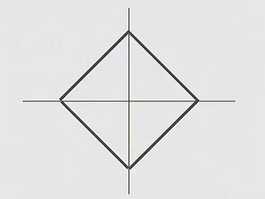
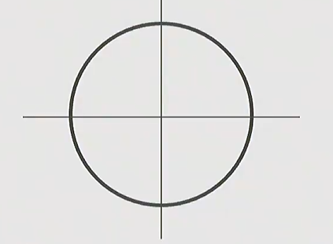

---

## 课程定位

 **深度学习如何解决计算机视觉问题**。它处在几个领域的交叉处：

- **人工智能 AI**：让机器表现出智能行为。
- **机器学习 ML**：从数据中学习规律，而不是手写规则。
- **深度学习 DL**：用多层神经网络学习特征表示。
- **计算机视觉 CV**：让机器从图像、视频、3D 场景等视觉数据中理解世界。

本课程的核心问题可以概括为：

> 如何把原始像素映射为语义理解、空间理解、生成能力与交互能力？

---

## 课程结构
课程大致分为四块：

1. **Deep Learning Basics**
   - 图像分类
   - KNN 与线性分类器
   - 损失函数
   - 优化
   - 反向传播
   - 多层感知机与神经网络

2. **Perceiving and Understanding the Visual World**
   - CNN
   - 经典 CNN 架构
   - RNN
   - Attention / Transformer
   - 目标检测
   - 图像分割
   - 视频理解
   - 视觉语言

3. **Reconstructing and Interacting with the Visual World**
   - 自监督学习
   - 生成模型
   - 3D 视觉
   - 机器人学习

4. **Human-Centered AI**
   - 公平性
   - 偏见
   - 伦理风险
   - 社会影响
--- 
## 视觉与深度学习的发展

####  生物视觉启发

- **Hubel & Wiesel, 1959**：发现视觉皮层中存在对特定方向、边缘、运动响应的神经元。
- **简单细胞 Simple Cells**：响应局部方向、边缘等模式。
- **复杂细胞 Complex Cells**：对位置变化更稳健，体现一定的平移不变性。

这一脉络后来影响了卷积神经网络中的：

- 局部感受野
- 分层特征
- 卷积
- 池化
- 对平移和局部扰动的鲁棒性

#### 早期模型驱动

早期计算机视觉试图手工定义视觉理解流程：

- **Roberts, 1963**：从 2D 图像推断 3D 几何结构。
- **David Marr, 1970s**：提出视觉表示阶段：
  - 原始图像
  - Primal Sketch：边缘、线段、纹理等低层结构
  - 2.5D Sketch：局部表面方向、深度关系
  - 3D Model：物体级三维表示
- **Recognition by Parts**：用部件组合识别物体，例如 generalized cylinders。
- **Canny Edge Detector, 1986**：经典边缘检测。
- **Normalized Cuts, 1997**：图像分割中的图划分思想。
- **SIFT, 1999**：局部特征匹配，具有尺度和旋转鲁棒性。
- **Viola-Jones, 2001**：机器学习驱动的人脸检测，是早期成功的视觉应用之一。

这一阶段的特点：

- 强依赖手工特征与几何假设。
- 能解决部分受控问题，但难以覆盖真实世界复杂变化。

#### 神经网络发展

- **Perceptron, 1958**：早期线性分类器。
- **Minsky & Papert, 1969**：指出单层感知机无法学习 XOR，引发神经网络低潮。
- **Neocognitron, 1980**：受视觉皮层启发，交替使用类似卷积和池化的结构，但缺少有效训练算法。
- **Backpropagation, 1986**：反向传播可高效计算多层网络梯度。
- **LeNet, 1998**：卷积网络成功应用于手写数字识别。
- **2000s Deep Learning**：更深网络开始被探索，但受限于数据、算力和训练技术。

####  ImageNet 与 AlexNet

深度学习真正爆发来自三个条件同时成熟：

- **Data**：ImageNet 提供大规模标注图像，分类挑战包含约 1000 类、百万级图像。
- **Algorithms**：反向传播、卷积网络、激活函数、正则化、优化技巧持续积累。
- **Computation**：GPU 和后来的 Tensor Cores 让大模型训练可行。

关键节点：

- **ImageNet, 2009**：大规模视觉识别数据集。
- **AlexNet, 2012**：在 ImageNet 上显著超过传统方法，使深度学习成为计算机视觉主流。

---

### 4. 深度学习在视觉中的应用扩展

从 2012 年以后，深度学习快速扩展到多个视觉任务：

- **图像分类 Image Classification**：判断整张图像属于哪个类别。
- **图像检索 Image Retrieval**：根据视觉相似性搜索图像。
- **目标检测 Object Detection**：输出物体类别和位置框。
- **语义分割 Semantic Segmentation**：为每个像素预测语义类别。
- **实例分割 Instance Segmentation**：区分同类不同实例。
- **视频理解 Video Understanding**：识别动作、事件和时序结构。
- **姿态估计 Pose Estimation**：识别人或物体关键点。
- **图像描述 Image Captioning**：把图像转换为自然语言描述。
- **视觉关系 Visual Relationship**：理解对象之间的关系，例如 “person riding bike”。
- **风格迁移 Style Transfer**：分离并重组内容和风格。
- **生成模型 Generative Models**：GAN、扩散模型、文本生成图像。
- **视觉语言模型 Vision-Language Models**：例如 CLIP，将图像和文本映射到共享语义空间。
- **3D 视觉 3D Vision**：从 2D/多视角数据恢复三维结构。
- **具身智能 Embodied AI / Robotics**：视觉感知与动作决策结合。

---

### 6. 任务类型：从分类到结构化理解

| 任务 | 输入 | 输出 | 技术重点 |
|---|---|---|---|
| 图像分类 | 一张图像 | 一个类别 | 全局语义识别 |
| 语义分割 | 一张图像 | 每个像素的类别 | 像素级预测 |
| 目标检测 | 一张图像 | 类别 + 边界框 | 物体定位与分类 |
| 实例分割 | 一张图像 | 每个实例的 mask | 同类实例区分 |
| 视频分类 | 视频序列 | 动作/事件类别 | 时序建模 |
| 多模态理解 | 图像/视频 + 文本 | 文本、检索、问答等 | 跨模态表征 |

---

### 7. 模型类型

- **MLP / 全连接网络**：把输入展平后用矩阵乘法建模，缺少显式空间归纳偏置。
- **CNN**：利用局部连接、权重共享、层级特征，适合图像网格结构。
- **RNN**：处理序列数据，适合早期视频、语言、序列建模。
- **Attention / Transformer**：用注意力机制建模长程依赖，成为视觉语言和大模型的重要基础。
- **生成模型**：学习数据分布，可以生成图像、补全图像、跨模态生成。

---

### 8. 大规模训练概念

当模型和数据超出单机能力时，需要分布式训练：

- **Data Parallelism 数据并行**
  - 每个 worker 拷贝一份模型。
  - 数据被切分到不同 worker。
  - 每轮同步或异步聚合梯度。

- **Model Parallelism 模型并行**
  - 模型被切分到不同设备。
  - 适合单个模型过大、无法放进一张 GPU 的场景。

- **Synchronous Gradient Updates**
  - 多个 worker 同步梯度后统一更新。
  - 稳定，但可能被慢 worker 拖慢。

- **Asynchronous Gradient Updates**
  - worker 独立提交梯度。
  - 吞吐更高，但梯度可能滞后。

---

### 9. 第一讲要抓住的核心观点

- 视觉不是简单的像素匹配，而是从低层信号到高层语义的表示学习问题。
- 深度学习的成功不是单点突破，而是 **数据 + 算法 + 算力** 的共同结果。
- CNN 的很多思想能追溯到生物视觉和早期视觉模型。
- 现代视觉已经从分类扩展到检测、分割、视频、3D、生成、视觉语言和机器人。
- 模型部署有现实风险，视觉系统既能造成伤害，也能带来重要价值。

---

## 第 2 讲：使用线性分类器进行图像分类

### 1. 图像分类任务

**图像分类 Image Classification**：

给定一张图像，从预设类别集合中预测一个标签。

例子：

```text
输入：一张 32 x 32 x 3 的 CIFAR-10 图像
输出：{airplane, automobile, bird, cat, deer, dog, frog, horse, ship, truck} 中的一个类别
```

计算机看到的图像是张量：

$$
x \in \mathbb{R}^{H \times W \times C}
$$

其中像素值通常在 $[0, 255]$ 或归一化后的 $[0, 1]$，数据张量为分辨率800×200×3通道。

---

### 2. Semantic Gap：语义鸿沟

人看到的是 “猫”，机器看到的是数字矩阵。这个差距就是语义鸿沟。

视觉分类的典型挑战：

- **Viewpoint Variation**：视角改变导致像素大幅变化。
- **Illumination**：光照变化改变颜色和阴影。
- **Background Clutter**：背景干扰目标识别。
- **Occlusion**：目标被遮挡。
- **Deformation**：物体形态变化，例如动物姿态。
- **Intraclass Variation**：同一类别内部差异巨大。
- **Context**：上下文会影响语义判断。

---

### 3. 数据驱动方法

传统手写规则难以穷尽所有视觉变化，因此采用数据驱动方法：

1. 收集带标签的数据集。
2. 用机器学习算法训练分类器。
3. 在未见过的新图像上评估。

标准流程：

```text
训练集 train：学习模型参数
验证集 validation：选择超参数
测试集 test：最终评估泛化性能，只在最后使用一次
```

---

### 4. Nearest Neighbor 分类器

#### 4.1 基本思想

最近邻分类器不真正 “训练”，而是记住所有训练样本。

预测时：

1. 计算测试图像与每张训练图像的距离。
2. 找到最相似的训练图像。
3. 复制它的标签作为预测结果。

复杂度：

| 阶段 | 复杂度 | 评价 |
|---|---:|---|
| 训练 | $O(1)$ | 只是记忆数据 |
| 预测 | $O(N)$ | 每次预测都要和训练集比较，速度慢 |

在实际深度学习系统中，通常希望训练可以慢一些，但预测要快。

#### 4.2 距离度量

常见距离：

**L1 / Manhattan Distance**

$$
d_1(x, y) = \sum_i |x_i - y_i|
$$


**L2 / Euclidean Distance**

$$
d_2(x, y) = \sqrt{\sum_i (x_i - y_i)^2}
$$

二者差异：

- L1 更像沿网格线移动，适合想做特征保留。
- L2 是直线距离。
- 距离选择会改变决策边界。

---

### 5. K-Nearest Neighbors

KNN 是最近邻的推广：

- 不只看最近的 1 个样本。
- 找到最近的 $K$ 个样本。
- 用多数投票决定类别。

关键超参数：

- $K$ 的取值
- 距离函数，例如 L1 或 L2

#### 为什么像素距离不好用

直接比较像素距离通常不是可靠的视觉语义度量。

例如：

- 图像平移 1 个像素，语义不变，但像素距离可能变大。
- 加一点色调变化，语义不变，但像素距离变化明显。
- 遮挡一部分图像，像素距离可能与完全不同语义的图像相近。

所以 KNN 是理解数据驱动分类的好起点，但不是现代图像分类的主力方法。

---

### 6. 超参数选择

**超参数 Hyperparameters** 是算法本身的选择，不是训练过程中直接学出来的参数。

例如：

- KNN 中的 $K$
- 距离度量 L1 / L2
- 学习率
- 正则化强度

错误做法：

- 在训练集上选超参数：容易过拟合。
- 在测试集上反复选超参数：会污染测试集，导致泛化评估失真。

正确做法：

```text
train：训练不同模型
validation：选择超参数
test：只在最终模型确定后评估一次
```

小数据集可以使用 **Cross-Validation 交叉验证**：

- 把训练数据分成多个 fold。
- 每次用一个 fold 做验证集，其余做训练集。
- 对多次验证结果取平均。

深度学习中交叉验证不常用，原因是训练成本高，通常使用固定验证集。

---

### 7. 线性分类器：Parametric Approach

KNN 需要保留整个训练集，而线性分类器只保留参数。

线性分类器形式：

$$
f(x, W, b) = Wx + b
$$

其中：

- $x$：输入图像展平后的向量。
- $W$：权重矩阵。
- $b$：偏置向量。
- $f(x, W, b)$：每个类别的分数，也叫 logits。

以 CIFAR-10 为例：

$$
x \in \mathbb{R}^{3072}
$$

因为：

$$
32 \times 32 \times 3 = 3072
$$

若有 10 个类别：

$$
W \in \mathbb{R}^{10 \times 3072}, \quad b \in \mathbb{R}^{10}
$$

输出：

$$
s = Wx + b \in \mathbb{R}^{10}
$$

每个 $s_j$ 表示图像属于第 $j$ 类的分数。

---

### 8. 如何理解线性分类器

#### 8.1 代数视角

线性分类器对输入做矩阵乘法：

$$
s_j = W_j x + b_j
$$

其中 $W_j$ 是第 $j$ 类的权重向量。

#### 8.2 视觉模板视角

每一类的权重 $W_j$ 可以看作一个 “类别模板”。

- 如果输入图像与某类模板相似，该类得分更高。
- 线性分类器每类只有一个模板，因此表达能力有限。

#### 8.3 几何视角

线性分类器在特征空间中学习线性决策边界：

- 二分类中是直线或超平面。
- 多分类中是一组超平面。

局限：

- 难以处理 XOR 这类非线性结构。
- 难以处理环形分布。
- 难以处理同一类别多模态分布。

---

### 9. 训练线性分类器需要两件事

1. **损失函数 Loss Function**
   - 衡量当前参数 $W, b$ 的预测有多差。

2. **优化算法 Optimization**
   - 找到让损失尽可能小的参数。

数据集平均损失：

$$
L = \frac{1}{N}\sum_{i=1}^{N} L_i
$$

其中 $L_i$ 是第 $i$ 个样本的损失。

---

### 10. Softmax 分类器

Softmax 分类器又称 **Multinomial Logistic Regression**。

它把 logits 转换为概率：

$$
p_j = \frac{e^{s_j}}{\sum_k e^{s_k}}
$$

其中：

- $s_j$：第 $j$ 类的 logit。
- $p_j$：第 $j$ 类的预测概率。
- 所有 $p_j \ge 0$。
- 所有概率之和为 1。

正确类别为 $y_i$ 时，单样本交叉熵损失：

$$
L_i = -\log p_{y_i}
$$

展开为：

$$
L_i = -\log \frac{e^{s_{y_i}}}{\sum_j e^{s_j}}
$$

等价于：

$$
L_i = -s_{y_i} + \log \sum_j e^{s_j}
$$

直觉：

- 正确类别概率越接近 1，损失越接近 0。
- 正确类别概率越接近 0，损失越大。

初始化时如果所有类别分数接近相等，且共有 $C$ 类：

$$
p_j \approx \frac{1}{C}
$$

所以：

$$
L_i \approx -\log \frac{1}{C} = \log C
$$

例如 CIFAR-10 有 10 类：

$$
L_i \approx \log 10 \approx 2.3
$$

---

### 11. Multiclass SVM Loss

SVM 损失关注的是 **margin**：正确类别分数应该比错误类别至少高出一个间隔 $\Delta$。

单样本多分类 SVM 损失：

$$
L_i = \sum_{j \ne y_i} \max(0, s_j - s_{y_i} + \Delta)
$$

通常取：

$$
\Delta = 1
$$

含义：

- 如果错误类别分数 $s_j$ 太接近或超过正确类别分数 $s_{y_i}$，产生损失。
- 如果正确类别分数已经比错误类别高至少 $\Delta$，该错误类别贡献 0 损失。

当所有初始分数都接近 0 时：

$$
L_i \approx C - 1
$$

因为除正确类别外，每个错误类别都会贡献约 1 的 margin loss。

---

### 12. Softmax vs SVM

| 对比点 | Softmax | Multiclass SVM |
|---|---|---|
| 目标 | 最大化正确类别概率 | 让正确类别分数超过错误类别至少一个 margin |
| 输出解释 | 概率分布 | 类别分数间隔 |
| 损失形式 | 交叉熵 | hinge loss |
| 对分数变化的敏感度 | 即使分类正确，仍会继续推动概率更接近 1 | margin 满足后损失为 0 |
| 常见用途 | 深度学习分类主流 | 传统线性分类与理解 margin 很重要 |

重要区别：

- Softmax 关心完整概率分布。
- SVM 更关心正确类别和错误类别之间是否拉开足够间隔。
- 两者都需要通过优化算法调整 $W$，本讲主要先定义损失，后续讲优化。
---
## 第三讲：正则化
- 正则化