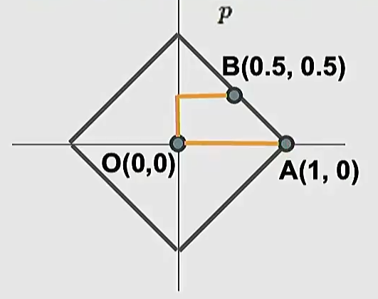
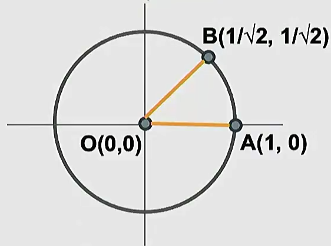
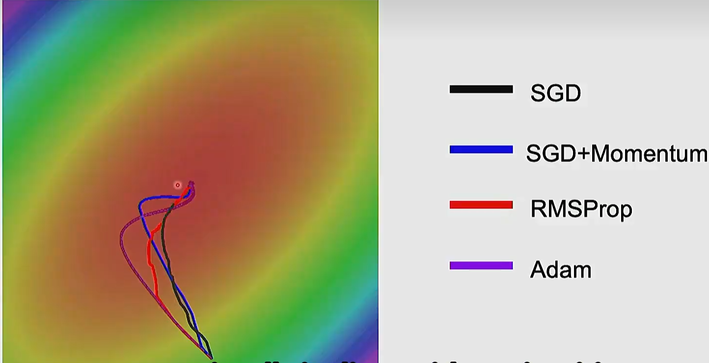
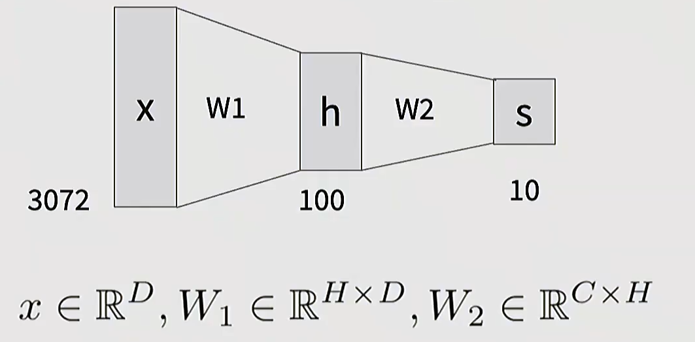
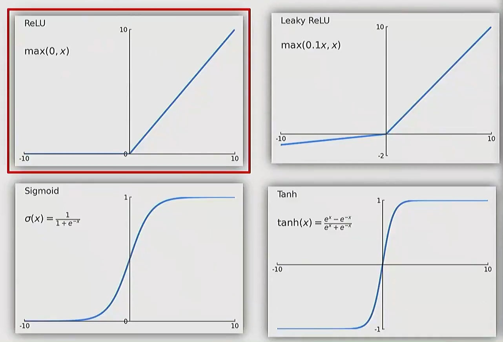
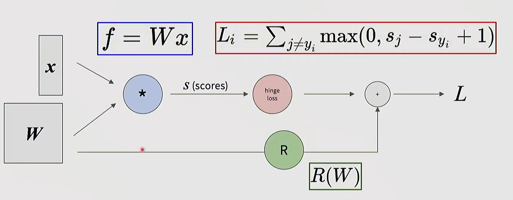

# Stanford CS231n：深度学习与计算机视觉


## 课程导览

### 章节索引

- 基础：[[#第 1 讲：课程介绍与视觉发展]] · [[#第 2 讲：分类器]] · [[#第 3 讲：正则化和优化]] · [[#第 4 讲：神经网络与反向传播]]
- 视觉理解：[[#第 5 讲：卷积神经网络 CNN]] · [[#第 6 讲：训练神经网络]] · [[#第 7 讲：RNN]] · [[#第 8 讲：Attention and Transformers]] · [[#第 9 讲：Object Detection, Image Segmentation, Visualization]] · [[#第 10 讲：Video Understanding]] · [[#第 11 讲：大规模分布式训练]]
- 生成与交互智能：[[#第 12 讲：自监督学习]] · [[#第 13 讲：生成模型（一）]] · [[#第 14 讲：生成模型（二）]] · [[#第 15 讲：3D 视觉]] · [[#第 16 讲：视觉与语言]]

### 课程知识主线

课程大致分为四块：

1. **Deep Learning Basics**
   - 图像分类
   - KNN 与线性分类器
   - 损失函数
   - 优化
   - 反向传播
   - 多层感知机与神经网络

2. **Perceiving and Understanding the Visual World**
   - CNN
   - 经典 CNN 架构
   - RNN
   - Attention / Transformer
   - 目标检测
   - 图像分割
   - 视频理解
   - 视觉语言

3. **Reconstructing and Interacting with the Visual World**
   - 自监督学习
   - 生成模型
   - 3D 视觉
   - 机器人学习

4. **Human-Centered AI**
   - 公平性
   - 偏见
   - 伦理风险
   - 社会影响
--- 
## 第 1 讲：课程介绍与视觉发展

### 1. 生物视觉启发

- **Hubel & Wiesel, 1959**：发现视觉皮层中存在对特定方向、边缘、运动响应的神经元。
- **简单细胞 Simple Cells**：响应局部方向、边缘等模式。
- **复杂细胞 Complex Cells**：对位置变化更稳健，体现一定的平移不变性。

这一脉络后来影响了卷积神经网络中的：

- 局部感受野
- 分层特征
- 卷积
- 池化
- 对平移和局部扰动的鲁棒性

### 2. 早期模型驱动

早期计算机视觉试图手工定义视觉理解流程：

- **Roberts, 1963**：从 2D 图像推断 3D 几何结构。
- **David Marr, 1970s**：提出视觉表示阶段：
  - 原始图像
  - Primal Sketch：边缘、线段、纹理等低层结构
  - 2.5D Sketch：局部表面方向、深度关系
  - 3D Model：物体级三维表示
- **Recognition by Parts**：用部件组合识别物体，例如 generalized cylinders。
- **Canny Edge Detector, 1986**：经典边缘检测。
- **Normalized Cuts, 1997**：图像分割中的图划分思想。
- **SIFT, 1999**：局部特征匹配，具有尺度和旋转鲁棒性。
- **Viola-Jones, 2001**：机器学习驱动的人脸检测，是早期成功的视觉应用之一。

这一阶段的特点：

- 强依赖手工特征与几何假设。
- 能解决部分受控问题，但难以覆盖真实世界复杂变化。

### 3. 神经网络发展

- **Perceptron, 1958**：早期线性分类器。
- **Minsky & Papert, 1969**：指出单层感知机无法学习 XOR，引发神经网络低潮。
- **Neocognitron, 1980**：受视觉皮层启发，交替使用类似卷积和池化的结构，但缺少有效训练算法。
- **Backpropagation, 1986**：反向传播可高效计算多层网络梯度。
- **LeNet, 1998**：卷积网络成功应用于手写数字识别。
- **2000s Deep Learning**：更深网络开始被探索，但受限于数据、算力和训练技术。

### 4. ImageNet 与 AlexNet

深度学习真正爆发来自三个条件同时成熟：

- **Data**：ImageNet 提供大规模标注图像，分类挑战包含约 1000 类、百万级图像。
- **Algorithms**：反向传播、卷积网络、激活函数、正则化、优化技巧持续积累。
- **Computation**：GPU 和后来的 Tensor Cores 让大模型训练可行。

关键节点：

- **ImageNet, 2009**：大规模视觉识别数据集。
- **AlexNet, 2012**：在 ImageNet 上显著超过传统方法，使深度学习成为计算机视觉主流。

***

### 5. 深度学习在视觉中的应用扩展

从 2012 年以后，深度学习快速扩展到多个视觉任务：

- **图像分类 Image Classification**：判断整张图像属于哪个类别。
- **图像检索 Image Retrieval**：根据视觉相似性搜索图像。
- **目标检测 Object Detection**：输出物体类别和位置框。
- **语义分割 Semantic Segmentation**：为每个像素预测语义类别。
- **实例分割 Instance Segmentation**：区分同类不同实例。
- **视频理解 Video Understanding**：识别动作、事件和时序结构。
- **姿态估计 Pose Estimation**：识别人或物体关键点。
- **图像描述 Image Captioning**：把图像转换为自然语言描述。
- **视觉关系 Visual Relationship**：理解对象之间的关系，例如 “person riding bike”。
- **风格迁移 Style Transfer**：分离并重组内容和风格。
- **生成模型 Generative Models**：GAN、扩散模型、文本生成图像。
- **视觉语言模型 Vision-Language Models**：例如 CLIP，将图像和文本映射到共享语义空间。
- **3D 视觉 3D Vision**：从 2D/多视角数据恢复三维结构。
- **具身智能 Embodied AI / Robotics**：视觉感知与动作决策结合。

***

### 6. 模型类型

- **MLP / 全连接网络**：把输入展平后用矩阵乘法建模，缺少显式空间归纳偏置。
- **CNN**：利用局部连接、权重共享、层级特征，适合图像网格结构。
- **RNN**：处理序列数据，适合早期视频、语言、序列建模。
- **Attention / Transformer**：用注意力机制建模长程依赖，成为视觉语言和大模型的重要基础。
- **生成模型**：学习数据分布，可以生成图像、补全图像、跨模态生成。

***

## 第 2 讲：分类器

###  图像分类任务

**图像分类 Image Classification**：

给定一张图像，从预设类别集合中预测一个标签。

例子：

```text
输入：一张 32 x 32 x 3 的 CIFAR-10 图像
输出：{airplane, automobile, bird, cat, deer, dog, frog, horse, ship, truck} 中的一个类别
```

计算机看到的图像是张量：

$$
x \in \mathbb{R}^{H \times W \times C}
$$

其中像素值通常在 $[0, 255]$ 或归一化后的 $[0, 1]$。例如 CIFAR-10 的单张彩色图像形状是 $32\times32\times3$。

视觉分类的典型挑战：视角改变导致像素大幅变化、
- **Illumination**：光照变化改变颜色和阴影、背景干扰、目标被遮挡、类间差异等。

***

###  数据驱动方法

传统手写规则难以穷尽所有视觉变化，因此采用数据驱动方法：

1. 收集带标签的数据集。
2. 用机器学习算法训练分类器。
3. 在未见过的新图像上评估。

标准流程：

```text
训练集 train：学习模型参数
验证集 validation：选择超参数
测试集 test：最终评估泛化性能，只在最后使用一次
```

***

### 1. Nearest Neighbor 分类器

#### 1.1 基本思想

最近邻分类器不真正 “训练”，而是记住所有训练样本。

预测时：

1. 计算测试图像与每张训练图像的距离。
2. 找到最相似的训练图像。
3. 复制它的标签作为预测结果。

复杂度：

| 阶段 | 复杂度 | 评价 |
|---|---:|---|
| 训练 | $O(1)$ | 只是记忆数据 |
| 预测 | $O(N)$ | 每次预测都要和训练集比较，速度慢 |

在实际深度学习系统中，通常希望训练可以慢一些，但预测要快。

#### 1.2 距离度量

**常见距离：**

**L1 / Manhattan Distance**

$$
d_1(x, y) = \sum_i |x_i - y_i|
$$



***
**L2 / Euclidean Distance**

$$
d_2(x, y) = \sqrt{\sum_i (x_i - y_i)^2}
$$



二者差异：

- L1 更像沿网格线移动，适合想做特征保留。
- L2 是直线距离。
- 距离选择会改变决策边界。

***

### 2. K-Nearest Neighbors

KNN 是最近邻的推广：

- 不只看最近的 1 个样本。
- 找到最近的 $K$ 个样本。
- 用多数投票决定类别。

关键超参数：

- $K$ 的取值
- 距离函数，例如 L1 或 L2

#### 直接比较像素距离通常不是可靠的视觉语义度量。

例如：

- 图像平移 1 个像素，语义不变，但像素距离可能变大。
- 加一点色调变化，语义不变，但像素距离变化明显。
- 遮挡一部分图像，像素距离可能与完全不同语义的图像相近。

所以 KNN 是理解数据驱动分类的好起点，但不是现代图像分类的主力方法。

***

###  超参数选择

**超参数 Hyperparameters** 是算法本身的选择，不是训练过程中直接学出来的参数。

例如：

- KNN 中的 $K$
- 距离度量 L1 / L2
- 学习率
- 正则化强度

错误做法：

- 在训练集上选超参数：容易过拟合。
- 在测试集上反复选超参数：会污染测试集，导致泛化评估失真。

正确做法：

```text
train：训练不同模型
validation：选择超参数
test：只在最终模型确定后评估一次
```

小数据集可以使用 **Cross-Validation 交叉验证**：

- 把训练数据分成多个 fold。
- 每次用一个 fold 做验证集，其余做训练集。
- 对多次验证结果取平均。

深度学习中交叉验证不常用，原因是训练成本高，通常使用固定验证集。

***

### 3. 线性分类器：Parametric Approach

KNN 需要保留整个训练集，而线性分类器只保留参数。

线性分类器对输入做矩阵乘法：

$$
f(x, W, b) = Wx + b
$$

其中：

- $x$：输入图像展平后的向量。
- $W$：权重矩阵。==我们重点关注哪些==
- $b$：偏置向量。==需要我们的权重组合到达想要的值==
- $f(x, W, b)$：每个类别的分数，也叫 logits。

例：以 CIFAR-10 将image分类到10个类中

$$
x \in \mathbb{R}^{3072}
$$

因为：

$$
32 \times 32 \times 3 = 3072
$$

若有 10 个类别：

$$
W \in \mathbb{R}^{10 \times 3072}, \quad b \in \mathbb{R}^{10}
$$

输出：

$$
s = Wx + b \in \mathbb{R}^{10}
$$

s为10×1的矩阵，每个 $s_j$ 表示图像属于第 $j$ 类的分数。

 - **损失函数 Loss Function**
   - 衡量当前参数 $W, b$ 的预测有多差。

- **优化算法 Optimization**
   - 找到让损失尽可能小的参数。

数据集平均损失：

$$
L = \frac{1}{N}\sum_{i=1}^{N} L_i
$$

其中 $L_i$ 是第 $i$ 个样本的损失。


***

### 4. Softmax 分类器

它把 logits 转换为概率：

$$
p_j = \frac{e^{s_j}}{\sum_k e^{s_k}}
$$

其中：

- $s_j$：第 $j$ 类的 logit。
- $p_j$：第 $j$ 类的预测概率。
正确类别为 $y_i$ 时，单样本交叉熵损失：

$$
L_i = -\log p_{y_i}
$$


等价于：

$$
L_i = -s_{y_i} + \log \sum_j e^{s_j}
$$

- 正确类别概率越接近 1，损失越接近 0。
- 正确类别概率越接近 0，损失越大。

初始化时如果所有类别分数接近相等，且共有 $C$ 类：

$$
p_j \approx \frac{1}{C}
$$

所以：

$$
L_i \approx -\log \frac{1}{C} = \log C
$$

例如 CIFAR-10 有 10 类：

$$
L_i \approx \log 10 \approx 2.3
$$

***

### 附加： Multiclass SVM Loss

SVM 损失关注的是 **margin**：正确类别分数应该比错误类别至少高出一个间隔 $\Delta$。

单样本多分类 SVM 损失：

$$
L_i = \sum_{j \ne y_i} \max(0, s_j - s_{y_i} + \Delta)
$$

通常取：

$$
\Delta = 1
$$

含义：

- 如果错误类别分数 $s_j$ 太接近或超过正确类别分数 $s_{y_i}$，产生损失。
- 如果正确类别分数已经比错误类别高至少 $\Delta$，该错误类别贡献 0 损失。

当所有初始分数都接近 0 时：

$$
L_i \approx C - 1
$$

因为除正确类别外，每个错误类别都会贡献约 1 的 margin loss。

***

### 对比 Softmax vs SVM

| 对比点       | Softmax              | Multiclass SVM           |
| --------- | -------------------- | ------------------------ |
| 目标        | 最大化正确类别概率            | 让正确类别分数超过错误类别至少一个 margin |
| 输出解释      | 概率分布                 | 类别分数间隔                   |
| 损失形式      | 交叉熵                  | hinge loss               |
| 对分数变化的敏感度 | 即使分类正确，仍会继续推动概率更接近 1 | margin 满足后损失为 0          |
| 常见用途      | 深度学习分类主流             | 传统线性分类与理解 margin 很重要     |

重要区别：

- Softmax 关心完整概率分布。
- SVM 更关心正确类别和错误类别之间是否拉开足够间隔。
- 两者都需要通过优化算法调整 $W$，本讲主要先定义损失，后续讲优化。

***

## 第 3 讲：正则化和优化

### 1. 从分类器到完整的目标函数

第 2 讲已经建立了图像分类的基本框架：

- 数据集：$(x_i, y_i)$，其中 $x_i$ 是图像，$y_i$ 是类别标签。
- 打分函数：$f(x, W)$，线性分类器中常写作 $f(x, W)=Wx+b$。
- 损失函数：衡量当前参数产生的分数有多差。

训练时真正最小化的是 **数据损失 + 正则化损失**：

$$
L(W) = \frac{1}{N} \sum_{i=1}^{N} L_i(f(x_i, W), y_i) + \lambda R(W)
$$

其中：

- $\frac{1}{N}\sum_i L_i$：要求模型预测匹配训练数据。
- $R(W)$：对参数形态施加偏好。
- $\lambda$：正则化强度，是超参数。

***
### 2. 正则化
	正则化会阻止模型把训练集拟合得过于完美，所以训练损失通常会变大；但它减少了模型对训练噪声、偶然模式和异常样本的依赖，因此测试集泛化可能更好。
正则化的核心目标：

- 偏好更简单的模型。
- 避免过拟合训练数据中的噪声。
- 在多个能解释训练数据的假设中，选择更可能泛化的一个。
- 有时还能改善优化曲面的性质，例如增加曲率，让优化更稳定。

这对应 Occam's Razor：

> 在多个竞争解释中，优先选择更简单的解释。

***

#### 2.1 常见正则化形式

##### L2 Regularization

$$
R(W) = \sum_k W_k^2
$$

特点：

- 惩罚大权重。
- 倾向于把权重“摊开”，让多个特征共同承担预测。
- 在深度学习里常和 weight decay 相关。

##### L1 Regularization

$$
R(W) = \sum_k |W_k|
$$

特点：

- 更容易产生稀疏权重。
- 倾向于让部分参数变成 0，从而做特征选择。

##### Elastic Net

$$
R(W) = \alpha \sum_k |W_k| + \beta \sum_k W_k^2
$$

结合 L1 的稀疏性和 L2 的平滑惩罚。

#### 更复杂的正则化

- Dropout
- Batch Normalization
- Stochastic Depth
- Fractional Pooling
- Data Augmentation

这些方法不一定都以显式 $R(W)$ 的形式出现，但本质上都在限制模型过拟合或改善训练动态。

***

### 3. 优化问题：如何找到好的 $W$
==网络学习（最小化成本函数）

网络以数据为输入，基于权重和偏置输出
成本函数以权重和偏置为输入，基于训练样本，输出一个‘衡量糟糕程度’的数值；
成本函数梯度告诉了我们对这些权重和偏执做哪些微调会让成本函数的值变化最快（哪些权重的哪些改变最要紧）

我们随机初始化权重结果一定会变得很糟糕，我们将输出的值与理想值做差，求出平方和：==
             ==（a0-A0）²+（a1-A1）²+==
        ==越接近理想值，结果就越小，于是我们可以把这个当成一个成本函数求最小值。重要的是，成本函数会对所有训练数据取平均，意味着在所有样本上表现最好。

#### 3.1 Gradient
任意方向的斜率可以看作该方向与梯度的点积；最陡下降方向是负梯度方向。

数值梯度用有限差分近似：

$$
\frac{\partial L}{\partial W_k} \approx \frac{L(W + h e_k) - L(W)}{h}
$$


> 用解析梯度训练，用数值梯度做 gradient check。

***

#### 3.2 梯度下降

基础梯度下降更新：

$$
W \leftarrow W - \eta \nabla_W L(W)
$$

其中：

- $\eta$：learning rate，学习率/步长。
- $\nabla_W L(W)$：当前参数处的梯度。

学习率太大可能导致 loss 爆炸；学习率太小会收敛很慢。

***

### 4. 随机梯度下降:Stochastic Gradient Descent

完整数据损失：

$$
L(W) = \frac{1}{N}\sum_{i=1}^{N}L_i
$$

当 $N$ 很大时，每一步都遍历全量数据非常昂贵。SGD 用 数据子集进行操作：

$$
\nabla_W L(W) \approx \frac{1}{B}\sum_{i \in \mathcal{B}}\nabla_W L_i
$$

常见 batch size：32/64/128/256

SGD 的核心取舍：

- 每一步更便宜。
- 梯度有噪声。
- 噪声有时能帮助逃离鞍点，但也会造成震荡。

***

#### 4.1 SGD 的三个典型问题

##### Problem 1：病态曲率 损失在一个方向变化很快、另一个方向变化很慢：

- 陡峭方向上会来回震荡。
- 平缓方向上前进很慢。

##### Problem 2：局部最小值与鞍点

- 鞍点附近梯度可能接近 0，普通梯度下降会变慢甚至卡住。

##### Problem 3：Mini-batch 噪声

- SGD 用小批量估计梯度，所以每一步方向不一定等于真实全量梯度，会产生抖动。

***

### 4.2 Momentum

SGD + Momentum 引入速度变量，保留历史方向：

$$
v \leftarrow \rho v - \eta \nabla_W L(W)
$$
按速度更新
$$
W \leftarrow W + v
$$

其中：

- $\rho$：momentum / friction，常见取值 $0.9$ 或 $0.99$。
- 在连续一致的方向上加速。
- 在震荡方向上互相抵消。
- 更容易穿过局部噪声和鞍点附近的平坦区域。

***

### 5. RMSProp

RMSProp 为每个参数维护梯度平方的滑动平均：

$$
square \leftarrow decay \cdot square + (1-decay)\cdot g^2
$$

$$
W \leftarrow W - \eta \frac{g}{\sqrt{square}+\epsilon}
$$

作用：

- 梯度长期很大的方向，步长被压小。
- 梯度长期很小的方向，步长相对变大。
- 可以看作 per-parameter learning rate / adaptive learning rate。

***

### 6. Adam 与 AdamW

Adam 结合了 Momentum 和 RMSProp：

- 一阶矩估计 $m$：类似 momentum，跟踪梯度均值。
- 二阶矩估计 $v$：跟踪梯度平方均值。
- bias correction：修正初始时 $m, v$ 从 0 开始导致的偏差。

常用初始选择：

```text
beta1 = 0.9
beta2 = 0.999
learning_rate = 1e-3 或 5e-4
```

AdamW 是 Adam 的常用变体，重点是 **decoupled weight decay**：

- 标准 Adam 中，L2 正则项会进入梯度并参与 moment 计算。
- AdamW 把 weight decay 从梯度 moment 计算中解耦，作为更新后的额外衰减项。

实践上，AdamW 通常是训练深度模型的稳妥默认选择。



***

### 7. Learning Rate Schedule

几乎所有优化器都需要学习率。学习率策略决定训练过程中 $\eta$ 如何变化。

常见策略：

- **Step Decay**：在固定 epoch 把学习率乘以某个比例，例如 ResNet 常见的 30/60/90 epoch 衰减。
- **Cosine Decay**：按照余弦曲线平滑下降。
- **Linear Decay**：线性下降。
- **Inverse Square Root Decay**：常见于 Transformer 训练。
- **Linear Warmup**：初期从 0 线性增大学习率，防止训练初期 loss 爆炸。

经验规则：

> 如果 batch size 增大 $N$ 倍，初始 learning rate 往往也可以近似增大 $N$ 倍。

这只是经验起点，最终仍要靠验证集和训练曲线调参。

***

####  一阶优化与二阶优化

##### First-Order Optimization

只使用梯度构造线性近似：

1. 用梯度近似当前局部损失形状。
2. 沿负梯度方向走一步。

SGD、Momentum、RMSProp、Adam、AdamW 都属于一阶方法。

##### Second-Order Optimization

二阶方法使用 Hessian 构造二次近似：

$$
H = \nabla_W^2 L(W)
$$

问题：

- Hessian 有 $O(N^2)$ 个元素。
- 求逆通常需要 $O(N^3)$。
- 深度模型参数量可能是千万级或亿级，直接二阶方法不可行。

L-BFGS 等方法会近似 Hessian 或逆 Hessian，但在 mini-batch 噪声环境下效果不总是稳定。

***

## 第 4 讲：神经网络与反向传播

### 1. 从线性分类器到神经网络

线性分类器：

$$
s = Wx + b
$$

两层全连接神经网络：

$$
h = \sigma(W_1x + b_1)
$$

$$
s = W_2h + b_2
$$

其中：

- $x$：输入图像向量。
- $h$：隐藏层表示。
- $s$：类别分数 logits。
- $\sigma$：activation function，激活函数。

以 CIFAR-10 为例：



- 线性分类器直接学习 10 个类别模板。
- 两层网络可以先学习大量中间模板，再组合成类别分数。
- 隐藏层让不同类别可以共享特征。

***

####  为什么必须有非线性

如果没有激活函数：

$$
s = W_2(W_1x) = (W_2W_1)x
$$

这仍然只是一个线性分类器。

非线性的作用：

- 改变输入空间的表示。
- 让原本线性不可分的数据变得可分。
- 多层线性 + 非线性叠加后，模型表达能力远强于单个线性分类器。

常用默认激活函数：为了引入非线性，且根据问题特征函数选取，经验性的 



ReLU 的特点：

- 计算简单。
- 梯度传播相对稳定。
- 是许多视觉模型的可靠默认选择。
- 但存在一直为0的情况

***

### 2. 模型容量与正则化

更多层、更宽隐藏层通常意味着更大容量。

> 不要主要靠缩小网络规模来做正则化；更常见做法是使用足够大的模型，再用正则化控制泛化。

原因：

- 小模型可能表达能力不足，直接欠拟合。
- 大模型加合适正则化通常更容易优化，也更容易取得好结果。

***

### 3. 神经网络和生物神经元的关系

神经网络历史上受到生物神经元启发，但不能过度类比。

差异：

- 生物神经元类型很多，连接模式复杂。
- 树突本身可能执行复杂非线性计算。
- 突触不是单个静态权重，而是复杂动态系统。
- 人工神经网络为了计算效率，通常组织成规则层结构。

所以更准确的理解是：

> 现代神经网络是可微分函数组合系统，而不是大脑的精确模拟。

***

### 4. 神经网络的训练目标

把线性打分函数替换为非线性网络后，整体训练目标仍然是：

$$
L = L_{\text{data}} + \lambda R(W)
$$

例如：

```text
输入图像 x
-> 神经网络产生 logits s
-> Softmax 或 SVM loss
-> 加上 regularization
-> 得到总损失 L
```

关键问题变成：

> 如何高效计算每个参数对损失的梯度？

也就是：

$$
\frac{\partial L}{\partial W_1}, \quad \frac{\partial L}{\partial W_2}, \quad \frac{\partial L}{\partial b_1}, \quad \frac{\partial L}{\partial b_2}
$$

手推完整矩阵微积分对复杂模型不可行，因此需要计算图和反向传播。

***

### 5. Computational Graph

计算图把复杂函数拆成简单操作节点：

每个节点负责：

- forward：计算输出，并缓存 backward 需要的中间值。
- backward：根据 upstream gradient 和 local gradient 计算 downstream gradients。

这种模块化方式使复杂模型可组合：

- 换 loss 不需要重推整个模型。
- 换层结构只要每个节点实现 forward/backward。
- PyTorch、TensorFlow 等框架本质上都在维护类似的计算图和自动求导系统。

***

### 6. Backpropagation 
反向传播就是在计算图上递归应用链式法则。

对一个节点：

```text
输入 x -> 节点 f -> 输出 z -> 损失 L
```

如果已知 upstream gradient：

$$
\frac{\partial L}{\partial z}
$$

并能计算 local gradient：

$$
\frac{\partial z}{\partial x}
$$

那么：

$$
\frac{\partial L}{\partial x}
=
\frac{\partial L}{\partial z}
\frac{\partial z}{\partial x}
$$


***

### 7. 常见计算节点的梯度模式

#### 加

$$
z = x + y
$$

加法节点把 upstream gradient 原样分发给两个输入：

$$
\frac{\partial L}{\partial x} = \frac{\partial L}{\partial z}
$$

$$
\frac{\partial L}{\partial y} = \frac{\partial L}{\partial z}
$$

#### 乘

$$
z = xy
$$

乘法节点会交换乘数：

$$
\frac{\partial L}{\partial x} =
\frac{\partial L}{\partial z} \cdot y
$$

$$
\frac{\partial L}{\partial y} =
\frac{\partial L}{\partial z} \cdot x
$$

#### Copy Gate

如果一个变量被多个后续节点使用，反向传播时梯度相加：

$$
\frac{\partial L}{\partial x}
=
\sum_k \frac{\partial L}{\partial x}^{(k)}
$$

#### Max Gate

$$
z = \max(x, y)
$$

梯度只传给 forward 中取到最大值的输入，另一个输入梯度为 0。

#### Sigmoid

$$
\sigma(x)=\frac{1}{1+e^{-x}}
$$

局部梯度：

$$
\frac{d\sigma}{dx}=\sigma(x)(1-\sigma(x))
$$

***

### 8. Backprop 实现：forward / backward API

每个模块通常有两个接口：

```text
forward(x):
    计算输出 out
    缓存 backward 需要的中间值
    返回 out

backward(dout):
    使用缓存和 upstream gradient dout
    计算 dx, dW, db 等梯度
    返回梯度
```

forward pass：

- 从输入到输出计算分数和损失。
- 保存中间结果。

backward pass：

- **从损失开始反向传播**。
- 每个节点用链式法则计算输入和参数的梯度。

***

### 9. 向量、矩阵和张量的反向传播

标量情形下，梯度是数字；向量和矩阵情形下：

- $x$ 是向量时，$\frac{\partial L}{\partial x}$ 与 $x$ 形状相同。
- $W$ 是矩阵时，$\frac{\partial L}{\partial W}$ 与 $W$ 形状相同。
- 损失 $L$ 仍然是标量。

理论上向量到向量的导数是 Jacobian：

$$
J = \frac{\partial z}{\partial x}
$$

但实际深度学习中几乎不会显式构造完整 Jacobian，因为内存和计算量太大。

实践做法：

> 隐式计算 Jacobian-vector product，只保留需要的梯度张量。

***

### 10. ReLU 的向量反传

逐元素 ReLU：

$$
z = \max(0, x)
$$

反向传播：

$$
\frac{\partial L}{\partial x_i}
=
\begin{cases}
\frac{\partial L}{\partial z_i}, & x_i > 0 \\
0, & x_i \le 0
\end{cases}
$$

- forward 中激活的神经元传递梯度。
- 被截断为 0 的神经元不传递梯度。

---

## 第 5 讲：卷积神经网络 CNN 


传统全连接神经网络处理图像时，通常会把图像展平成一维向量。

例如：

```text
32 × 32 × 3 图像 → 3072 维向量
```

这样做的问题是：

- 图像原本具有二维空间结构展平后会破坏“上下左右”的空间位置信息；
- 像素之间有局部邻域关系；
- 参数量过大，容易过拟合。

CNN 的核心思想是：

> 利用卷积核在图像上滑动，通过局部连接和权重共享提取空间特征，再通过多层堆叠形成从低级纹理到高级语义的层级表达。

---

### 1. CNN 的基本组成

典型 CNN 结构通常由以下模块堆叠而成：

```text
Input → Convolution → ReLU → Pooling → Convolution → ReLU → Pooling → Fully Connected → Output
```

主要组成：

| 模块                    | 作用               |
| --------------------- | ---------------- |
| Convolution Layer     | 提取局部特征           |
| Activation Function   | 引入非线性表达能力        |
| Pooling Layer         | 降采样，减少尺寸，提高平移鲁棒性 |
| Fully Connected Layer | 综合特征并完成分类        |
| Softmax / Sigmoid     | 输出类别概率           |

ConvNet 是由卷积层、池化层和全连接层堆叠而成的网络。

---

### 2. 卷积层 Convolution Layer

>一个卷积核会同时覆盖所有输入通道。CS231n 中也将其解释为：一个 `5 × 5 × 3` 的 filter 与图像局部区域做点积，本质是一个 75 维向量点积。

---

#### 2.1. 卷积层的四个核心超参数

卷积层主要有四个超参数：

|超参数|英文|作用|
|---|---|---|
|卷积核数量|Number of filters / Cout|决定输出通道数|
|卷积核大小|Kernel size / F|决定局部感受野大小|
|步长|Stride / S|控制卷积核滑动间隔|
|填充|Padding / P|控制边缘补零，影响输出尺寸|


---

#### 2.2. 输出尺寸计算公式

假设输入尺寸为：

```text
W1 × H1 × C
```

卷积核大小为：

```text
F × F
```

padding 为：

```text
P
```

stride 为：

```text
S
```

输出尺寸为：

```text
W2 = (W1 - F + 2P) / S + 1
H2 = (H1 - F + 2P) / S + 1
```

输出通道数等于卷积核数量：

```text
Output: W2 × H2 × K
```


---

#### 2.3 Padding：为什么要补零？

如果不加 padding，卷积后特征图会不断变小。

例如：

```text
输入：7 × 7
卷积核：3 × 3
stride = 1
padding = 0

输出：(7 - 3) / 1 + 1 = 5
输出尺寸：5 × 5
```

问题：

- 图像边缘信息被利用次数少；
- 多层卷积后特征图迅速缩小；
- 深层网络难以保持空间分辨率。

因此使用 padding：

```text
padding = P
输出尺寸 = W - K + 1 + 2P
```

常见设置：

```text
当 kernel size = 3, stride = 1 时：
P = 1
输出尺寸保持不变
```
 
---

#### 2.4 Stride：步长的作用

Stride 表示卷积核每次滑动的距离。

```text
stride = 1：逐像素滑动，输出尺寸较大
stride = 2：隔一个像素滑动，输出尺寸减小
```

作用：

- 控制特征图大小；
- 实现降采样；
- 减少计算量；
- 扩大后续层的感受野。

示例：

```text
输入：7 × 7
卷积核：3 × 3
stride = 2
padding = 0

输出：(7 - 3) / 2 + 1 = 3
输出尺寸：3 × 3
```

---
#### 2.5 1 × 1 卷积

1 × 1 卷积看起来只覆盖一个像素，但它会跨通道计算。

假设输入为：

```text
56 × 56 × 64
```

使用 32 个 `1 × 1 × 64` 的卷积核：

```text
输出：56 × 56 × 32
```

作用：

- 改变通道数；
- 实现通道间信息融合；
- 降维；
- 减少计算量；
- 常用于 Inception、ResNet、MobileNet 等结构。
---
### 3. Receptive Field：感受野

感受野指的是：

> 输出特征图中某一个神经元，能够“看到”的原始输入区域大小。

对于单层卷积：

```text
kernel size = K
每个输出位置对应输入中的 K × K 区域
```

多层卷积后，感受野会逐层扩大。

如果 stride = 1，连续堆叠 L 层、kernel size = K 的卷积层，感受野近似为：

```text
Receptive Field = 1 + L × (K - 1)
```

例如：

```text
3 层 3 × 3 卷积：
RF = 1 + 3 × (3 - 1) = 7
```

也就是说，多个小卷积核堆叠可以获得较大的感受野。

---
### 4. 参数量计算

卷积层参数量：

```text
参数量 = F × F × Cin × Cout + Cout
```

其中：

- `F × F × Cin × Cout` 是卷积核权重；
    
- `Cout` 是 bias。
    

例子：

```text
输入：32 × 32 × 3
卷积核：5 × 5
卷积核数量：6
stride = 1
padding = 0
```

输出尺寸：

```text
W2 = (32 - 5 + 0) / 1 + 1 = 28
H2 = 28
输出：28 × 28 × 6
```

参数量：

```text
5 × 5 × 3 × 6 + 6 = 456
```

相比全连接层，CNN 的参数量明显减少。

---

### 5. Pooling Layer：池化层

池化层用于对局部区域进行降采样。

常见池化方式：

| 类型              | 操作       |
| --------------- | -------- |
| Max Pooling     | 取局部区域最大值 |
| Average Pooling | 取局部区域平均值 |

Max Pooling 示例：

```text
输入局部区域：
[1, 3
 2, 4]

Max Pooling 输出：4
```

池化层特点：

- 没有可学习参数；
- 降低特征图空间尺寸；
- 减少计算量；
- 提高一定程度的平移不变性；
- 保持通道数不变。
---

#### 5.1 Pooling 输出尺寸公式

假设输入为：

```text
W1 × H1 × C
```

池化核大小为：

```text
F
```

步长为：

```text
S
```

则输出尺寸：

```text
W2 = (W1 - F) / S + 1
H2 = (H1 - F) / S + 1
```

输出通道数不变：

```text
Output: W2 × H2 × C
```

典型设置：

```text
2 × 2 Max Pooling, stride = 2
```

作用：

```text
H × W × C → H/2 × W/2 × C
```
---

### 6. CNN 与全连接网络的区别

| 对比项    | 全连接网络 MLP | CNN         |
| ------ | --------- | ----------- |
| 输入处理   | 展平图像      | 保留空间结构      |
| 参数连接   | 全连接       | 局部连接        |
| 参数共享   | 无         | 有           |
| 参数量    | 大         | 小           |
| 图像任务表现 | 较弱        | 较强          |
| 特征提取   | 依赖人工或隐式学习 | 自动学习局部到全局特征 |

#### CNN 的核心优势

####  局部连接

图像中相邻像素关系更强，因此卷积只关注局部区域。

优点：

- 保留局部空间结构；
- 降低参数量
- 更符合图像数据特性。
---

####  权重共享

同一个卷积核会在整张图像上滑动。

含义：

```text
同一个特征检测器可以在不同位置检测相同模式
```

例如：

- 横向边缘可以出现在左上角，也可以出现在右下角；
- 卷积核在所有位置共享参数；
- 因此 CNN 对位置变化更鲁棒
---

####  层级特征表达

CNN 会逐层学习：
```text
浅层：边缘、纹理、颜色
中层：局部结构、形状、器官边界
深层：语义类别、病灶模式、整体结构
```

医学图像中可以理解为：

```text
浅层：灰度变化、边缘、纹理
中层：组织结构、器官轮廓
深层：病灶区域、疾病相关影像模式
```

---

### 7. CNN 在医学图像中的应用理解

在医学图像处理中，CNN 常用于：

| 任务  | 示例                      |     |
| --- | ----------------------- | --- |
| 分类  | 判断是否患病，如 AD / PD / 正常对照 |     |
| 检测  | 检测病灶位置                  |     |
| 分割  | 分割肿瘤、器官、脑区              |     |
| 配准  | 对齐不同模态图像                |     |
| 重建  | CT、MRI 图像重建             |     |
| 增强  | 去噪、超分辨率、对比度增强           |     |

对于 MRI、CT 等医学影像，CNN 的优势是：

- 自动提取影像特征；
- 减少人工特征工程；
- 可处理复杂空间结构；
- 可扩展到 3D CNN；
- 可用于多模态融合。

 2D CNN 适合普通二维图像,  X-ray , 病理图像 patch。
 3D CNN适合MRI；CT；PET；三维脑影像。

---
## 第 6 讲：训练神经网络 


```text
如何让神经网络真正训练起来？
如何让训练过程稳定？
如何判断模型是否过拟合或欠拟合？
如何选择合理的超参数？
```

---
### 1.激活函数


#### Sigmoid 激活函数

 优缺点

- 输出可以解释为概率；
- 早期神经网络常用；
- 适合二分类输出层。

- 梯度饱和
- 输出不是零中心
- 指数计算较慢

---

####  tanh 激活函数

#### 优缺点

- tanh 是零中心的
-
- 梯度饱和问题。

---

#### ReLU 激活函数


####  优缺点

- 计算简单
- 缓解梯度消失
- 收敛速度快

- dead relu:

常见原因：
- 学习率太大；
- 初始化不合理；
- 数据分布偏移严重。

---

#### Leaky ReLU / PReLU / ELU

为了解决 ReLU 在负半轴梯度为 0 的问题，可以使用改进版本。

---

##### 6.1 Leaky ReLU

```text
f(x) = max(αx, x)
```

其中：

```text
α 通常是 0.01
```

负半轴仍然保留一个很小的梯度。

---

##### 6.2 PReLU

PReLU 与 Leaky ReLU 类似，但 α 是可学习参数：

```text
f(x) = max(αx, x)
```

其中 α 通过训练自动学习。

---

##### 6.3 ELU

ELU 在负半轴使用指数形式，使输出更平滑。

优点：

- 负半轴不完全为 0；
- 输出均值更接近 0；
- 有助于稳定训练。

缺点：

- 计算复杂度比 ReLU 高。

---

####  激活函数对比总结

| 激活函数       | 优点           | 缺点        | 常见用途        |
| ---------- | ------------ | --------- | ----------- |
| Sigmoid    | 可解释为概率       | 梯度饱和、非零中心 | 二分类输出层      |
| tanh       | 零中心          | 仍有梯度饱和    | RNN 早期结构    |
| ReLU       | 简单、高效、收敛快    | Dead ReLU | CNN/MLP 隐藏层 |
| Leaky ReLU | 缓解 Dead ReLU | 多一个超参数    | 深层网络        |
| PReLU      | 负半轴斜率可学习     | 增加参数      | 图像模型        |
| ELU        | 输出更平滑        | 计算较慢      | 特定深度网络      |

---

### 2. 数据预处理 Data Preprocessing

神经网络训练前，通常需要对输入数据做预处理。

---

#### 1.零中心化 Zero-Centering

#####  每个像素减去训练集均值

```text
X = X - mean(X)
```


让数据分布以 0 为中心。

优点：
- 优化更稳定；
    
- 梯度更新方向更均衡；
    
- 减少某些维度长期偏正或偏负的问题。
    
---

#### 2.标准化 Normalization

```text
X = (X - mean) / std
```

使数据近似满足：

```text
均值 = 0
方差 = 1
```

如果不同特征尺度差异很大：

```text
特征 A 范围：0 ~ 1
特征 B 范围：0 ~ 10000
```

模型会更容易被大尺度特征主导，优化路径也会变得不稳定。

标准化后，不同维度处于相近尺度，有助于梯度下降。

---

####  3.PCA 与 Whitening

#####  PCA

PCA 通过主成分分析，将数据投影到方差最大的方向上。

作用：

- 降维；
    
- 去除冗余；
    
- 保留主要信息。
---

##### Whitening

会进一步让每个维度的方差接近 1。

对于现代 CNN：PCA / Whitening 不常用，更常用减均值 + 归一化

---

###  3.权重初始化 Weight Initialization

权重初始化非常关键，如果初始化不好，网络可能出现：

- 所有神经元学到相同特征；
    
- 激活值逐层爆炸；
    
- 激活值逐层衰减；
    
- 梯度爆炸；
    
- 梯度消失。
---
*不能将所有权重初始化为0*

假设某一层所有权重都初始化为 0：

```text
W = 0
```

那么同一层所有神经元接收到相同输入，输出相同，梯度也相同。

结果：

```text
所有神经元更新方向完全一样
```

这叫：

```text
symmetry problem 对称性问题
```

也就是说，多个神经元虽然形式上存在，但实际学到的是同一个特征。

---

#### 3.1 小随机数初始化

早期常用：

```python
W = 0.01 * np.random.randn(D, H)
```

问题是：

- 如果权重太小，信号逐层衰减；
    
- 如果权重太大，信号逐层爆炸。
    

所以需要更合理的初始化策略。

---

#### 3.2 Xavier Initialization

Xavier 初始化适合 sigmoid/tanh 这类激活函数。

基本思想：

```text
保持前向传播和反向传播中的方差稳定
```

常见形式：

```text
W ~ N(0, 1 / fan_in)
```

或：

```text
W ~ N(0, 2 / (fan_in + fan_out))
```

其中：

|符号|含义|
|---|---|
|fan_in|输入神经元数量|
|fan_out|输出神经元数量|

---

#### 3.3 He Initialization

对于 ReLU，推荐使用 He 初始化。

公式：

```python
W = np.random.randn(n) * sqrt(2.0 / n)
```

其中：

```text
n = 输入神经元数量
```
He 等人的方法针对 ReLU 推导出方差应为 `2.0/n`，实践推荐形式是 `w = np.random.randn(n) * sqrt(2.0/n)`。([CS231n](https://cs231n.github.io/neural-networks-2/ "CS231n Deep Learning for Computer Vision"))

---

### 4. Batch Normalization 批归一化

Batch Normalization，简称 BN，是训练深层网络的重要技术。
Batch Normalization 可以看作在网络内部每一层进行可微的预处理，通常放在全连接层或卷积层之后、非线性激活函数之前，并且能让网络对较差初始化更鲁棒。([CS231n](https://cs231n.github.io/neural-networks-2/ "CS231n Deep Learning for Computer Vision"))

---
对于某一层的激活值：

```text
x1, x2, ..., xm
```

在一个 mini-batch 内计算均值和方差：

```text
μ = 1/m ∑ xi
σ² = 1/m ∑ (xi - μ)²
```

然后标准化：

```text
x_hat = (x - μ) / sqrt(σ² + ε)
```

再进行可学习的缩放和平移：

```text
y = γ x_hat + β
```

其中：

|参数|含义|
|---|---|
|γ|scale，可学习缩放参数|
|β|shift，可学习平移参数|
|ε|防止除零的小常数|

---

#### 问题：为什么 BN 后还需要 γ 和 β？

如果只做标准化：

```text
均值 = 0
方差 = 1
```

可能会限制网络表达能力。

加入：

```text
γ 和 β
```

之后，网络可以自己学习是否保留标准化效果，或者恢复到其他分布。

这使 BN 不只是强制归一化，而是：

```text
可学习的归一化变换
```

---

#### BN 的作用

- 稳定激活分布

	网络每一层输入分布更稳定，训练更容易。

- 允许使用更大学习率

	因为激活分布不容易剧烈漂移，训练过程更稳定。

- 降低对初始化的敏感性

	即使初始化不完美，BN 也可以缓解激活值爆炸或消失的问题。使用 BatchNorm 的网络对较差初始化更鲁棒。

- 有轻微正则化效果

	mini-batch 均值和方差具有随机性，相当于引入了一定噪声，有时可以带来轻微正则化效果。

#### BN 在训练和测试阶段的区别

  *训练阶段*

使用当前 mini-batch 的均值和方差：

```text
μ_batch, σ²_batch
```

---

*测试阶段

测试时通常不再依赖当前 batch，而是使用训练过程中累计的 running mean 和 running variance：

```text
running_mean
running_var
```

原因：

- 测试时可能只有单张图片；
    
- batch 统计不稳定；
    
- 需要固定的推理行为。
    

---

####  BN在网络的位置

常见顺序：

```text
Linear / Conv → BatchNorm → ReLU
```

也可以看到：

```text
Linear / Conv → ReLU → BatchNorm
```

但经典用法通常是：

```text
先线性变换，再 BN，再激活
```

---

### 5. 训练过程监控

训练神经网络时，不能只看最终准确率。

应该持续观察：

- loss 曲线；
    
- train accuracy；
    
- validation accuracy；
    
- 参数更新比例；
    
- 激活值分布；
    
- 梯度分布。
    
---

#### 5.1 Loss 曲线怎么看？

- **正常下降**

```text
loss 平滑下降 → 训练正常
```
- **不下降**

可能原因：

- 学习率太低；
    
- 初始化不合理；
    
- 数据未归一化；
    
- 梯度没有正确传播；
    
- 正则化太强。
    
---

-  **loss 剧烈震荡**

可能原因：

- 学习率太高；
    
- batch size 太小；
    
- 数据噪声大。
    
---

-  **loss 变成 NaN**

可能原因：

- 学习率过高；
    
- 梯度爆炸；
    
- 数值溢出；
    
- 除零错误；
    
- log 输入为 0。
---

#### 5.2 训练集准确率与验证集准确率

##### 欠拟合 Underfitting

表现：

```text
训练集准确率低
验证集准确率也低
```

说明模型没有学到足够信息。

解决：

- 增大模型容量；
    
- 训练更久；
    
- 减小正则化；
    
- 调整学习率；
    
- 使用更好的特征或网络结构。
---

#####  过拟合 Overfitting

表现：

```text
训练集准确率高
验证集准确率低
```

说明模型记住了训练数据，但泛化能力差。

解决：

- 增加数据；
    
- 数据增强；
    
- 增大正则化；
    
- 使用 Dropout；
    
- 减小模型复杂度；
    
- early stopping。
    

---

#### 5.3 参数更新比例（Weights-to-Updates Ratio）

可以观察：

```text
update / weight
```

也就是：

```text
参数更新量 / 参数本身大小
```

如果比例太大：

```text
学习率可能过高
```

如果比例太小：

```text
学习率可能过低
```

经验上，合理比例通常应保持在较小范围内，例如：

```text
约 1e-3 左右
```

这不是硬性标准，但可以作为调试参考。

---

### 6. 梯度检查（Gradient Check）

当自己实现反向传播时，需要确认梯度是否正确。

数值梯度的中心差分公式：

```text
df/dx ≈ [f(x + h) - f(x - h)] / (2h)
```

CS231n 课程笔记也推荐使用 centered difference formula，因为它比普通前向差分更精确，误差阶更低。([CS231n](https://cs231n.github.io/neural-networks-3/ "CS231n Deep Learning for Computer Vision"))

---

#### 6.1 相对误差

比较解析梯度和数值梯度时，不建议只看绝对误差。

常用相对误差：

```text
relative_error = |grad_analytic - grad_numeric| 
                 / max(|grad_analytic|, |grad_numeric|)
```

原因：

```text
同样的绝对误差，在大梯度和小梯度场景下意义不同
```

CS231n 课程笔记也强调，相对误差比直接比较绝对差值更合适。([CS231n](https://cs231n.github.io/neural-networks-3/ "CS231n Deep Learning for Computer Vision"))

---

### 7. 超参数选择

神经网络中需要手动选择的超参数包括：

|超参数|作用|
|---|---|
|learning rate|控制每次参数更新步长|
|batch size|控制每次训练样本数量|
|weight decay / L2|控制模型复杂度|
|dropout rate|控制随机失活比例|
|hidden size|控制隐藏层容量|
|number of layers|控制网络深度|
|optimizer|控制参数更新方式|
|initialization|控制训练起点|
|learning rate schedule|控制学习率变化|

---

#### 7.1 学习率

学习率是最重要的超参数之一。

##### 7.1.1 学习率太大

表现：

```text
loss 不下降
loss 剧烈震荡
loss 变成 NaN
```

原因：

```text
每次更新跨得太大，越过最优区域
```

---

##### 7.1.2 学习率太小

表现：

```text
loss 下降非常慢
训练长期没有明显提升
```

原因：

```text
每次更新太保守
```

---

##### 7.1.3 合理学习率

理想情况：

```text
loss 稳定下降
训练准确率逐步上升
验证准确率同步提升
```

---

#### 7.2 学习率搜索策略

不要只试一个学习率。

可以按数量级搜索：

```text
1e-1
1e-2
1e-3
1e-4
1e-5
```

通常先粗搜，再细搜：

```text
粗搜：确定大概数量级
细搜：在有效范围内进一步调参
```

例如：

```text
粗搜发现 1e-3 有效
细搜可以试 3e-4, 1e-3, 3e-3
```

---

#### 7.3 Random Search 与 Grid Search

Grid Search：

```text
固定网格组合
```

Random Search：

```text
随机采样组合
```

在高维超参数空间中，很多超参数并不一样重要。Random Search 更容易在关键超参数上覆盖更多取值，因此通常比 Grid Search 更高效。

---

### 8. 正则化

正则化用于减少过拟合。

常见方法：

- L2 regularization；
    
- L1 regularization；
    
- Dropout；
    
- Data augmentation；
    
- Early stopping；
    
- BatchNorm 的轻微正则化效果。
    

CS231n 笔记中总结，常见实践包括使用 L2 regularization、Dropout 和 Batch Normalization。([CS231n](https://cs231n.github.io/neural-networks-2/ "CS231n Deep Learning for Computer Vision"))

---

#### 8.1 L2 正则化

损失函数中加入：

```text
L = L_data + λ ∑ W²
```

其中：

```text
λ = 正则化强度
```

作用：

- 惩罚过大的权重；
    
- 让模型更平滑；
    
- 降低过拟合风险。
    

CS231n 课程笔记也说明，L2 regularization 是常见正则化方式，会惩罚参数平方幅值。([CS231n](https://cs231n.github.io/neural-networks-2/ "CS231n Deep Learning for Computer Vision"))

---

#### 8.2 Dropout

Dropout 的核心思想：

```text
训练时随机关闭一部分神经元
```

例如：

```text
p = 0.5
```

表示每个神经元以 0.5 的概率保留。

---

##### 8.2.1 训练阶段

```text
随机 mask 一部分神经元
```

网络每次看到的结构都不完全一样。

这相当于训练了很多共享参数的子网络。

---

##### 8.2.2 测试阶段

测试时使用完整网络，但需要保证输出尺度一致。

常用做法是 inverted dropout：

```text
训练时除以 p
测试时不变
```

CS231n 笔记中解释了 Dropout：训练时以概率 p 保留神经元，测试时不再随机丢弃，并需要保持训练和测试时输出期望一致。([CS231n](https://cs231n.github.io/neural-networks-2/ "CS231n Deep Learning for Computer Vision"))

---

### 9. Batch Size 的影响

#### 9.1 小 batch

优点：

- 显存占用小；
    
- 梯度噪声较大，有时有助于泛化。
    

缺点：

- 训练不稳定；
    
- BN 统计不可靠；
    
- GPU 利用率可能低。
    

---

#### 9.2 大 batch

优点：

- 梯度估计更稳定；
    
- 计算并行效率高。
    

缺点：

- 显存占用大；
    
- 可能泛化较差；
    
- 需要配合学习率调整。
---

## 第 7 讲：RNN 

### 1. 序列建模问题

RNN 主要解决的是 **序列数据建模** 问题。

普通神经网络和 CNN 更适合固定长度输入，例如图像分类：

```markdown
image -> label
```

但很多任务的输入或输出是变长序列，例如：

```markdown
文本生成：word -> word -> word -> ...
机器翻译：sentence -> sentence
图像描述：image -> sentence
视频分类：frame sequence -> action label
```

所以本节核心是：

```markdown
如何让神经网络拥有“记忆”，从而处理前后相关的序列数据？
```

---

### 2. RNN 的核心思想

RNN 的关键变量是 hidden state：

```markdown
h_t
```

它表示模型在第 `t` 个时间步已经看到的信息。

每一步 RNN 接收两个输入：

```markdown
当前输入 x_t
上一时刻状态 h_{t-1}
```

然后更新得到：

```markdown
当前状态 h_t
```

核心公式：

```markdown
h_t = f(h_{t-1}, x_t)
```

Vanilla RNN 中通常写成：

```markdown
h_t = tanh(W_xh x_t + W_hh h_{t-1} + b)
```

其中：

```markdown
W_xh：输入到隐藏状态的权重
W_hh：上一隐藏状态到当前隐藏状态的权重
b：偏置项
```

理解重点：

```markdown
RNN 不是每个时间步都新建一个网络，
而是在所有时间步共享同一套参数。
```

---

### 3. RNN 的展开形式

RNN 可以沿时间展开：

```markdown
h_1 = RNN(x_1, h_0)
h_2 = RNN(x_2, h_1)
h_3 = RNN(x_3, h_2)
...
h_T = RNN(x_T, h_{T-1})
```

展开后看起来像一个很深的网络，但所有时间步共用参数。

这个特点带来两个结果：

|优点|缺点|
|---|---|
|可以处理任意长度序列|时间步之间难以并行|
|参数量不随序列长度增加|长序列容易梯度消失或爆炸|

---

### 4. RNN 可以处理哪些序列任务？

RNN 的输入输出形式可以分为几类。

|类型|形式|典型任务|
|---|---|---|
|One-to-One|一个输入，一个输出|图像分类|
|One-to-Many|一个输入，多个输出|图像描述|
|Many-to-One|多个输入，一个输出|情感分类、视频分类|
|Many-to-Many|多个输入，多个输出|机器翻译|
|同步 Many-to-Many|每一步输入都有输出|序列标注、视频逐帧分类|

不用死记这些名称，重点是理解：

```markdown
RNN 适合处理输入或输出中带有时间顺序的数据。
```

---

### 5. 语言模型中的 RNN

语言模型的任务是：

```markdown
根据前面的词，预测下一个词。
```

例如句子：

```markdown
I love deep learning
```

可以构造训练样本：

```markdown
输入：I       love    deep
目标：love    deep    learning
```

每个时间步，RNN 都输出一个对下一个词的预测分布。

流程如下：

```markdown
当前词 -> RNN -> hidden state -> scores -> softmax -> 下一个词概率
```

损失函数通常是每个时间步的交叉熵损失之和：

```markdown
Loss = Σ CrossEntropy(pred_t, target_t)
```

---

### 6. RNN 的训练：BPTT

RNN 的反向传播叫：

```markdown
BPTT：Backpropagation Through Time
```

意思是沿时间方向做反向传播。

普通神经网络的反向传播是在层之间传递梯度，RNN 还要在时间步之间传递梯度：

```markdown
loss_T -> h_T -> h_{T-1} -> h_{T-2} -> ... -> h_1
```

因此，序列越长，梯度传播路径越长。

---

### 7. Vanilla RNN 的主要问题

Vanilla RNN 最大的问题是 **长距离依赖难以学习**。

#### 7.1 梯度消失

RNN 反向传播时会反复乘以权重矩阵和激活函数导数。

当这些值较小时，梯度会逐渐趋近于 0。

结果是：

```markdown
早期时间步几乎学不到东西，
模型难以记住很久之前的信息。
```

例如：

```markdown
The cat, which was chased by the dogs, was hungry.
```

模型需要记住主语是 `cat`，但中间隔了很多词，Vanilla RNN 容易忘掉。

#### 7.2 梯度爆炸

如果反复相乘的值较大，梯度可能变得极大。

常见现象：

```markdown
loss 变成 NaN
参数更新不稳定
```

常用处理方法：

```markdown
Gradient Clipping
```

也就是把梯度限制在合理范围内。

---

### 8. LSTM：解决长期依赖问题

LSTM 是 RNN 的改进版本。

Vanilla RNN 只有一个状态：

```markdown
h_t
```

LSTM 多了一个长期记忆状态：

```markdown
c_t
```

可以理解为：

```markdown
h_t：当前输出相关的短期状态
c_t：保存长期信息的记忆通道
```

LSTM 用三个门控制信息流动：

|门|作用|
|---|---|
|Forget Gate|决定遗忘多少旧信息|
|Input Gate|决定写入多少新信息|
|Output Gate|决定输出多少当前信息|

核心更新公式：

```markdown
c_t = f_t ⊙ c_{t-1} + i_t ⊙ g_t
h_t = o_t ⊙ tanh(c_t)
```

理解重点：

```markdown
LSTM 不是简单地每一步都覆盖记忆，
而是通过门控机制决定保留、更新和输出哪些信息。
```

因此，LSTM 比 Vanilla RNN 更适合处理长序列。

---

### 9. GRU：LSTM 的简化版本

GRU 也是为了解决长期依赖问题，但结构比 LSTM 更简单。

它没有单独的 cell state，只保留 hidden state：

```markdown
h_t
```

主要有两个门：

|门|作用|
|---|---|
|Update Gate|控制保留多少旧状态、写入多少新状态|
|Reset Gate|控制生成新状态时参考多少历史信息|

对比：

|模型|特点|
|---|---|
|Vanilla RNN|简单，但长期依赖差|
|LSTM|表达能力强，适合长序列|
|GRU|比 LSTM 简洁，参数更少|

---

### 10. 图像描述任务：CNN + RNN

Image Captioning 是本讲重要应用之一。

任务形式：

```markdown
image -> sentence
```

常见结构：

```markdown
CNN encoder + RNN decoder
```

流程：

```markdown
1. CNN 提取图像特征
2. 将图像特征输入 RNN
3. RNN 逐词生成描述句子
```

例如：

```markdown
image -> CNN feature -> <START> -> a -> dog -> is -> running -> <END>
```

训练时使用真实 caption：

```markdown
输入：<START>, a, dog, is, running
目标：a, dog, is, running, <END>
```

测试时模型自己生成：

```markdown
上一步预测出的词，会作为下一步输入。
```

---

### 11. Seq2Seq：序列到序列模型

Seq2Seq 用于：

```markdown
输入一个序列，输出另一个序列。
```

典型任务是机器翻译：

```markdown
English sentence -> Chinese sentence
```

基本结构：

```markdown
Encoder RNN + Decoder RNN
```

Encoder 负责读入输入序列，得到一个最终 hidden state。

Decoder 根据这个 hidden state 生成输出序列。

问题是：

```markdown
普通 Seq2Seq 会把整个输入压缩到一个固定长度向量中，
如果句子太长，信息容易丢失。
```

这也是后面 Attention 机制出现的原因。

---

### 12. 实现重点

#### 12.1 RNN 单步前向传播

```python
next_h = np.tanh(x @ Wx + prev_h @ Wh + b)
```

维度：

```markdown
x:      (N, D)
prev_h: (N, H)
Wx:     (D, H)
Wh:     (H, H)
next_h: (N, H)
```

#### 12.2 整个序列前向传播

```python
prev_h = h0

for t in range(T):
    next_h = rnn_step_forward(x[:, t, :], prev_h, Wx, Wh, b)
    h[:, t, :] = next_h
    prev_h = next_h
```

重点是：

```markdown
时间步循环
共享参数
保存 cache 供反向传播使用
```

#### 12.3 Word Embedding

如果输入是词编号，不能直接送进 RNN，要先转成词向量：

```python
out = W_embed[x]
```

反向传播时要注意同一个词可能出现多次，所以梯度要累加：

```python
np.add.at(dW_embed, x, dout)
```

#### 12.4 Temporal Softmax Loss

Caption 任务中，每个时间步都有一个分类损失。

但是 `<NULL>` 位置不应该参与 loss，所以需要 mask：

```markdown
mask = captions_out != <NULL>
```

---

### 13. 本节总结

```markdown
RNN 的核心是 hidden state，它让模型能够记住之前的信息。

Vanilla RNN 结构简单，但长序列中容易梯度消失或爆炸。

LSTM 和 GRU 通过门控机制改善长期依赖问题。

```

---
## 第 8 讲：Attention and Transformers 

### 1. 解决什么问题

RNN 的问题可以概括为：

```markdown
RNN 按时间顺序递推：
x1 -> h1 -> h2 -> h3 -> ...

缺点：
1. 难以并行
2. 长距离依赖困难
3. Seq2Seq 中容易把整句压缩到一个固定 hidden state，信息损失较大
```

Attention 的核心想法是：

```markdown
当前输出不只依赖最后一个 hidden state，
而是可以根据需要查看输入序列中的所有位置。
```

例如翻译任务中，生成某个法语词时，模型可以重点关注对应的英语词，而不是只依赖 Encoder 的最后状态。

---

### 2. Attention 的核心思想

Attention 可以理解成一个 **加权检索机制**。

给定：

```markdown
Query：当前要查询的信息
Keys：每个候选位置的索引特征
Values：每个候选位置真正要被取出的内容
```

模型先计算 Query 和每个 Key 的相似度，再用 softmax 得到权重，最后对 Values 做加权求和。

核心流程：

```markdown
1. 计算相似度：
   score = Query 和 Key 的匹配程度

2. softmax 得到 attention weights：
   权重越大，说明当前位置越重要

3. 加权求和：
   output = 所有 Value 的加权平均
```

标准 scaled dot-product attention：

```markdown
Q = query matrix
K = key matrix
V = value matrix

E = QK^T / sqrt(D)
A = softmax(E)
Y = AV
```

其中：

```markdown
E：相似度矩阵
A：attention 权重矩阵
Y：attention 输出
```

先计算 `E = QK^T / sqrt(D_Q)`，再经过 softmax 得到 attention weights，最后用 `Y = AV` 得到输出。

---

### 3. Self-Attention

普通 attention 中，Query 可能来自 decoder，Key/Value 可能来自 encoder。

Self-Attention 的特殊之处是：

```markdown
Q, K, V 都来自同一组输入 X。
```

也就是说，序列中的每个 token 都可以去看同一序列中的其他 token。

输入：

```markdown
X: (N, D)
N = token 数量
D = 每个 token 的特征维度
```

计算：

```markdown
Q = XW_Q
K = XW_K
V = XW_V

E = QK^T / sqrt(D)
A = softmax(E)
Y = AV
```

直观理解：

```markdown
Self-Attention 让每个 token 根据上下文重新更新自己的表示。
```

例如句子：

```markdown
The animal didn't cross the street because it was tired.
```

模型需要知道 `it` 指代的是 `animal`。Self-Attention 可以让 `it` 直接关注前面的 `animal`，而不需要像 RNN 那样靠 hidden state 一步步传递信息。

---

### 4. Masked Self-Attention

语言模型需要预测下一个 token。

预测第 `t` 个位置时，模型不能偷看未来 token。

所以需要 mask：

```markdown
允许看：当前位置及之前的 token
禁止看：当前位置之后的 token
```

做法是在 softmax 前，把未来位置的相似度设为 `-inf`：

```markdown
E_future = -inf
softmax(-inf) = 0
```

这样未来 token 的 attention weight 就会变成 0。

CS231n 课件中明确说明，Masked Self-Attention 通过把某些 similarities 覆盖成 `-inf` 来控制每个向量能看哪些输入；它用于 language modeling，因为预测下一个词时不能 “look ahead”。

---

### 5. Multi-Head Self-Attention

单个 attention head 只能从一个表示空间中计算注意力。

Multi-Head Attention 的做法是：

```markdown
并行运行多个 self-attention head，
每个 head 有自己的一组 W_Q, W_K, W_V。
```

每个 head 可以学习不同类型的关系，例如：

```markdown
一个 head 关注语法关系
一个 head 关注指代关系
一个 head 关注局部上下文
一个 head 关注长距离依赖
```

计算流程：

```markdown
1. 多个 head 分别计算 attention
2. 拼接所有 head 的输出
3. 经过一个输出投影矩阵 W_O
```

公式结构：

```markdown
head_i = Attention(XW_Qi, XW_Ki, XW_Vi)

MultiHead(X) = Concat(head_1, ..., head_H) W_O
```

CS231n 课件把 Multiheaded Self-Attention 描述为并行运行 `H` 个 Self-Attention，每个 head 有自己的权重，最后通过 output projection 融合各个 head 的输出。

---

### 6. Transformer Block

Transformer 不是单独一个 attention 层，而是把 attention、MLP、LayerNorm、Residual Connection 组合起来的网络模块。

一个基本 Transformer Block：

```markdown
输入 X
 ↓
LayerNorm
 ↓
Multi-Head Self-Attention
 ↓
Residual Add
 ↓
LayerNorm
 ↓
MLP
 ↓
Residual Add
 ↓
输出 Y
```

核心理解：

```markdown
Self-Attention：负责 token 之间的信息交互
MLP：负责每个 token 内部的非线性变换
Residual Connection：帮助深层网络训练
LayerNorm：稳定训练
```

CS231n 课件强调，Transformer Block 中 **Self-Attention 是向量之间唯一的信息交互方式**，而 LayerNorm 和 MLP 都是对每个向量独立操作；Transformer 本质上就是堆叠很多相同的 Transformer blocks。

---

### 7. Transformer 为什么比 RNN 更适合大模型？

#### 7.1 并行性更强

RNN 必须顺序计算：

```markdown
h1 -> h2 -> h3 -> ...
```

Transformer 可以同时处理整个序列：

```markdown
X -> Self-Attention -> Y
```

所以 Transformer 更适合 GPU / TPU 上的大规模并行计算。

---

#### 7.2 长距离依赖更直接

RNN 中，远距离信息需要经过很多时间步传递。

Transformer 中，任意两个 token 可以通过 attention 直接交互。

```markdown
RNN：距离远，路径长
Transformer：任意位置直接建立联系
```

---

#### 7.3 主要代价：Attention 矩阵很大

Self-Attention 需要计算：

```markdown
E = QK^T
```

如果序列长度为 `N`，attention 矩阵大小是：

```markdown
N x N
```

所以普通 attention 的内存复杂度大致是：

```markdown
O(N²)
```

这也是长上下文 Transformer 很贵的主要原因。CS231n 课件指出，self-attention 主要由矩阵乘法组成，其中 attention weights 的形状与 `N x N` 有关；课件也提到 FlashAttention 通过不存储完整 attention matrix 来降低内存需求。

---

### 8. Transformer 用于语言模型

语言模型的目标：

```markdown
根据前面的 token，预测下一个 token。
```

流程：

```markdown
1. token id 通过 embedding matrix 转成向量
2. 输入多个 Transformer blocks
3. 使用 masked self-attention，防止看到未来 token
4. 最后用 projection matrix 输出 vocab size 维度的 scores
5. 用 softmax + cross-entropy 训练 next-token prediction
```

对应维度：

```markdown
Embedding Matrix: V x D
Projection Matrix: D x V
```

其中：

```markdown
V = vocabulary size
D = model dimension
```

CS231n 课件中说明，LLM 开头使用 embedding matrix 将词转换为向量，Transformer block 内使用 masked attention，最后用 `D x V` 的 projection matrix 输出词表分数，并用 softmax + cross-entropy 训练预测下一个 token。

---

### 9. Vision Transformer：ViT

Transformer 不只用于文本，也可以用于图像。

ViT 的核心做法：

```markdown
把图像切成 patch，
把每个 patch 当成一个 token。
```

例如：

```markdown
输入图像：224 x 224 x 3
patch 大小：16 x 16 x 3
每个 patch flatten 后维度：16 * 16 * 3 = 768
再线性投影到 D 维
```

之后：

```markdown
patch vectors -> Transformer -> pooling / class token -> classifier
```

与语言模型不同，图像分类中通常不需要 masked attention，因为每个图像 patch 可以看所有其他 patch。

CS231n 课件中以 ViT 为例说明：图像被切成 `16x16x3` patches，flatten 后线性变换到 `D` 维，作为 Transformer 输入；ViT 使用 positional encoding 表示每个 patch 的 2D 位置，且图像 patch 可以互相查看，不需要 masked attention。

---

### 10. Transformer 的现代改进

原始 Transformer 自 2017 年以来主体结构变化不大，但一些改动已经很常见。

| 改进         | 作用                                              |
| ---------- | ----------------------------------------------- |
| Pre-Norm   | 把 normalization 放到 attention / MLP 前面，训练更稳定     |
| RMSNorm    | 用 RMSNorm 替代 LayerNorm，计算更简洁，训练更稳定              |
| SwiGLU MLP | 带来更好的非线性，替代普通 MLP，常见于现代大语言模型                    |
| MoE        | 多个 expert MLP，每个 token 只激活部分 expert，提高参数量但控制计算量 |

CS231n 课件总结的常见 Transformer 改动包括 Pre-Norm、RMSNorm、SwiGLU 和 Mixture of Experts；其中 MoE 会学习多个 MLP expert，每个 token 只路由到部分 expert，从而大幅增加参数量但只适度增加计算量。

---

### 11. 和作业 / 实现最相关的重点

#### 11.1 Attention 公式必须清楚

```python
Q = X @ Wq
K = X @ Wk
V = X @ Wv

scores = Q @ K.T / np.sqrt(d)
weights = softmax(scores)
out = weights @ V
```

最容易错的是：

```markdown
1. softmax 的维度
2. QK^T 的矩阵形状
3. scaling factor 是 sqrt(d)
4. mask 要加在 softmax 之前
```

---

#### 11.2 Mask 的位置

正确做法：

```python
scores[mask == 0] = -np.inf
weights = softmax(scores)
```

不要在 softmax 后再随便置零，否则权重和不一定仍然为 1。

---

#### 11.3 Multi-Head 的维度变化

常见形状：

```markdown
X: (B, N, D)

Q, K, V:
(B, H, N, D_head)

attention scores:
(B, H, N, N)

head output:
(B, H, N, D_head)

concat:
(B, N, H * D_head)

output:
(B, N, D)
```

其中：

```markdown
B = batch size
N = sequence length
D = model dimension
H = number of heads
D_head = D / H
```

---

### 12. 本节总结

```markdown
Attention 是一种基于 Query-Key-Value 的加权检索机制。

Self-Attention 让序列中每个 token 都能查看其他 token。

Masked Self-Attention 用于语言模型，防止模型看到未来 token。

Multi-Head Attention 让模型从多个子空间学习不同关系。

Transformer Block = Self-Attention + MLP + LayerNorm + Residual。

LLM 使用 masked Transformer 做 next-token prediction。

ViT 把图像 patch 当作 token，用 Transformer 做图像识别。

Transformer 的优势是并行性强、长距离依赖直接；主要代价是 attention 的 O(N²) 内存和计算压力。
```

---
## 第 9 讲：Object Detection, Image Segmentation, Visualization

### 1. 解决什么问题

图像分类只回答：图是什么
但很多视觉任务需要更细的信息：

```markdown
语义分割：每个像素属于什么类别？
目标检测：图中有哪些物体？它们在哪里？
实例分割：每个独立物体的像素区域是什么？
可视化理解：模型到底看了图像哪里？
```

所以第 9 讲的核心是：

```markdown
从 image-level prediction 走向 pixel-level / object-level prediction。
```

---

### 2. 三类视觉任务的区别

| 任务                    | 输出              | 是否区分实例 |
| --------------------- | --------------- | ------ |
| Image Classification  | 一个类别标签          | 不涉及    |
| Semantic Segmentation | 每个像素一个类别        | 不区分实例  |
| Object Detection      | 每个物体一个框和类别      | 区分实例   |
| Instance Segmentation | 每个物体一个 mask 和类别 | 区分实例   |
|                       |                 |        |

语义分割只关心像素类别，例如所有牛的像素都标成 `cow`；目标检测需要输出多个物体的 bounding box；实例分割进一步要求给每个独立物体输出像素级 mask。课件也用 classification、semantic segmentation、object detection、instance segmentation 对这几类任务做了对比。

---

### 3. Semantic Segmentation：语义分割

#### 3.1 任务定义

语义分割的目标是：

```markdown
输入：一张图像
输出：H x W 的类别图
```

也就是对每个像素分类。训练数据中，每张图像的每个像素都有语义类别标签；测试时，模型要给新图像的每个像素预测类别。

例如输出可以是：

```markdown
sky / grass / cow / road / person / car ...
```

---

#### 3.2 Sliding Window 的问题

一种直接想法是：

```markdown
取一个 patch -> 用 CNN 分类中心像素 -> 滑动整个图像
```

但这个方法非常低效，因为相邻 patch 大量重叠，却重复做 CNN 计算。课件明确指出 sliding window 的问题是没有复用 overlapping patches 的共享特征。

---

#### 3.3 Fully Convolutional Network, FCN

更合理的方法是：

```markdown
用一个全卷积网络一次性输出整张图的像素分类结果。
```

形式上：

```markdown
Input:  3 x H x W
Feature: D x H' x W'
Scores: C x H x W
Output: H x W
```

其中 `C` 是类别数。课件中 FCN 的基本思想是用只有卷积层的网络一次性预测所有像素，而不是逐 patch 分类。

实际网络通常会先下采样、再上采样：

```markdown
Downsampling：扩大感受野，降低计算量
Upsampling：恢复空间分辨率
```

课件列出的上采样方式包括 unpooling 和 transposed convolution。

---

#### 3.4 U-Net

U-Net 是语义分割中的经典结构。

它包含两部分：

```markdown
Encoder：逐步下采样，提取语义特征
Decoder：逐步上采样，恢复空间分辨率
```

关键是 skip connection：

```markdown
把 encoder 中的高分辨率特征拼接到 decoder 对应层。
```

这样可以同时保留：

```markdown
深层语义信息
浅层空间细节
```

课件对 U-Net 的解释是：downsampling 增大感受野但会丢失空间信息，upsampling 恢复高分辨率映射，并将下采样阶段的高分辨率特征拼接回来。

---

### 4. Object Detection：目标检测

#### 4.1 任务定义

目标检测要回答两个问题：

```markdown
图中有哪些物体？
每个物体在哪里？
```

输出通常是：

```markdown
class label + bounding box
```

bounding box 常表示为：

```markdown
(x, y, w, h)
```

课件中把单目标检测称为 classification + localization，即同时输出类别分数和 box coordinates。

---

#### 4.2 多目标检测的困难

多目标检测比分类难，因为：

```markdown
1. 图中可能有多个物体
2. 每个物体大小不同
3. 每个物体长宽比不同
4. 物体数量不固定
```

直接对大量位置、尺度、长宽比的 crop 分别跑 CNN 会非常贵。课件也指出，这种方法需要对 huge number of locations, scales, aspect ratios 应用 CNN，计算开销很大。

---

### 5. Two-Stage Detector：Faster R-CNN

Two-stage detector 的代表是 Faster R-CNN。

它分两步：

```markdown
第一阶段：生成候选区域 proposals
第二阶段：对每个 proposal 分类并修正边界框
```

Faster R-CNN 的关键改进是让 CNN 自己产生 proposals，也就是加入 Region Proposal Network, RPN。课件描述为：插入 RPN 从 feature map 中预测 proposals，然后像 Fast R-CNN 一样 crop features、分类每个 proposal。

Faster R-CNN 训练时通常包含四类损失：

```markdown
1. RPN object / not object 分类损失
2. RPN box regression 损失
3. 最终 object class 分类损失
4. 最终 box regression 损失
```

课件中也明确列出 Faster R-CNN joint training 的 4 个 losses。

---

### 6. RoI Pool 与 RoI Align

目标检测中，proposal 大小不一样，但后续分类器需要固定尺寸特征。

所以需要把不同大小的区域变成统一大小：

```markdown
proposal feature -> fixed-size region feature
```

#### RoI Pool

RoI Pool 的做法是：

```markdown
1. 把 proposal 投影到 feature map
2. 对齐到网格 cell
3. 分成固定数量的小区域
4. 每个区域做 max pooling
```

问题是：RoI Pool 会把连续坐标 “snap” 到离散网格，可能产生轻微错位。课件指出 RoI Pool 的 region features 总是固定大小，但会有 slightly misaligned 的问题。

#### RoI Align

RoI Align 不做粗暴取整，而是：

```markdown
用 bilinear interpolation 在连续位置采样特征。
```

它减少了坐标错位问题。课件中 RoI Align 明确写到 no snapping，并用 bilinear interpolation 在子区域中采样。

---

### 7. Single-Stage Detector：YOLO / SSD / RetinaNet

Two-stage detector 精度较高，但速度相对慢。

Single-stage detector 的思想是：

```markdown
不单独生成 proposals，
而是直接在密集网格上预测类别和 box。
```

代表模型：

```markdown
YOLO
SSD
RetinaNet
```

YOLO 的基本方式是把图像划分为 `S x S` 网格，每个 grid cell 预测若干 bounding boxes、objectness score 和 class probability。课件中 YOLO 部分写到每个 box 输出 `P(object)`、bounding boxes `(x, y, h, w)` 和 `P(class)`。

两类 detector 可以这样理解：

|类型|代表|特点|
|---|---|---|
|Two-stage|Faster R-CNN|更慢，但通常更准|
|Single-stage|YOLO / SSD|更快，但早期版本通常精度略低|

课件总结中也写到 Faster R-CNN slower but more accurate，SSD much faster but not as accurate。

---

### 8. DETR：Transformer 做目标检测

DETR 是用 Transformer 做目标检测的代表方法。

它的思路是：

```markdown
直接从 Transformer 输出一组 boxes。
```

与传统检测器相比，DETR 的特点是：

```markdown
不需要 anchors
不需要手工设计 box transform regression
用 bipartite matching 匹配预测框和真实框
```

课件中 DETR 部分总结为：directly output a set of boxes from a Transformer；no anchors, no regression of box transforms；用 bipartite matching 匹配 predicted boxes 和 ground-truth boxes。

直观理解：

```markdown
Faster R-CNN / YOLO：更偏工程化检测 pipeline
DETR：把检测看成 set prediction 问题
```

---

### 9. Instance Segmentation：实例分割

实例分割同时要求：

```markdown
1. 找到每个物体
2. 判断物体类别
3. 给每个物体输出像素级 mask
```

典型模型是 Mask R-CNN。

Mask R-CNN 可以理解为：

```markdown
Faster R-CNN + mask prediction branch
```

它在每个 RoI 上增加一个小的 mask network，预测一个二值 mask。课件中写到 Mask R-CNN 添加了一个作用在每个 RoI 上的小 mask network，用于预测 `28 x 28` binary mask。

Mask R-CNN 的输出包括：

```markdown
classification scores
box coordinates
instance mask
```

课件也展示了 Mask R-CNN 中 RoI Align、classification scores、box coordinates 和 mask prediction 的结构。

---

### 10. Visualization & Understanding：理解模型

这一部分关注：

```markdown
模型到底看到了什么？
哪些像素影响了预测？
哪些区域支持了某个类别？
```

---

#### 10.1 Visualize Filters

第一层卷积核通常会学到低级视觉特征，例如：

```markdown
边缘
颜色对比
方向纹理
```

课件展示了 AlexNet、ResNet、DenseNet 等模型第一层 filters 的可视化。

---

#### 10.2 Saliency Map

Saliency Map 的核心问题是：

```markdown
哪些输入像素最影响某个类别分数？
```

做法：

```markdown
1. 前向传播得到 class score
2. 计算该 class score 对输入像素的梯度
3. 对 RGB 通道取绝对值和最大值
4. 得到每个像素的重要性
```

课件中 Saliency via Backprop 的步骤就是：计算未归一化 class score 对 image pixels 的梯度，取绝对值，并在 RGB channels 上取 max。

---

#### 10.3 CAM

CAM，即 Class Activation Mapping，用来定位图像中对某个类别最有贡献的区域。

它依赖：

```markdown
最后一层卷积特征
Global Average Pooling
分类层权重
```

CAM 的直觉是：

```markdown
如果某些空间位置的特征通道对 class c 权重很大，
这些位置就更支持 class c 的预测。
```

课件中 CAM 使用最后一层 CNN features、global average pooling 和 fully connected weights 构造 class activation maps。

---

#### 10.4 Grad-CAM

CAM 的限制是通常只能用于特定结构，尤其依赖最后卷积层和 GAP。

Grad-CAM 更通用：

```markdown
1. 选择任意卷积层 activation A
2. 计算 class score S_c 对 A 的梯度
3. 对梯度做 global average pooling，得到每个 channel 的权重
4. 用这些权重加权 activation map
5. 经过 ReLU 得到 heatmap
```

课件中 Grad-CAM 的公式流程正是：选任意层 activation，计算 class score 对 activation 的梯度，对梯度做 global average pooling 得到权重，再计算 activation map。

---

### 11. 和作业 / 实现最相关的重点

#### 11.1 语义分割

需要清楚输出形状：

```markdown
Input:  N x 3 x H x W
Output: N x C x H x W
Target: N x H x W
```

每个像素都是一个分类问题。

核心损失：

```markdown
pixel-wise cross entropy
```

---

#### 11.2 目标检测

需要区分两个子任务：

```markdown
classification：预测类别
localization：预测 box
```

因此检测模型通常有两类 loss：

```markdown
classification loss
box regression loss
```

Faster R-CNN 还要额外处理 RPN 的 objectness 和 box regression。课件中 Faster R-CNN 的联合训练明确包含 RPN 分类、RPN box 回归、最终分类、最终 box 回归四类损失。

---

#### 11.3 RoI 操作

重点理解：

```markdown
RoI Pool：快，但有坐标量化误差
RoI Align：用双线性插值，减少错位
```

这个区别对 Mask R-CNN 尤其重要，因为 mask 是像素级输出，对空间对齐更敏感。课件也指出 RoI Align 来自 Mask R-CNN，并且不进行 snapping，而是用 bilinear interpolation。

---

#### 11.4 NMS、Anchors、Box Regression

检测任务中常见工程细节包括：

```markdown
NMS：去除高度重叠的重复框
Anchors：预设不同尺度和长宽比的候选框
Box Regression：预测对 anchor/proposal 的坐标修正
```

课件在 Faster R-CNN 细节中提到 non-max suppression、anchors、positive/negative samples 和 bounding box regression parameterization。

---

### 12. 本节总结

```markdown
第 9 讲核心是：计算机视觉不止分类，还要定位、分割和解释。

Semantic Segmentation：
对每个像素分类，不区分同类实例。

Object Detection：
输出每个物体的类别和 bounding box。

Instance Segmentation：
输出每个物体的类别、box 和 mask。

Faster R-CNN：
two-stage detector，先生成 proposals，再分类和修框。

YOLO / SSD：
single-stage detector，速度更快，直接密集预测 boxes。

Mask R-CNN：
Faster R-CNN 加 mask branch，用于实例分割。

Saliency / CAM / Grad-CAM：
用于分析模型预测依赖图像中的哪些区域。
```

---
## 第 10 讲：Video Understanding

### 1. 要解决什么问题

图像是静态的：

```markdown
Image: 3 x H x W
```

视频是图像序列：

```markdown
Video: T x 3 x H x W
```

其中：

```markdown
T = 时间帧数
H, W = 图像高和宽
3 = RGB 通道
```

所以视频理解不仅要看 **每一帧是什么**，还要看 **帧与帧之间发生了什么变化**。

核心问题：

```markdown
如何同时建模空间信息和时间信息？
```

空间信息回答：

```markdown
画面里有什么？
```

时间信息回答：

```markdown
这些东西在做什么？
```

---

### 2. 视频分类任务

Video Classification 的任务是：

```markdown
输入：一段视频 clip
输出：一个动作类别
```

例如：

```markdown
running
swimming
jumping
eating
standing
```

与图像分类相比，视频分类的难点是：

```markdown
1. 输入数据量更大
2. 时间维度带来额外计算成本
3. 动作类别依赖运动模式，而不只是单帧外观
```

例如，仅看一帧可能很难区分：

```markdown
standing vs walking
opening vs closing
pushing vs pulling
```

这些动作必须依赖时间变化判断。

---

### 3. 视频数据为什么难处理？

视频可以看成很多张图像叠在一起，因此数据量比单张图片大很多。

直接处理完整视频通常不现实，所以训练时常用：

```markdown
短 clip
低帧率
较低空间分辨率
```

基本策略是：

```markdown
训练时：
从长视频中采样短 clip 训练

测试时：
从视频中采样多个 clip
分别预测
最后平均或投票
```

理解重点：

```markdown
视频模型通常不是一次处理整段长视频，
而是先学习短时间窗口中的时空模式。
```

---

### 4. 处理视频的几种基本方法

#### 4.1 单帧 CNN

最简单的方法是：

```markdown
每一帧单独送入 CNN
然后平均所有帧的预测结果
```

流程：

```markdown
frame_1 -> CNN -> scores_1
frame_2 -> CNN -> scores_2
frame_3 -> CNN -> scores_3

average scores -> video prediction
```

优点：

```markdown
简单
可以直接复用图像分类 CNN
计算相对容易
```

缺点：

```markdown
几乎没有显式建模时间信息
对依赖运动的动作识别效果有限
```

一句话：

```markdown
单帧 CNN 主要看“画面里有什么”，不擅长看“发生了什么”。
```

---

#### 4.2 Late Fusion

Late Fusion 的思路是：

```markdown
每帧先独立提取特征，
到后面再融合时间信息。
```

流程：

```markdown
frame_1 -> CNN -> feature_1
frame_2 -> CNN -> feature_2
frame_3 -> CNN -> feature_3

features -> concatenate / pooling / FC -> prediction
```

优点：

```markdown
可以利用预训练 CNN
实现简单
比单帧平均稍微考虑了多帧信息
```

缺点：

```markdown
时间交互发生得太晚
低层运动模式没有被充分建模
```

---

#### 4.3 Early Fusion

Early Fusion 的思路是：

```markdown
把多个连续帧在输入层就合并起来。
```

例如把多帧 RGB 图像堆叠成更厚的通道：

```markdown
T frames -> 3T channels
```

然后送入 2D CNN。

优点：

```markdown
第一层卷积就能看到多帧信息
比 late fusion 更早融合时间信息
```

缺点：

```markdown
时间建模能力仍然有限
只在输入阶段混合帧，后续层仍主要是 2D 空间卷积
```

---

### 5. 3D CNN：同时做空间卷积和时间卷积

3D CNN 是视频理解中的核心方法之一。

普通 2D CNN 的卷积核是：

```markdown
K_h x K_w
```

3D CNN 把它扩展成：

```markdown
K_t x K_h x K_w
```

也就是在时间、高度、宽度三个维度上同时卷积。CS231n 第 10 讲课件也明确写到：把每个 2D `Kh x Kw` conv/pool 层替换为 3D `Kt x Kh x Kw` 版本。([2026 年第 10 讲课件](https://cs231n.stanford.edu/slides/2026/lecture_10.pdf))

---

#### 5.1 3D 卷积在学什么？

2D 卷积主要学习空间模式：

```markdown
边缘
纹理
局部形状
物体部件
```

3D 卷积可以学习时空模式：

```markdown
物体移动方向
动作节奏
帧间变化
局部运动轨迹
```

例如：

```markdown
手从左往右移动
人从坐下到站起
球从空中落下
```

这些都需要时间维度。

---

#### 5.2 3D CNN 的优缺点

|方法|优点|缺点|
|---|---|---|
|2D CNN|计算便宜，可复用图像模型|时间建模弱|
|3D CNN|能直接建模时空特征|参数更多，计算更贵，数据需求更大|

一句话：

```markdown
3D CNN = 把 CNN 从图像空间扩展到视频时空空间。
```

---

### 6. I3D：Inflated 3D ConvNet

I3D 的核心思想是：

```markdown
把成熟的 2D CNN 架构“膨胀”为 3D CNN。
```

例如原来是：

```markdown
2D conv: K_h x K_w
```

膨胀后变成：

```markdown
3D conv: K_t x K_h x K_w
```

这样可以复用图像分类网络的设计思想。

更直观地说：

```markdown
ResNet / Inception 这类 2D 图像模型已经很成熟，
I3D 把它们扩展到视频任务中。
```

课件中也把 I3D 描述为将 2D 网络 inflated 到 3D 的方法。([2026 年第 10 讲课件](https://cs231n.stanford.edu/slides/2026/lecture_10.pdf))

---

### 7. Two-Stream Networks：双流网络

Two-stream networks 是视频动作识别中的经典方法。

它把视频信息分成两路：

|Stream|输入|作用|
|---|---|---|
|Spatial Stream|RGB frames|识别外观、场景、物体|
|Temporal Stream|Optical Flow|识别运动方向和速度|

也就是：

```markdown
RGB stream：看“是什么”
Optical flow stream：看“怎么动”
```

最后再融合两个 stream 的预测结果。

---

#### 7.1 Optical Flow 是什么？

Optical Flow 表示相邻帧之间像素的运动。

它大致回答：

```markdown
每个像素从上一帧移动到了哪里？
```

所以它能显式表达运动信息，例如：

```markdown
向左移动
向右移动
快速移动
局部旋转
```

Two-stream networks 的优势是：

```markdown
RGB 提供外观信息
Optical Flow 提供运动信息
二者互补
```

缺点是：

```markdown
Optical Flow 计算成本高
训练和推理 pipeline 更复杂
不如端到端 RGB 视频模型简洁
```

---

### 8. Video Transformer

第 8 讲讲过 Transformer 可以处理 token 序列。视频也可以被转成 token 序列。

基本做法：

```markdown
1. 把视频切成帧
2. 每帧切成 patch
3. 每个 patch 转成 token
4. Transformer 对时空 token 做 self-attention
```

形式上：

```markdown
Video -> frame patches -> spatiotemporal tokens -> Transformer -> prediction
```

Video Transformer 的优势是：

```markdown
可以建模长距离时空关系
不同位置、不同时间的 patch 可以直接交互
```

缺点是：

```markdown
token 数量很大
attention 计算成本高
需要大量数据或预训练
```

对比：

|模型|建模方式|
|---|---|
|3D CNN|局部时空卷积|
|Video Transformer|全局时空 attention|
|Two-stream|RGB 外观 + optical flow 运动|

---

### 9. 多模态视频理解

视频不仅包含画面，还可能包含：

```markdown
图像帧
声音
语音
字幕
文本描述
动作轨迹
```

Multimodal Video Understanding 的目标是：

```markdown
融合视觉、音频、语言等多种信息来理解视频。
```

官方课程表也把 multimodal video understanding 列为第 10 讲主题之一；第 10 讲课件中还出现了 Audio-Visual Video Understanding 和 Attention Bottlenecks for Multimodal Fusion 等内容。([Spring 2026 课程表](https://cs231n.stanford.edu/schedule.html))

---

#### 9.1 为什么需要多模态？

很多视频任务只看画面是不够的。

例如：

```markdown
有人在演讲：
画面能看到人和场景
音频能听到说话内容和语气
字幕能提供语言语义
```

再如：

```markdown
判断“玻璃破碎”
视觉能看到碎片
音频能听到破碎声
```

因此，多模态模型比纯视觉模型能利用更多证据。

---

#### 9.2 常见融合方式

|融合方式|思路|
|---|---|
|Early Fusion|输入层直接拼接不同模态特征|
|Late Fusion|各模态单独预测，最后融合结果|
|Intermediate Fusion|在中间层交互融合|
|Attention Fusion|用 attention 学习不同模态之间的关系|

其中 attention fusion 更灵活，因为模型可以根据任务动态决定关注哪个模态。

例如：

```markdown
问题问“他说了什么” -> 更关注音频/字幕
问题问“他拿着什么” -> 更关注视觉帧
```

---

### 10. Video Understanding 的典型任务

第 10 讲以视频分类为主，但视频理解任务可以扩展到很多形式。

|任务|输入|输出|
|---|---|---|
|Video Classification|一段视频|一个动作类别|
|Action Localization|一段长视频|动作发生的时间区间|
|Spatiotemporal Detection|一段视频|物体/人的时空框|
|Video Captioning|一段视频|一句自然语言描述|
|Video Question Answering|视频 + 问题|答案|
|Audio-Visual Understanding|视频 + 音频|综合语义判断|

理解重点：

```markdown
Video classification 是最基础任务；
更复杂的视频理解需要定位时间、空间，甚至结合语言和声音。
```

---

### 11. 几类方法的整体对比

|方法|核心思想|优点|缺点|
|---|---|---|---|
|Single-frame CNN|每帧单独分类|简单、便宜|忽略运动|
|Late Fusion|后期融合多帧特征|易实现|时间交互弱|
|Early Fusion|输入阶段融合多帧|较早看到时间信息|时间建模仍有限|
|3D CNN|时空卷积|直接建模运动|计算贵|
|Two-stream|RGB + optical flow|外观和运动互补|optical flow 复杂|
|Video Transformer|时空 self-attention|长距离关系强|token 多，成本高|
|Multimodal Model|融合视觉、音频、文本|信息更完整|模态对齐和融合困难|

---

### 12. 和作业 / 实现相关的重点

#### 12.1 视频输入维度

常见视频 tensor：

```python
# PyTorch 常见格式
x.shape = (N, C, T, H, W)
```

其中：

```markdown
N = batch size
C = channel
T = number of frames
H = height
W = width
```

注意：

```markdown
图像模型输入通常是 4D：
N x C x H x W

视频模型输入通常是 5D：
N x C x T x H x W
```

---

#### 12.2 3D 卷积维度

PyTorch 中 3D convolution 通常使用：

```python
nn.Conv3d(
    in_channels=C_in,
    out_channels=C_out,
    kernel_size=(K_t, K_h, K_w),
    stride=(S_t, S_h, S_w),
    padding=(P_t, P_h, P_w)
)
```

输出仍然是 5D：

```python
out.shape = (N, C_out, T_out, H_out, W_out)
```

关键是：

```markdown
Conv2d 只在 H, W 上滑动
Conv3d 在 T, H, W 上滑动
```

---

#### 12.3 Clip Sampling

训练时通常不是读完整视频，而是采样短片段：

```python
video -> sample T frames -> clip
```

需要注意：

```markdown
T 太小：时间信息不足
T 太大：显存和计算成本高
采样太稀：细节动作可能丢失
采样太密：长时间语义覆盖不足
```

---

#### 12.4 评估时的多 clip 平均

测试时常见做法：

```markdown
1. 从同一个视频采样多个 clips
2. 每个 clip 单独预测
3. 平均 logits 或 probabilities
4. 得到最终视频级预测
```

这类似图像分类中的 test-time augmentation。

---

## 第 11 讲：大规模分布式训练

> [!note] 官方材料
> [Lecture 11: Large-Scale Distributed Training](https://cs231n.stanford.edu/slides/2026/lecture_11.pdf)

### 1. 为什么单卡训练不再够用

大模型训练同时受到三类资源约束：

- **计算（compute）**：一次训练需要执行的浮点运算量太大。
- **显存（memory）**：参数、梯度、优化器状态和中间激活无法全部放进单卡。
- **通信（communication）**：多卡之间交换张量的速度远低于芯片内部计算和显存带宽。

以含 $P$ 个参数的模型为例，若采用 FP16 参数与梯度、FP32 Adam 主参数及一阶/二阶矩，仅模型状态就可能接近每参数 16 字节：

$$
M_{\text{state}} \approx P(2_{\text{param}}+2_{\text{grad}}+4_{\text{master}}+4_m+4_v)
$$

这还没有计入激活、临时缓冲区和通信空间。因此，分布式训练的核心不是简单地“多放几张 GPU”，而是决定**沿张量的哪一个维度切分工作和状态**。

### 2. GPU 集群与通信原语

GPU 内部的计算和 HBM 带宽很高，但跨 GPU、跨服务器、跨机架的带宽逐级下降。算法设计应尽量让计算与通信重叠，并减少跨越慢链路的数据量。

常用集合通信（collectives）：

| 原语 | 每张 GPU 的输入 | 每张 GPU 的输出 | 常见用途 |
|---|---|---|---|
| All-Reduce | 完整但不同的张量 | 所有输入的归约结果 | 数据并行同步梯度 |
| Reduce-Scatter | 完整张量 | 归约结果的一部分 | FSDP 分片梯度 |
| All-Gather | 张量的一部分 | 拼接后的完整张量 | FSDP 临时收集参数 |
| All-to-All | 多个分块 | 按目标设备重排后的分块 | 改变分片轴、专家并行 |

> [!tip] 理解与扩展：通信不是“附加步骤”
> 在大规模训练中，总耗时近似由最慢的计算或通信路径决定。若通信能完全隐藏在计算之后，它的表面开销接近零；若不能隐藏，增加 GPU 反而可能降低利用率。

### 3. 数据并行（Data Parallelism）

数据并行让每张 GPU 保存一份完整模型，但处理不同的 mini-batch。设共有 $M$ 张 GPU，每卡计算局部梯度 $g_m$：

$$
g=\frac{1}{M}\sum_{m=1}^{M}g_m
$$

反向传播后通过 All-Reduce 得到相同的全局梯度，再在每张卡上执行相同参数更新。

优点是实现简单、计算分工自然；限制是每张卡仍需容纳完整模型和优化器状态。全局 batch size 还会变成 $M\times B_{\text{local}}$，通常要相应调整学习率、warmup 和正则化。

### 4. FSDP、ZeRO 与 HSDP

**Fully Sharded Data Parallel（FSDP）** 把参数、梯度和优化器状态分散到多张 GPU：

1. 某层前向计算前，通过 All-Gather 临时收集该层完整参数。
2. 计算完成后释放不属于本卡的参数副本。
3. 反向传播后用 Reduce-Scatter 归约并重新分片梯度。

它以更多通信换取显著的显存节省。ZeRO 可按分片对象理解为逐步从优化器状态扩展到梯度和参数；FSDP 与 ZeRO-3 的核心思想接近。

**Hybrid Sharded Data Parallel（HSDP）** 将设备分组：组内做 FSDP，组间复制模型并做数据并行。实际部署时常让高频通信留在高速互联的服务器或机架内部。

### 5. Activation Checkpointing

普通反向传播会保留前向过程的中间激活。激活检查点只保存少量边界激活，反向传播时重新计算缺失部分：

$$
\text{更少激活显存} \quad \Longleftrightarrow \quad \text{更多重复计算}
$$

它不减少模型状态，而是针对随 batch size、序列长度和网络深度增长的激活内存。对 Transformer，大序列训练往往同时需要 activation checkpointing 和参数分片。

### 6. 其他并行维度

#### 6.1 Pipeline Parallelism（PP）

按网络层切分模型，每个阶段放在不同 GPU。把 batch 拆成多个 micro-batch 后，不同阶段可以流水执行。流水线首尾存在空闲时间，称为 **pipeline bubble**；micro-batch 越多，bubble 占比通常越小，但调度和激活管理更复杂。

#### 6.2 Tensor Parallelism（TP）

把同一层的矩阵乘法沿行或列切分。例如线性层 $Y=XW$ 可把 $W$ 分块到多卡计算，再通过 All-Gather 或 Reduce-Scatter 组合结果。TP 通信频繁，更适合节点内高速互联。

#### 6.3 Context Parallelism（CP）

沿序列维度切分 token，用于超长上下文。Self-Attention 中每个查询仍需要访问其他位置的键和值，因此要专门组织 $Q,K,V$ 的跨卡交换。

#### 6.4 多维并行（ND Parallelism）

超大模型通常组合使用 DP/FSDP、TP、PP 与 CP。选择原则是：

- 先用低通信成本的维度扩展。
- 高频通信尽量限制在高速互联域内。
- 让每卡工作量足够大，以摊薄调度与通信开销。

### 7. 利用率与扩展效率

- **HFU（Hardware FLOPs Utilization）**：实际执行的 FLOPs 相对硬件峰值的比例，包含重计算。
- **MFU（Model FLOPs Utilization）**：模型理论所需 FLOPs 相对硬件峰值的比例，不把 checkpoint 重计算视为有效模型工作。

因此开启 activation checkpointing 可能提高 HFU，却不一定提高 MFU。训练系统优化的目标不是单看 GPU 是否“很忙”，而是缩短完成目标模型训练所需的总时间与成本。

### 8. 本讲小结

分布式训练的本质是围绕**计算、显存、通信**做切分与权衡：数据并行切 batch，TP 切层内张量，PP 切层，CP 切序列；FSDP 则切模型状态。不存在对所有硬件和模型都最优的并行方案，拓扑、模型结构和通信重叠能力共同决定最终配置。

---

## 第 12 讲：自监督学习

> [!note] 官方材料
> [Lecture 12: Self-Supervised Learning](https://cs231n.stanford.edu/slides/2026/lecture_12.pdf)

### 1. 从标签监督到数据自身监督

自监督学习（Self-Supervised Learning, SSL）不依赖人工类别标签，而是从数据结构中自动构造训练信号：

$$
x \xrightarrow{\text{构造目标}} \tilde{x},y_{\text{pretext}}
$$

先用大量无标签数据训练编码器 $f_\theta$，再把表示迁移到分类、检测、分割等下游任务。预训练的目的不是把 pretext task 做到极致，而是学到可迁移的语义表示。

### 2. 如何评价表示质量

- **Linear probing**：冻结编码器，只训练线性分类头；主要测量表示是否已经线性可分。
- **Full fine-tuning**：允许整个网络更新；测量表示作为初始化的迁移效果。
- **Semi-supervised evaluation**：只使用少量标注，观察样本效率。
- **最近邻与可视化**：用于观察表示空间的语义聚类，但不能替代定量评估。

Linear probe 差而 fine-tuning 好，不一定说明预训练无效：表示可能包含有用信息，只是尚未以线性方式组织。

### 3. 基于图像变换的预文本任务

经典设计包括旋转预测、相对 patch 位置、拼图、图像修复、颜色恢复和视频颜色传播。共同思想是：要完成表面任务，模型必须理解物体结构、上下文或时序一致性。

问题也很明显：模型可能发现“捷径”。例如拼图任务可能利用裁剪边缘，颜色恢复可能偏向局部纹理。因此 pretext task 的关键是让低级统计捷径不足以完成任务。

### 4. Masked Autoencoder（MAE）

MAE 随机遮挡很高比例的图像 patch，编码器只处理可见 patch，轻量解码器根据可见表示与 mask token 重建缺失像素。

核心损失通常是被遮挡 patch 上的像素均方误差：

$$
\mathcal{L}_{\text{MAE}}=\frac{1}{|\mathcal{M}|}\sum_{i\in\mathcal{M}}\|x_i-\hat{x}_i\|_2^2
$$

高遮挡率既降低编码器计算量，也迫使模型利用全局语义。MAE 的重要启示是：视觉中的空间冗余很大，若遮挡率过低，模型只靠邻近像素插值就能重建。

### 5. 对比学习与 InfoNCE

对同一实例做两次随机数据增强得到正样本对，其他实例作为负样本。设归一化表示为 $z_i,z_j$，相似度为余弦相似度，InfoNCE 损失可写为：

$$
\ell_{i,j}=-\log\frac{\exp(\operatorname{sim}(z_i,z_j)/\tau)}{\sum_{k\ne i}\exp(\operatorname{sim}(z_i,z_k)/\tau)}
$$

温度 $\tau$ 控制分布尖锐程度。数据增强实际上定义了模型应保持的“不变性”：裁剪、颜色扰动和模糊很强时，模型被要求忽略这些变化并保留语义。

### 6. SimCLR 与 MoCo

**SimCLR** 使用强数据增强、非线性 projection head 和大 batch。projection head 让对比损失作用于投影空间，供下游使用的编码器表示不必丢掉所有增强相关信息。

**MoCo** 维护负样本队列，并用动量更新 key encoder：

$$
\theta_k\leftarrow m\theta_k+(1-m)\theta_q
$$

队列提供大量负样本，动量编码器让新旧 key 的表示缓慢变化，从而保持字典一致性。MoCo 将“负样本数量”从物理 batch size 中部分解耦。

### 7. 序列对比与无负样本蒸馏

**Contrastive Predictive Coding（CPC）** 用上下文预测未来潜变量，把时序结构变成监督信号，适用于音频、视频等序列。

**DINO** 使用 student-teacher 自蒸馏：同一图像的不同视图分别送入学生和教师网络，学生匹配教师分布，教师由学生参数的指数移动平均更新。为避免所有输入映射到同一表示的 collapse，需要配合 centering、sharpening 和多视图策略。DINO 在 ViT 上还能自然产生具有物体区域感的注意力图。

### 8. 理解与扩展：不变性与信息保留

自监督学习一直在平衡两个目标：

- 同一语义对象的不同视图应靠近，即获得不变性。
- 不同样本仍应可区分，即保留足够信息。

增强过弱会让任务过于简单，增强过强又可能把本应区分的语义抹掉。最好的增强策略与下游任务有关：颜色对物种分类可能不重要，对医学影像却可能是关键证据。

### 9. 本讲小结

自监督学习通过重建、对比、预测或蒸馏从无标签数据学习表示。MAE 强调“从缺失内容恢复结构”，SimCLR/MoCo 强调“同实例跨视图一致”，DINO 强调“教师-学生跨视图匹配”。评价时要区分 pretext 指标、linear probe 与 full fine-tuning。

---

## 第 13 讲：生成模型（一）

> [!note] 官方材料
> [Lecture 13: Generative Models, Part 1](https://cs231n.stanford.edu/slides/2026/lecture_13.pdf)

### 1. 判别模型与生成模型

判别模型关注 $p(y\mid x)$ 或直接学习从输入到标签的决策边界；生成模型学习数据分布 $p(x)$，有条件生成时学习 $p(x\mid y)$。学习分布后可以采样、补全、去噪、压缩，也可以表达同一条件下存在多个合理输出的歧义。

### 2. 生成模型的分类

| 类型 | 能否显式计算密度 | 代表方法 | 主要特点 |
|---|---|---|---|
| Tractable explicit density | 可以精确计算 | Autoregressive model | 似然清晰，采样串行 |
| Approximate explicit density | 用下界或近似 | VAE、Diffusion | 有潜变量或多步过程 |
| Implicit density | 通常不能直接算 $p(x)$ | GAN | 可直接采样，对抗训练 |

### 3. 最大似然估计

给定数据集 $\{x^{(i)}\}_{i=1}^{N}$，最大似然训练为：

$$
\theta^*=\arg\max_\theta\sum_{i=1}^{N}\log p_\theta(x^{(i)})
$$

等价于最小化负对数似然。它可以解释为让模型分布在训练数据附近分配更高概率，也等价于最小化经验数据分布到模型分布的某种 KL 散度。

### 4. 自回归模型

利用概率链式法则把联合分布分解为条件分布：

$$
p(x)=\prod_{i=1}^{D}p(x_i\mid x_1,\ldots,x_{i-1})
$$

图像可以按像素或离散视觉 token 排成序列，再用 PixelCNN、Transformer 等预测下一个元素。训练时所有位置的条件概率可并行计算；采样时必须逐元素生成，因此通常很慢。

优点是似然目标明确、训练稳定；缺点是生成顺序成为人为归纳偏置，而且高分辨率原始像素序列过长。现代方法常先用 tokenizer 把图像压缩成离散潜变量，再在 token 空间做自回归建模。

### 5. 从 Autoencoder 到 VAE

普通 Autoencoder 学习：

$$
z=f_\phi(x),\qquad \hat{x}=g_\theta(z)
$$

并最小化重建误差。它能学表示，但潜空间中未被训练样本覆盖的区域没有明确含义，直接从任意 $z$ 采样通常无法生成合理数据。

VAE 把编码器改为近似后验 $q_\phi(z\mid x)$，解码器定义似然 $p_\theta(x\mid z)$，并规定先验 $p(z)$ 通常为标准高斯：

$$
p_\theta(x)=\int p_\theta(x\mid z)p(z)\,dz
$$

### 6. ELBO：可优化的似然下界

真实后验 $p_\theta(z\mid x)$ 往往不可直接计算，因此优化 Evidence Lower Bound：

$$
\log p_\theta(x)\ge
\underbrace{\mathbb{E}_{q_\phi(z\mid x)}[\log p_\theta(x\mid z)]}_{\text{重建项}}
-\underbrace{D_{KL}(q_\phi(z\mid x)\|p(z))}_{\text{先验正则}}
$$

- 重建项要求 $z$ 保留足够信息以解释输入。
- KL 项让不同样本的后验靠近统一先验，使潜空间连续且可采样。

两项存在张力：KL 太弱会退化成普通 Autoencoder，太强则可能发生 **posterior collapse**，解码器忽略 $z$。

### 7. 重参数化技巧

编码器输出 $\mu(x)$ 和 $\sigma(x)$，随机采样改写为：

$$
\epsilon\sim\mathcal{N}(0,I),\qquad z=\mu+\sigma\odot\epsilon
$$

随机性被移到与参数无关的 $\epsilon$，从而可以对 $\mu,\sigma$ 反向传播。训练完成后，生成过程不需要编码器：从 $p(z)$ 采样，再送入解码器。

### 8. 三类方法的直观对比

| 方法 | 学到什么 | 训练 | 采样 | 常见问题 |
|---|---|---|---|---|
| Autoencoder | 确定性压缩表示 | 重建损失 | 无可靠先验 | 潜空间有空洞 |
| VAE | 带先验的概率潜空间 | ELBO，较稳定 | 一次解码 | 样本可能偏平滑 |
| Autoregressive | 精确条件分解 | 最大似然 | 串行 | 高分辨率采样慢 |

### 9. 本讲小结

自回归模型通过链式法则直接建模密度；VAE 用潜变量表达数据生成过程，并通过 ELBO 联合训练近似后验和生成模型。理解 VAE 的关键不是记住“编码器加噪声”，而是看清重建项与 KL 项分别承担的角色。

---

## 第 14 讲：生成模型（二）

> [!note] 官方材料
> [Lecture 14: Generative Models, Part 2](https://cs231n.stanford.edu/slides/2026/lecture_14.pdf)

### 1. Generative Adversarial Network（GAN）

GAN 同时训练生成器 $G$ 和判别器 $D$。生成器把噪声 $z\sim p(z)$ 映射为样本 $G(z)$；判别器判断输入来自真实数据的概率。

原始极小极大目标为：

$$
\min_G\max_D\;\mathbb{E}_{x\sim p_{data}}[\log D(x)]
+\mathbb{E}_{z\sim p(z)}[\log(1-D(G(z)))]
$$

训练通常交替更新 $D$ 和 $G$。实践中生成器常使用 non-saturating loss $-\log D(G(z))$，以缓解训练初期判别器过强造成的梯度饱和。

### 2. GAN 的能力与困难

DCGAN 用卷积网络稳定图像 GAN 的基本架构；StyleGAN 通过映射网络、逐层风格调制与噪声注入，提升生成质量和潜空间可控性。

GAN 的优势是一次前向即可生成清晰样本；主要困难包括：

- **Mode collapse**：生成器只覆盖少数模式。
- **训练不稳定**：两方博弈的动态不等同于普通损失最小化。
- **难以评估密度**：一般不能直接计算 $p(x)$。
- **生成质量与覆盖度冲突**：看起来锐利不代表覆盖真实分布。

### 3. 扩散模型的统一直觉

扩散/流模型学习把简单噪声分布逐步变成数据分布。Spring 2026 课件重点使用 **Rectified Flow** 解释这一过程。

从真实样本 $x$ 和高斯噪声 $z$ 构造直线路径：

$$
x_t=(1-t)x+t z,\qquad t\in[0,1]
$$

沿这条路径的目标速度为：

$$
v_{target}=\frac{dx_t}{dt}=z-x
$$

网络 $v_\theta(x_t,t)$ 用均方误差学习速度场：

$$
\mathcal{L}=\mathbb{E}_{x,z,t}\|v_\theta(x_t,t)-(z-x)\|_2^2
$$

采样时从 $t=1$ 的噪声出发，反向积分 ODE 到 $t=0$，得到数据样本。虽然训练路径是直线，条件期望形成的最优速度场未必让每个样本都沿原配对直线返回，但整体会把噪声分布运输到数据分布。

### 4. 条件生成与 Classifier-Free Guidance

条件模型同时输入文本、类别等条件 $c$。训练时随机丢弃一部分条件，使同一网络同时学会条件与无条件预测。采样时组合两者：

$$
v_{cfg}=v_{uncond}+s(v_{cond}-v_{uncond})
$$

较大的 guidance scale $s$ 通常增强条件一致性，但可能降低多样性、造成过饱和或放大模型偏差。CFG 本质上是在“更贴合提示”与“更接近自然数据分布”之间调节。

### 5. Noise Schedule 与预测参数化

一般化扩散可写成：

$$
x_t=a(t)x+b(t)z
$$

网络可以预测噪声 $\epsilon$、干净样本 $x_0$、velocity 或 score $\nabla_x\log p_t(x)$。这些表述在适当变换下相关，但不同 schedule、loss weighting 和数值求解器会显著影响训练稳定性与采样步数。

### 6. Latent Diffusion 与 DiT

在像素空间扩散成本很高。Latent Diffusion 先用 Autoencoder 把图像压缩到潜空间：

$$
x\xrightarrow{E}z\xrightarrow{\text{diffusion}}\hat{z}\xrightarrow{D}\hat{x}
$$

这样主要生成计算发生在更低空间分辨率上。**Diffusion Transformer（DiT）** 再用 Transformer 取代传统 U-Net 作为潜空间去噪/速度网络，使模型更容易随数据与计算规模扩展。

### 7. 加速与现代生成路线

- **更好的求解器与 schedule**：用更少步数逼近反向过程。
- **Distillation**：把多步教师压缩为少步或单步学生。
- **视频扩散**：在潜空间同时建模空间和时间，但计算与一致性难度显著增加。
- **离散潜变量 + 自回归**：高分辨率图像先 token 化，再使用语言模型式生成；说明自回归路线并未消失。

### 8. 方法对比

| 方法 | 训练稳定性 | 采样速度 | 覆盖数据模式 | 显式似然 |
|---|---|---|---|---|
| GAN | 较难 | 快，单次前向 | 可能 mode collapse | 通常不可得 |
| VAE | 较稳定 | 快 | 较好 | 优化下界 |
| Diffusion / Flow | 较稳定 | 多步，较慢 | 通常较好 | 视具体形式而定 |
| Autoregressive | 稳定 | 串行 | 较好 | 可计算 |

### 9. 本讲小结

GAN 通过对抗博弈学习隐式分布；扩散与 Rectified Flow 学习从噪声到数据的连续运输。现代图像生成系统常同时结合潜空间压缩、Transformer 主干、条件引导和蒸馏，因此模型名称不同，底层组件却经常互相借用。

---

## 第 15 讲：3D 视觉

> [!note] 官方材料
> [Lecture 15: 3D Vision](https://cs231n.stanford.edu/slides/2026/lecture_15.pdf)

### 1. 3D 视觉的核心问题

3D 视觉希望从图像、视频或传感器数据恢复场景的几何、外观和相机关系。单张 2D 图像到 3D 世界不是一一映射：小而近的物体与大而远的物体可能产生相同投影，这就是**尺度/深度歧义**。

不同 3D 表示不是同一信息的简单文件格式转换，而是选择不同的归纳偏置、计算操作和误差形式。

### 2. 深度图与表面法向

- **Depth map** 为每个像素记录相机到表面的距离，天然与图像对齐，适合单目深度估计和 RGB-D 融合。
- **Surface normal** 描述表面局部朝向，更直接反映几何形状和光照关系。

单目模型输出的相对深度可能正确，但绝对尺度未知。现代深度基础模型通过大规模、多来源数据提高跨场景泛化，但在透明、反光、重复纹理和极端视角下仍可能失败。

### 3. Voxels

Voxel 用 $V\times V\times V$ 网格表示空间占用，可直接使用 3D convolution。它规则、易批处理，但内存随分辨率立方增长：

$$
M=O(V^3)
$$

Octree 只细分靠近表面的区域，可降低空空间浪费，但数据结构和 GPU 并行实现更复杂。

### 4. Point Cloud

点云是无序集合 $\{p_i\}_{i=1}^{P}$，每个点可带坐标、颜色和法向。PointNet 对每个点独立编码，再用对称聚合函数保证置换不变性：

$$
h=\operatorname{MAX}_{i=1}^{P}\phi(p_i)
$$

简单 PointNet 对局部邻域建模较弱，后续层级方法和 Point Transformer 会显式聚合邻近点。

比较预测点云 $P$ 与真值 $Q$ 常用 Chamfer Distance：

$$
d_{CD}(P,Q)=\sum_{p\in P}\min_{q\in Q}\|p-q\|_2^2+
\sum_{q\in Q}\min_{p\in P}\|q-p\|_2^2
$$

它可微且易算，但不保证点之间一一对应，可能容忍不均匀密度。

### 5. Triangle Mesh

Mesh 用顶点、边和三角面显式描述表面，适合渲染、动画和物理交互。学习模型常从模板网格开始预测顶点位移，或先预测粗 voxel 再细化为 mesh。难点在于拓扑可能变化，且必须同时约束几何、面片质量与自交。

### 6. 隐式表示：Occupancy 与 SDF

隐式网络在任意连续坐标查询几何：

- Occupancy：$f_\theta(x,y,z)\rightarrow[0,1]$，判断点在物体内外。
- Signed Distance Function：$f_\theta(x,y,z)\rightarrow d$，输出到表面的带符号距离，零等值面就是物体表面。

隐式表示连续、分辨率不受固定网格直接限制，但生成 mesh 需要密集查询与等值面提取。

### 7. NeRF：用神经场表示场景

NeRF 输入三维位置与观察方向，输出密度 $\sigma$ 和颜色 $c$：

$$
F_\theta(x,y,z,\theta,\phi)\rightarrow(\sigma,c)
$$

沿相机射线采样并做可微体渲染，预测像素颜色。模型通过多视角图像监督学习，无需每个三维点的直接标签。它擅长 novel-view synthesis，但经典 NeRF 每条光线需要大量 MLP 查询，训练和渲染较慢。

### 8. 3D Gaussian Splatting

3DGS 用一组三维各向异性高斯显式表示场景，每个高斯带位置、尺度、旋转、不透明度与颜色/球谐系数。渲染时把高斯投影到图像平面并按深度混合。

与经典 NeRF 相比，3DGS 通常渲染更快、易于实时显示，但显式 primitive 数量可能很大，编辑、压缩和动态场景仍需额外机制。

### 9. 表示方法对比

| 表示 | 规则性 | 内存/计算 | 优势 | 局限 |
|---|---|---|---|---|
| Depth map | 2D 网格 | 低 | 与图像对齐 | 只表达当前视角 |
| Voxel | 3D 网格 | $O(V^3)$ | 适合 3D CNN | 高分辨率昂贵 |
| Point cloud | 无序点集 | 随点数增长 | 来自传感器自然 | 无显式表面 |
| Mesh | 顶点与面 | 较紧凑 | 渲染、交互方便 | 拓扑学习困难 |
| Implicit field | 连续函数 | 查询成本高 | 连续高精度 | 提取表面较慢 |
| 3DGS | 显式高斯集 | primitive 较多 | 快速新视角渲染 | 几何语义不总清晰 |

### 10. 现代系统视角

SLAM 同时估计相机轨迹与地图；单图 3D 生成则从强先验中猜测不可见区域。两者的“3D 重建”含义不同：前者强调多视角几何一致性，后者强调符合数据分布的合理补全。评估时必须区分像素级新视角质量、几何精度、相机姿态误差与生成多样性。

### 11. 本讲小结

3D 视觉首先是表示选择问题。规则网格便于卷积但昂贵，点云贴近传感器但缺表面，mesh 适合渲染却有拓扑难题，隐式场连续但查询慢，3DGS 用显式 primitive 换取实时渲染。任务与损失必须与表示匹配。

---

## 第 16 讲：视觉与语言

> [!note] 官方材料
> [Lecture 16: Vision + Language and Foundation Models](https://cs231n.stanford.edu/slides/2026/lecture_16.pdf)

### 1. 从专用模型到基础模型

传统视觉模型通常围绕一个固定任务和封闭标签集训练。基础模型则使用大规模、多样数据和通用预训练目标，经过 prompting、线性探测或微调适配多个下游任务。

“参数大”并不足以定义基础模型；关键是**广泛的数据覆盖、可迁移表示和跨任务适配能力**。

### 2. CLIP：图文对比学习

CLIP 使用图像编码器 $f$ 与文本编码器 $g$，在 batch 内构造图文相似度矩阵：

$$
s_{ij}=\frac{f(x_i)^Tg(t_j)}{\tau}
$$

训练目标让匹配图文对位于对角线，并把不匹配组合推远。通常同时计算 image-to-text 与 text-to-image 的交叉熵。

学到共享嵌入空间后，零样本分类可直接完成：

1. 把每个类别写成文本提示，如 “a photo of a {class}”。
2. 用文本编码器得到类别向量。
3. 把新图像向量与所有类别向量比较，选择相似度最高者。

这相当于以文本原型为“训练样本”的最近邻分类器。

### 3. Prompt Engineering 与 Prompt Ensembling

单个类别词可能歧义很大，完整模板能让文本更接近预训练时的自然图文描述。对多个模板的归一化文本向量取平均，可以减小某个措辞带来的偏差。

CLIP 的零样本能力来自自然语言定义开放类别，但也受数据覆盖限制。若某个概念在预训练数据中缺失或描述带偏见，换提示词不能凭空补回视觉知识。

### 4. CLIP 家族的扩展

- **SigLIP**：以独立 sigmoid loss 处理图文配对，不要求 batch 内做单一 softmax 竞争。
- **CoCa**：在对比目标之外加入 caption generation objective，同时学习全局对齐与细粒度生成。
- **Region-level training**：把文本与局部框或区域对齐，缓解全图对比表示对空间关系不敏感的问题。

CLIP 擅长高效检索与开放词汇分类，但纯全局嵌入常混淆关系，例如“草地里的杯子”和“杯子里的草”。这说明 bag-of-concepts 相似不等于组合语义理解。

### 5. Vision-Language Model（VLM）

VLM 不只比较图文相似度，还要生成语言。典型结构包含：

```text
image -> vision encoder -> visual tokens -> projector / adapter
                                                |
text tokens ------------------------------------+-> language model -> output tokens
```

视觉编码器提供 patch-level 特征，连接模块把它们映射到语言模型的 embedding space，LLM 再以自回归方式生成答案或描述。

### 6. LLaVA 的训练思路

LLaVA 使用预训练 CLIP 视觉编码器、投影层和预训练语言模型：

1. **Feature alignment**：冻结大部分组件，用图文对齐数据训练 projector，让视觉特征进入 LLM 可理解的空间。
2. **Visual instruction tuning**：用多轮视觉指令数据训练模型按照问题生成回答。

常取视觉编码器倒数第二层的 patch features，而不是只取一个全局 CLS token，因为问答和定位需要保留空间细节。

### 7. Flamingo 与跨注意力融合

Flamingo 在冻结语言模型中插入 gated cross-attention，让文本 token 按需读取视觉特征。它可以交错处理多张图像与文本，并支持 in-context learning。

两类连接方式的差别：

- 把视觉 token 当作“前缀”送入 LLM：结构直接，但 token 数量增加上下文成本。
- 用 cross-attention 读取视觉 memory：模态接口更清晰，但需要额外模块和训练设计。

### 8. 数据、开放性与模型能力

视觉语言数据既可能来自网页弱标注，也可能来自人工密集描述。网页数据规模大却充满偶然关联、噪声和偏见；人工数据意图更明确，但成本高。

需要区分：

- **API-only**：只能调用服务。
- **Open weights**：可下载权重，但训练数据或代码未必公开。
- **Fully open**：权重、数据、代码和评测流程都足以复现。

“可下载”不等于“可审计或可复现”。模型蒸馏自闭源 API 时，还会继承教师模型的未知偏差。

### 9. Chaining、Visual Programming 与 Omni Models

基础模型可以通过组合解决新任务：先让 LLM 生成类别描述，再用 CLIP 匹配；或让模型生成调用检测、分割、OCR、VQA 等模块的程序。Visual Programming 的优势是步骤可检查、工具可替换，代价是上游错误会沿链传播。

Omni model 进一步把图像、视频、音频和文本放入统一交互框架。统一接口不意味着所有模态已经真正统一表示；时间同步、空间定位和不同采样率仍是核心难题。

### 10. 局限与可靠使用

- **Hallucination**：语言先验可能压过视觉证据。
- **Counting 与空间关系**：全局对齐训练对精确计数、方位和细粒度属性不充分。
- **分布与文化偏见**：互联网数据中的关联会进入表示。
- **评测污染**：大规模预训练可能见过基准图像或相似文本。
- **置信度失真**：流畅答案不等于有视觉依据。

可靠应用应要求模型给出可验证的区域、检测结果或外部工具证据，并针对目标场景建立专门评测，而不是只检查回答是否自然。

### 11. 本讲小结

CLIP 用对比学习建立图文共享空间，支持开放词汇检索和零样本分类；LLaVA、Flamingo 等模型把视觉特征接入自回归语言模型，进一步获得问答、描述和多轮交互能力。视觉语言系统的核心挑战已从“能否对齐图文”扩展为“能否保持空间细节、组合关系、证据一致性和可审计性”。

---